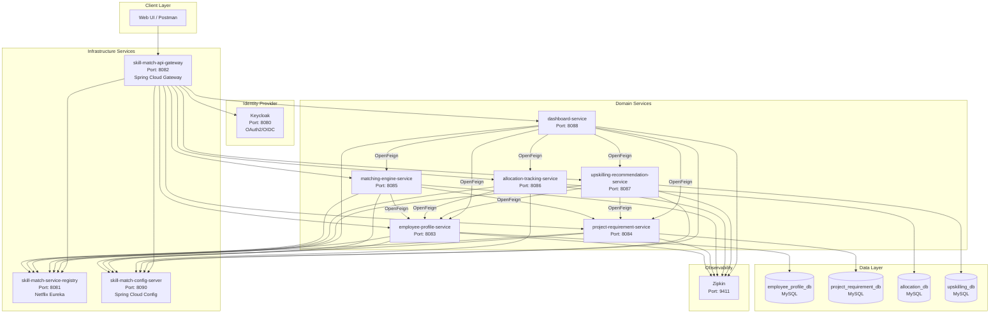
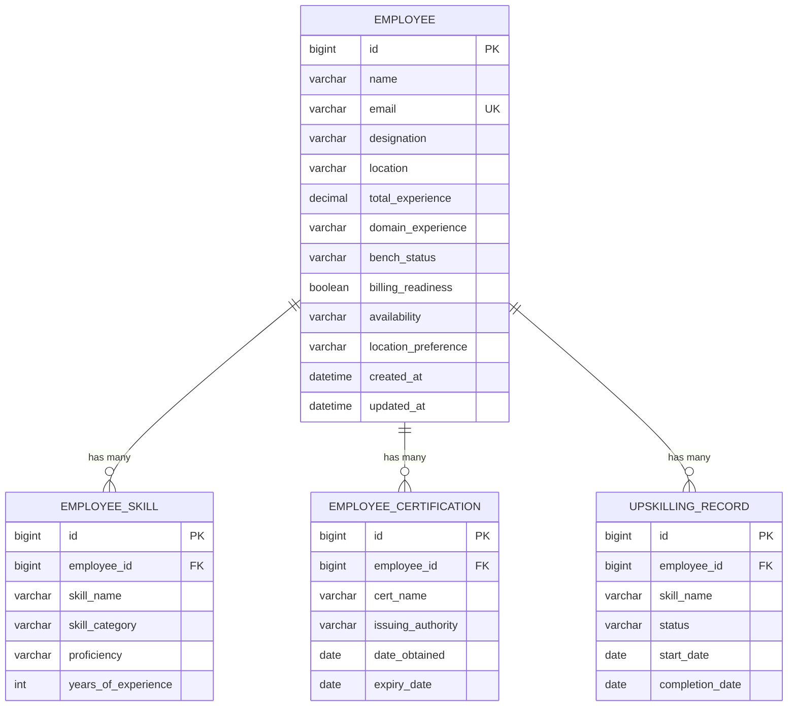
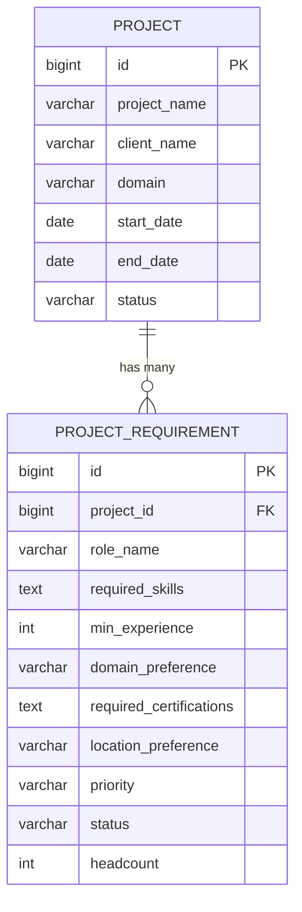
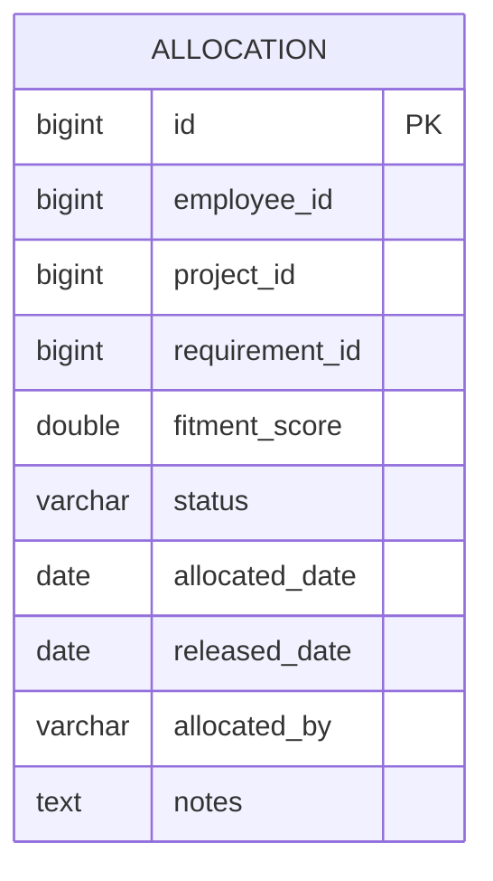
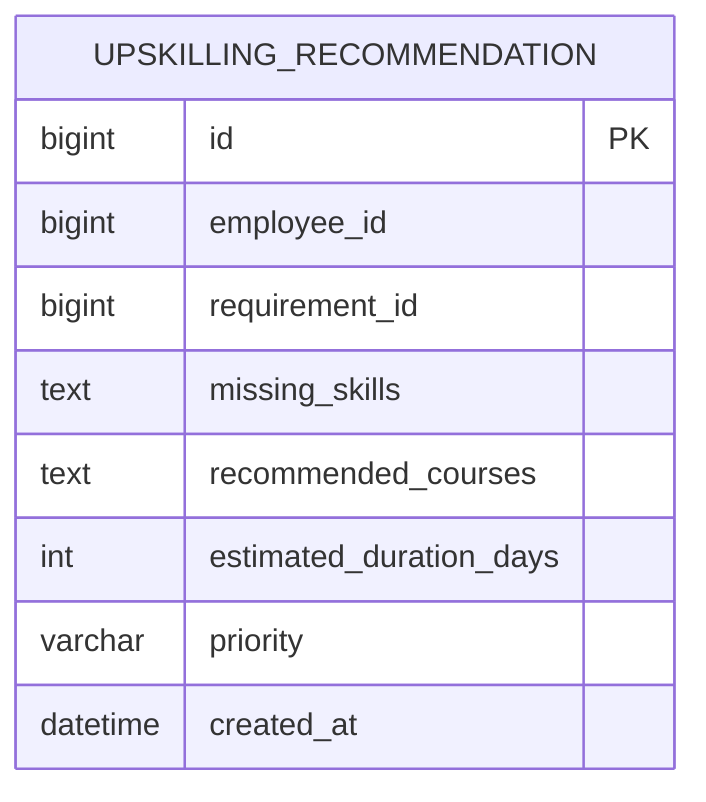

# Employee Skill Match Platform — End-to-End Design Document

## Table of Contents

- [1. Executive Summary](#1-executive-summary)
- [2. Architecture Overview](#2-architecture-overview)
- [3. Technology Stack](#3-technology-stack)
- [4. Service Specifications](#4-service-specifications)
  - [4.1 employee-profile-service](#41-employee-profile-service-port-8083)
  - [4.2 project-requirement-service](#42-project-requirement-service-port-8084)
  - [4.3 matching-engine-service](#43-matching-engine-service-port-8085)
  - [4.4 allocation-tracking-service](#44-allocation-tracking-service-port-8086)
  - [4.5 upskilling-recommendation-service](#45-upskilling-recommendation-service-port-8087)
  - [4.6 dashboard-service](#46-dashboard-service-port-8088)
- [5. Database Design](#5-database-design)
- [6. API Gateway Routes](#6-api-gateway-routes)
- [7. Fitment Score Algorithm](#7-fitment-score-algorithm)
- [8. Matching Factors Reference](#8-matching-factors-reference)
- [9. Docker Compose Specification](#9-docker-compose-specification)
- [10. Project Directory Structure](#10-project-directory-structure)
- [11. Testing Strategy](#11-testing-strategy)
- [12. Sample Workflow Walkthrough](#12-sample-workflow-walkthrough)
- [13. Postman Collection Specification](#13-postman-collection-specification)

---

## 1. Executive Summary

### Business Problem

Service companies (IT consulting, staffing firms, system integrators) face critical workforce allocation challenges:

- **Skill mismatch**: Employees on the bench possess skills that don't align with open project demands, leading to prolonged bench time and revenue loss.
- **Delayed staffing**: Manual processes to identify suitable candidates for project requirements take days or weeks, causing project delays and client dissatisfaction.
- **Bench employees not matched to open demands**: Resource managers lack visibility into the full bench pool and open requirements simultaneously, resulting in missed allocation opportunities.
- **Manual Excel/email-based allocation**: Current processes rely on spreadsheets, email threads, and tribal knowledge — error-prone, non-auditable, and unscalable.

### Goal

Build a **rule-based matching engine** that recommends best-fit employees for project demands with **fitment scoring**. The platform will:

- Automatically match bench employees to open project requirements based on weighted criteria (skills, experience, domain, certifications, availability, location).
- Generate a fitment score (0–100) for each employee-requirement pair, enabling data-driven allocation decisions.
- Track allocations through their lifecycle (PROPOSED → CONFIRMED → RELEASED).
- Recommend upskilling paths for partial matches to increase future staffing options.
- Provide real-time dashboards for workforce analytics.

### Target Users

| User Role | Primary Use Cases |
|-----------|-------------------|
| **Delivery Managers** | View project staffing recommendations, confirm/reject allocations, track project fulfillment |
| **Resource Managers** | Manage bench pool, run matching for open demands, compare candidates, optimize utilization |
| **HR Teams** | Monitor bench metrics, track upskilling progress, generate workforce analytics reports |

---

## 2. Architecture Overview

### System Architecture Diagram



### Data Flow

1. **UI → API Gateway**: All client requests enter through the API Gateway (port 8082).
2. **API Gateway → Keycloak**: Gateway validates OAuth2/JWT tokens against Keycloak before routing.
3. **API Gateway → Domain Services**: Authenticated requests are routed to the appropriate domain service based on URL path. The gateway propagates the `X-Auth-Id` header to downstream services.
4. **matching-engine-service → employee-profile-service / project-requirement-service**: The matching engine calls both services via OpenFeign to retrieve employee profiles and project requirements for fitment calculation.
5. **dashboard-service → All Domain Services**: Dashboard aggregates data from all domain services via OpenFeign for analytics and reporting.
6. **Service Discovery**: All services register with Eureka and discover each other dynamically.
7. **Centralized Config**: All services pull configuration from the Config Server at startup (via `bootstrap.yml`).

---

## 3. Technology Stack

### Reference Build Configuration

The technology choices are derived from the existing Internet Banking Microservices codebase, specifically:

- `core-banking-service/build.gradle` (lines 1–68): Demonstrates the standard dependency set including Spring Boot 3.2.4, Spring Cloud 2023.0.0, Eureka client, config client, Flyway, MySQL, H2 for tests, Lombok, Zipkin tracing, and SpringDoc OpenAPI.
- `internet-banking-fund-transfer-service/build.gradle` (lines 1–63): Demonstrates OpenFeign integration for inter-service communication alongside the standard dependency set.

### Technology Stack Table

| Layer | Technology | Version | Purpose |
|-------|-----------|---------|---------|
| **Language** | Java | 21 | Primary development language |
| **Framework** | Spring Boot | 3.2.4 | Application framework |
| **Cloud** | Spring Cloud | 2023.0.0 | Microservices infrastructure |
| **Build** | Gradle | 8.6 | Build automation (per-service wrapper) |
| **Service Discovery** | Netflix Eureka | (Spring Cloud managed) | Dynamic service registration and lookup |
| **API Gateway** | Spring Cloud Gateway | (Spring Cloud managed) | Edge routing, security enforcement |
| **Configuration** | Spring Cloud Config Server | (Spring Cloud managed) | Externalized centralized configuration |
| **Inter-Service Comm** | OpenFeign | (Spring Cloud managed) | Declarative REST clients |
| **Identity/Auth** | Keycloak | 23.0.7 | OAuth2/OIDC identity provider |
| **Database** | MySQL | 8.4 | Persistent data storage |
| **ORM** | Spring Data JPA + Hibernate | (Spring Boot managed) | Object-relational mapping |
| **Migrations** | Flyway | 10.12.0 | Database schema versioning |
| **Tracing** | Zipkin + Micrometer | 3 / (Spring Boot managed) | Distributed tracing |
| **API Documentation** | SpringDoc OpenAPI | 2.1.0 | Swagger UI / OpenAPI specs |
| **Containerization** | Docker + Docker Compose | Latest | Service containerization and orchestration |
| **Code Generation** | Lombok | (Spring Boot managed) | Boilerplate reduction |
| **Testing** | JUnit 5 + Mockito + H2 | 2.2.224 (H2) | Unit and integration testing |

---

## 4. Service Specifications

### 4.1 employee-profile-service (Port 8083)

#### Purpose and Responsibility

Manages the complete lifecycle of employee profiles including skills inventory, certifications, upskilling records, and availability status. Acts as the system of record for all employee-related data used in the matching process.

#### Package Structure

```
com.skillmatch.employee
├── controller/
│   └── EmployeeController.java
├── service/
│   └── EmployeeService.java
├── model/
│   ├── entity/
│   │   ├── Employee.java
│   │   ├── EmployeeSkill.java
│   │   ├── EmployeeCertification.java
│   │   └── UpskillingRecord.java
│   ├── dto/
│   │   ├── EmployeeDto.java
│   │   ├── EmployeeSkillDto.java
│   │   ├── EmployeeCertificationDto.java
│   │   └── UpskillingRecordDto.java
│   └── mapper/
│       └── EmployeeMapper.java
├── repository/
│   ├── EmployeeRepository.java
│   ├── EmployeeSkillRepository.java
│   ├── EmployeeCertificationRepository.java
│   └── UpskillingRecordRepository.java
├── exception/
│   ├── GlobalExceptionHandler.java
│   ├── EmployeeNotFoundException.java
│   └── ErrorResponse.java
└── configuration/
    └── OpenApiConfig.java
```

#### Entity Definitions

**Employee**

| Field | Type | Constraints | Description |
|-------|------|-------------|-------------|
| id | Long | @Id, @GeneratedValue | Primary key |
| name | String | @NotBlank | Full name of the employee |
| email | String | @Email, @Column(unique=true) | Corporate email |
| designation | String | | Current job title |
| location | String | | Current work location |
| totalExperience | BigDecimal | | Total years of professional experience |
| domainExperience | String | | Primary domain (Banking, Healthcare, Retail, etc.) |
| benchStatus | BenchStatus (enum) | BENCH, BILLABLE | Current billing status |
| billingReadiness | Boolean | | Whether employee is immediately deployable |
| availability | Availability (enum) | AVAILABLE, PARTIALLY_AVAILABLE, NOT_AVAILABLE | Current availability |
| locationPreference | String | | Preferred work location |
| createdAt | LocalDateTime | @CreatedDate | Record creation timestamp |
| updatedAt | LocalDateTime | @LastModifiedDate | Last update timestamp |

**EmployeeSkill**

| Field | Type | Constraints | Description |
|-------|------|-------------|-------------|
| id | Long | @Id, @GeneratedValue | Primary key |
| employeeId | Long | @ManyToOne FK | Reference to Employee |
| skillName | String | @NotBlank | Name of the skill |
| skillCategory | SkillCategory (enum) | PRIMARY, SECONDARY | Skill classification |
| proficiency | Proficiency (enum) | BEGINNER, INTERMEDIATE, EXPERT | Proficiency level |
| yearsOfExperience | Integer | | Years using this skill |

**EmployeeCertification**

| Field | Type | Constraints | Description |
|-------|------|-------------|-------------|
| id | Long | @Id, @GeneratedValue | Primary key |
| employeeId | Long | @ManyToOne FK | Reference to Employee |
| certName | String | @NotBlank | Certification name |
| issuingAuthority | String | | Issuing organization |
| dateObtained | LocalDate | | Date certification was earned |
| expiryDate | LocalDate | | Certification expiry date (nullable) |

**UpskillingRecord**

| Field | Type | Constraints | Description |
|-------|------|-------------|-------------|
| id | Long | @Id, @GeneratedValue | Primary key |
| employeeId | Long | @ManyToOne FK | Reference to Employee |
| skillName | String | @NotBlank | Skill being learned |
| status | UpskillingStatus (enum) | IN_PROGRESS, COMPLETED | Current upskilling status |
| startDate | LocalDate | | Training start date |
| completionDate | LocalDate | | Training completion date (nullable) |

#### Repository Interfaces

```java
// EmployeeRepository.java
public interface EmployeeRepository extends JpaRepository<Employee, Long> {

    // Find all bench employees with specified availability
    List<Employee> findByBenchStatusAndAvailability(BenchStatus benchStatus, Availability availability);

    // Custom query: find employees by skill names
    @Query("SELECT DISTINCT e FROM Employee e JOIN e.skills s WHERE s.skillName IN :skills AND e.benchStatus = :status")
    List<Employee> findBySkillsAndBenchStatus(@Param("skills") List<String> skills, @Param("status") BenchStatus status);

    // Find all available employees (BENCH + AVAILABLE or PARTIALLY_AVAILABLE)
    @Query("SELECT e FROM Employee e WHERE e.benchStatus = 'BENCH' AND e.availability IN ('AVAILABLE', 'PARTIALLY_AVAILABLE')")
    List<Employee> findAllAvailableEmployees();
}
```

#### DTO and Mapper Classes

```java
// EmployeeDto.java
@Data
@Builder
@NoArgsConstructor
@AllArgsConstructor
public class EmployeeDto {
    private Long id;
    private String name;
    private String email;
    private String designation;
    private String location;
    private BigDecimal totalExperience;
    private String domainExperience;
    private BenchStatus benchStatus;
    private Boolean billingReadiness;
    private Availability availability;
    private String locationPreference;
    private List<EmployeeSkillDto> skills;
    private List<EmployeeCertificationDto> certifications;
    private List<UpskillingRecordDto> upskillingRecords;
}

// EmployeeMapper.java — follows the pattern from internet-banking-user-service
public class EmployeeMapper {
    public EmployeeDto convertToDto(Employee entity) { /* ... */ }
    public Employee convertToEntity(EmployeeDto dto) { /* ... */ }
    public List<EmployeeDto> convertToDtoList(List<Employee> entities) { /* ... */ }
}
```

#### Service Layer Logic

```java
// EmployeeService.java — follows the pattern from UserService.java
@Slf4j
@Service
@RequiredArgsConstructor
public class EmployeeService {

    private final EmployeeRepository employeeRepository;
    private final EmployeeSkillRepository skillRepository;
    private final EmployeeCertificationRepository certRepository;
    private final EmployeeMapper employeeMapper = new EmployeeMapper();

    public EmployeeDto createEmployee(EmployeeDto dto) {
        // Validate email uniqueness, persist entity, return DTO
    }

    public EmployeeDto readEmployee(Long id) {
        return employeeMapper.convertToDto(
            employeeRepository.findById(id)
                .orElseThrow(() -> new EmployeeNotFoundException("Employee not found with id: " + id))
        );
    }

    public List<EmployeeDto> searchEmployees(BenchStatus status, List<String> skills) {
        // Filter by status and skills, return matched employees
    }

    public EmployeeDto updateEmployee(Long id, EmployeeDto dto) {
        // Partial update: only non-null fields are updated
    }

    public List<EmployeeSkillDto> getEmployeeSkills(Long employeeId) { /* ... */ }
    public EmployeeSkillDto addEmployeeSkill(Long employeeId, EmployeeSkillDto dto) { /* ... */ }
    public List<EmployeeDto> getAvailableEmployees() { /* ... */ }
}
```

#### REST API Endpoints

| Method | Path | Description | Request Body | Response | Status Codes |
|--------|------|-------------|--------------|----------|--------------|
| POST | `/api/v1/employees` | Create new employee profile | EmployeeDto | EmployeeDto | 200, 400 |
| GET | `/api/v1/employees/{id}` | Get employee by ID | — | EmployeeDto | 200, 404 |
| GET | `/api/v1/employees?status=BENCH&skills=Java,Spring Boot` | Search employees | — | List\<EmployeeDto\> | 200 |
| PATCH | `/api/v1/employees/{id}` | Update employee profile | EmployeeDto (partial) | EmployeeDto | 200, 404 |
| GET | `/api/v1/employees/{id}/skills` | Get employee skills | — | List\<EmployeeSkillDto\> | 200, 404 |
| POST | `/api/v1/employees/{id}/skills` | Add skill to employee | EmployeeSkillDto | EmployeeSkillDto | 200, 404 |
| GET | `/api/v1/employees/available` | Get all available employees | — | List\<EmployeeDto\> | 200 |

**Sample Request — Create Employee:**

```json
POST /api/v1/employees
{
  "name": "Rajesh Kumar",
  "email": "rajesh.kumar@company.com",
  "designation": "Senior Software Engineer",
  "location": "Bangalore",
  "totalExperience": 8.0,
  "domainExperience": "Banking",
  "benchStatus": "BENCH",
  "billingReadiness": true,
  "availability": "AVAILABLE",
  "locationPreference": "Bangalore"
}
```

**Sample Response:**

```json
{
  "id": 1,
  "name": "Rajesh Kumar",
  "email": "rajesh.kumar@company.com",
  "designation": "Senior Software Engineer",
  "location": "Bangalore",
  "totalExperience": 8.0,
  "domainExperience": "Banking",
  "benchStatus": "BENCH",
  "billingReadiness": true,
  "availability": "AVAILABLE",
  "locationPreference": "Bangalore",
  "skills": [],
  "certifications": [],
  "upskillingRecords": [],
  "createdAt": "2024-01-15T10:30:00",
  "updatedAt": "2024-01-15T10:30:00"
}
```

#### Controller Pattern

Reference: `internet-banking-user-service/src/main/java/com/javatodev/finance/controller/UserController.java`

```java
@Slf4j
@Tag(name = "Employee Controller", description = "APIs for managing employee profiles")
@RestController
@RequestMapping(value = "/api/v1/employees")
@RequiredArgsConstructor
public class EmployeeController {

    private final EmployeeService employeeService;

    @Operation(summary = "Create Employee", description = "Create a new employee profile")
    @PostMapping
    public ResponseEntity<EmployeeDto> createEmployee(@RequestBody EmployeeDto request) {
        log.info("Creating employee with {}", request.toString());
        return ResponseEntity.ok(employeeService.createEmployee(request));
    }

    @Operation(summary = "Get Employee", description = "Retrieve employee by ID")
    @GetMapping(value = "/{id}")
    public ResponseEntity<EmployeeDto> getEmployee(@PathVariable("id") Long id) {
        log.info("Reading employee by id {}", id);
        return ResponseEntity.ok(employeeService.readEmployee(id));
    }

    @Operation(summary = "Search Employees", description = "Search employees by status and skills")
    @GetMapping
    public ResponseEntity<List<EmployeeDto>> searchEmployees(
            @RequestParam(required = false) BenchStatus status,
            @RequestParam(required = false) List<String> skills) {
        log.info("Searching employees with status={}, skills={}", status, skills);
        return ResponseEntity.ok(employeeService.searchEmployees(status, skills));
    }

    @Operation(summary = "Update Employee", description = "Partially update employee profile")
    @PatchMapping(value = "/{id}")
    public ResponseEntity<EmployeeDto> updateEmployee(
            @PathVariable("id") Long id, @RequestBody EmployeeDto request) {
        log.info("Updating employee {} with {}", id, request.toString());
        return ResponseEntity.ok(employeeService.updateEmployee(id, request));
    }

    @Operation(summary = "Get Employee Skills", description = "Retrieve all skills for an employee")
    @GetMapping(value = "/{id}/skills")
    public ResponseEntity<List<EmployeeSkillDto>> getEmployeeSkills(@PathVariable("id") Long id) {
        return ResponseEntity.ok(employeeService.getEmployeeSkills(id));
    }

    @Operation(summary = "Add Employee Skill", description = "Add a skill to an employee profile")
    @PostMapping(value = "/{id}/skills")
    public ResponseEntity<EmployeeSkillDto> addEmployeeSkill(
            @PathVariable("id") Long id, @RequestBody EmployeeSkillDto skillDto) {
        return ResponseEntity.ok(employeeService.addEmployeeSkill(id, skillDto));
    }

    @Operation(summary = "Get Available Employees", description = "Get all employees on bench and available")
    @GetMapping(value = "/available")
    public ResponseEntity<List<EmployeeDto>> getAvailableEmployees() {
        return ResponseEntity.ok(employeeService.getAvailableEmployees());
    }
}
```

#### Exception Handling

Following the `GlobalExceptionHandler` pattern from `core-banking-service/src/main/java/com/javatodev/finance/exception/GlobalExceptionHandler.java`:

```java
@ControllerAdvice
public class GlobalExceptionHandler extends ResponseEntityExceptionHandler {

    @ExceptionHandler(EmployeeNotFoundException.class)
    protected ResponseEntity<ErrorResponse> handleEmployeeNotFoundException(
            EmployeeNotFoundException ex, Locale locale) {
        return ResponseEntity
            .badRequest()
            .body(ErrorResponse.builder()
                .code(ex.getCode())
                .message(ex.getMessage())
                .build());
    }

    @ExceptionHandler({Exception.class})
    protected ResponseEntity<String> handleException(Exception e, Locale locale) {
        return ResponseEntity
            .badRequest()
            .body("Exception occurred inside API: " + e.getMessage());
    }
}
```

---

### 4.2 project-requirement-service (Port 8084)

#### Purpose and Responsibility

Manages projects and their staffing requirements. Stores project metadata (client, domain, dates) and detailed requirement specifications (skills needed, experience levels, headcount) that the matching engine uses to find suitable candidates.

#### Package Structure

```
com.skillmatch.project
├── controller/
│   ├── ProjectController.java
│   └── RequirementController.java
├── service/
│   └── ProjectService.java
├── model/
│   ├── entity/
│   │   ├── Project.java
│   │   └── ProjectRequirement.java
│   ├── dto/
│   │   ├── ProjectDto.java
│   │   └── ProjectRequirementDto.java
│   └── mapper/
│       └── ProjectMapper.java
├── repository/
│   ├── ProjectRepository.java
│   └── ProjectRequirementRepository.java
├── exception/
│   ├── GlobalExceptionHandler.java
│   ├── ProjectNotFoundException.java
│   └── ErrorResponse.java
└── configuration/
    └── OpenApiConfig.java
```

#### Entity Definitions

**Project**

| Field | Type | Constraints | Description |
|-------|------|-------------|-------------|
| id | Long | @Id, @GeneratedValue | Primary key |
| projectName | String | @NotBlank | Project name |
| clientName | String | @NotBlank | Client organization |
| domain | String | | Industry domain (Banking, Healthcare, etc.) |
| startDate | LocalDate | | Project start date |
| endDate | LocalDate | | Expected end date |
| status | ProjectStatus (enum) | OPEN, IN_PROGRESS, CLOSED | Current project status |

**ProjectRequirement**

| Field | Type | Constraints | Description |
|-------|------|-------------|-------------|
| id | Long | @Id, @GeneratedValue | Primary key |
| projectId | Long | @ManyToOne FK | Reference to Project |
| roleName | String | @NotBlank | Role title (e.g., "Senior Java Developer") |
| requiredSkills | String | @Column(columnDefinition="TEXT") | JSON array of required skills |
| minExperience | Integer | | Minimum years of experience |
| domainPreference | String | | Preferred domain experience |
| requiredCertifications | String | @Column(columnDefinition="TEXT") | JSON array of certifications |
| locationPreference | String | | Preferred location |
| priority | Priority (enum) | HIGH, MEDIUM, LOW | Requirement urgency |
| status | RequirementStatus (enum) | OPEN, FILLED, PARTIALLY_FILLED | Fulfillment status |
| headcount | Integer | | Number of positions |

#### Repository Interfaces

```java
public interface ProjectRepository extends JpaRepository<Project, Long> {
    List<Project> findByStatus(ProjectStatus status);
}

public interface ProjectRequirementRepository extends JpaRepository<ProjectRequirement, Long> {
    List<ProjectRequirement> findByProjectId(Long projectId);
    List<ProjectRequirement> findByStatus(RequirementStatus status);

    @Query("SELECT pr FROM ProjectRequirement pr WHERE pr.status = 'OPEN' ORDER BY pr.priority DESC")
    List<ProjectRequirement> findAllOpenRequirements();
}
```

#### REST API Endpoints

| Method | Path | Description | Request Body | Response | Status Codes |
|--------|------|-------------|--------------|----------|--------------|
| POST | `/api/v1/projects` | Create a new project | ProjectDto | ProjectDto | 200, 400 |
| GET | `/api/v1/projects/{id}` | Get project by ID | — | ProjectDto | 200, 404 |
| GET | `/api/v1/projects?status=OPEN` | List projects by status | — | List\<ProjectDto\> | 200 |
| POST | `/api/v1/projects/{id}/requirements` | Add requirement to project | ProjectRequirementDto | ProjectRequirementDto | 200, 404 |
| GET | `/api/v1/projects/{id}/requirements` | Get all requirements for project | — | List\<ProjectRequirementDto\> | 200, 404 |
| GET | `/api/v1/requirements/open` | Get all open requirements | — | List\<ProjectRequirementDto\> | 200 |

**Sample Request — Create Project:**

```json
POST /api/v1/projects
{
  "projectName": "Project Alpha",
  "clientName": "TechBank",
  "domain": "Banking",
  "startDate": "2024-03-01",
  "endDate": "2024-12-31",
  "status": "OPEN"
}
```

**Sample Response:**

```json
{
  "id": 1,
  "projectName": "Project Alpha",
  "clientName": "TechBank",
  "domain": "Banking",
  "startDate": "2024-03-01",
  "endDate": "2024-12-31",
  "status": "OPEN",
  "requirements": []
}
```

**Sample Request — Add Requirement:**

```json
POST /api/v1/projects/1/requirements
{
  "roleName": "Senior Java Developer",
  "requiredSkills": "[\"Java\", \"Spring Boot\", \"Microservices\", \"Kafka\", \"AWS\"]",
  "minExperience": 5,
  "domainPreference": "Banking",
  "requiredCertifications": "[\"AWS Solutions Architect\"]",
  "locationPreference": "Bangalore",
  "priority": "HIGH",
  "status": "OPEN",
  "headcount": 2
}
```

**Sample Response:**

```json
{
  "id": 1,
  "projectId": 1,
  "roleName": "Senior Java Developer",
  "requiredSkills": "[\"Java\", \"Spring Boot\", \"Microservices\", \"Kafka\", \"AWS\"]",
  "minExperience": 5,
  "domainPreference": "Banking",
  "requiredCertifications": "[\"AWS Solutions Architect\"]",
  "locationPreference": "Bangalore",
  "priority": "HIGH",
  "status": "OPEN",
  "headcount": 2
}
```

#### Controller Pattern

Reference: `internet-banking-fund-transfer-service/src/main/java/com/javatodev/finance/controller/FundTransferController.java`

```java
@Slf4j
@Tag(name = "Project API", description = "APIs for managing projects and requirements")
@RequiredArgsConstructor
@RestController
@RequestMapping("/api/v1/projects")
public class ProjectController {

    private final ProjectService projectService;

    @Operation(summary = "Create Project", description = "Create a new project entry")
    @PostMapping
    public ResponseEntity<ProjectDto> createProject(@RequestBody ProjectDto request) {
        log.info("Creating project with {}", request.toString());
        return ResponseEntity.ok(projectService.createProject(request));
    }

    @Operation(summary = "Get Project", description = "Retrieve project by ID")
    @GetMapping(value = "/{id}")
    public ResponseEntity<ProjectDto> getProject(@PathVariable("id") Long id) {
        log.info("Reading project by id {}", id);
        return ResponseEntity.ok(projectService.readProject(id));
    }

    @Operation(summary = "List Projects", description = "List projects filtered by status")
    @GetMapping
    public ResponseEntity<List<ProjectDto>> listProjects(
            @RequestParam(required = false) ProjectStatus status) {
        return ResponseEntity.ok(projectService.listProjects(status));
    }

    @Operation(summary = "Add Requirement", description = "Add staffing requirement to project")
    @PostMapping(value = "/{id}/requirements")
    public ResponseEntity<ProjectRequirementDto> addRequirement(
            @PathVariable("id") Long projectId,
            @RequestBody ProjectRequirementDto request) {
        log.info("Adding requirement to project {}", projectId);
        return ResponseEntity.ok(projectService.addRequirement(projectId, request));
    }

    @Operation(summary = "Get Requirements", description = "Get all requirements for a project")
    @GetMapping(value = "/{id}/requirements")
    public ResponseEntity<List<ProjectRequirementDto>> getRequirements(@PathVariable("id") Long id) {
        return ResponseEntity.ok(projectService.getRequirements(id));
    }
}
```

#### Exception Handling

Same pattern as employee-profile-service — `GlobalExceptionHandler` with `@ControllerAdvice`.

---

### 4.3 matching-engine-service (Port 8085)

#### Purpose and Responsibility

Stateless computation service that calculates fitment scores by comparing employee profiles against project requirements. Does NOT have its own database — retrieves data via OpenFeign calls to `employee-profile-service` and `project-requirement-service`.

#### Dependencies (build.gradle)

```groovy
plugins {
    id 'java'
    id 'org.springframework.boot' version '3.2.4'
    id 'io.spring.dependency-management' version '1.1.4'
    id "com.gorylenko.gradle-git-properties" version "2.4.2"
}

group = 'com.skillmatch.matching'
version = '0.0.1-SNAPSHOT'

java {
    sourceCompatibility = '21'
}

ext {
    set('springCloudVersion', "2023.0.0")
}

dependencies {
    implementation 'org.springframework.boot:spring-boot-starter-web'
    implementation 'org.springframework.cloud:spring-cloud-starter-openfeign'
    implementation 'org.springframework.cloud:spring-cloud-starter-netflix-eureka-client'

    // SPRING BOOT - TRACING
    implementation 'org.springframework.boot:spring-boot-starter-actuator'
    implementation 'io.micrometer:micrometer-tracing-bridge-brave'
    implementation 'io.zipkin.reporter2:zipkin-reporter-brave'
    implementation 'io.github.openfeign:feign-micrometer'

    // SPRING CLOUD CONFIG
    implementation 'org.springframework.cloud:spring-cloud-starter-config'
    implementation 'org.springframework.cloud:spring-cloud-starter-bootstrap'

    // SWAGGER
    implementation 'org.springdoc:springdoc-openapi-starter-webflux-ui:2.1.0'

    compileOnly 'org.projectlombok:lombok'
    annotationProcessor 'org.projectlombok:lombok'

    testImplementation 'org.springframework.boot:spring-boot-starter-test'
}

dependencyManagement {
    imports {
        mavenBom "org.springframework.cloud:spring-cloud-dependencies:${springCloudVersion}"
    }
}
```

#### Package Structure

```
com.skillmatch.matching
├── controller/
│   └── MatchingController.java
├── service/
│   ├── MatchingService.java
│   └── FitmentScoreCalculator.java
├── client/
│   ├── EmployeeServiceClient.java
│   └── ProjectServiceClient.java
├── model/
│   └── dto/
│       ├── MatchResultDto.java
│       ├── BulkMatchRequest.java
│       ├── EmployeeDto.java
│       ├── EmployeeSkillDto.java
│       └── ProjectRequirementDto.java
├── exception/
│   ├── GlobalExceptionHandler.java
│   └── ErrorResponse.java
└── configuration/
    └── OpenApiConfig.java
```

#### OpenFeign Client Interfaces

```java
// EmployeeServiceClient.java
@FeignClient(name = "employee-profile-service")
public interface EmployeeServiceClient {

    @GetMapping("/api/v1/employees/{id}")
    EmployeeDto getEmployeeById(@PathVariable("id") Long id);

    @GetMapping("/api/v1/employees/available")
    List<EmployeeDto> getAvailableEmployees();

    @GetMapping("/api/v1/employees")
    List<EmployeeDto> searchEmployees(
        @RequestParam("status") String status,
        @RequestParam("skills") List<String> skills);

    @GetMapping("/api/v1/employees/{id}/skills")
    List<EmployeeSkillDto> getEmployeeSkills(@PathVariable("id") Long id);
}

// ProjectServiceClient.java
@FeignClient(name = "project-requirement-service")
public interface ProjectServiceClient {

    @GetMapping("/api/v1/projects/{id}")
    ProjectDto getProjectById(@PathVariable("id") Long id);

    @GetMapping("/api/v1/projects/{id}/requirements")
    List<ProjectRequirementDto> getProjectRequirements(@PathVariable("id") Long projectId);

    @GetMapping("/api/v1/requirements/open")
    List<ProjectRequirementDto> getOpenRequirements();
}
```

#### FitmentScoreCalculator

```java
@Component
public class FitmentScoreCalculator {

    // Weighted scoring algorithm
    private static final double WEIGHT_PRIMARY_SKILL = 0.25;
    private static final double WEIGHT_SECONDARY_SKILL = 0.10;
    private static final double WEIGHT_YEARS_EXPERIENCE = 0.15;
    private static final double WEIGHT_DOMAIN_EXPERIENCE = 0.15;
    private static final double WEIGHT_CERTIFICATIONS = 0.10;
    private static final double WEIGHT_AVAILABILITY = 0.10;
    private static final double WEIGHT_LOCATION = 0.05;
    private static final double WEIGHT_BILLING_READINESS = 0.05;
    private static final double WEIGHT_UPSKILLING = 0.05;

    public MatchResultDto calculateFitment(EmployeeDto employee, ProjectRequirementDto requirement) {
        double primarySkillScore = calculatePrimarySkillMatch(employee, requirement);
        double secondarySkillScore = calculateSecondarySkillMatch(employee, requirement);
        double experienceScore = calculateExperienceScore(employee, requirement);
        double domainScore = calculateDomainScore(employee, requirement);
        double certScore = calculateCertificationScore(employee, requirement);
        double availabilityScore = calculateAvailabilityScore(employee);
        double locationScore = calculateLocationScore(employee, requirement);
        double billingScore = calculateBillingReadinessScore(employee);
        double upskillingScore = calculateUpskillingScore(employee, requirement);

        double totalScore = (primarySkillScore * WEIGHT_PRIMARY_SKILL)
            + (secondarySkillScore * WEIGHT_SECONDARY_SKILL)
            + (experienceScore * WEIGHT_YEARS_EXPERIENCE)
            + (domainScore * WEIGHT_DOMAIN_EXPERIENCE)
            + (certScore * WEIGHT_CERTIFICATIONS)
            + (availabilityScore * WEIGHT_AVAILABILITY)
            + (locationScore * WEIGHT_LOCATION)
            + (billingScore * WEIGHT_BILLING_READINESS)
            + (upskillingScore * WEIGHT_UPSKILLING);

        // Scale to 0-100
        double fitmentScore = totalScore * 100;

        return MatchResultDto.builder()
            .employeeId(employee.getId())
            .employeeName(employee.getName())
            .fitmentScore(fitmentScore)
            .matchedSkills(getMatchedSkills(employee, requirement))
            .missingSkills(getMissingSkills(employee, requirement))
            .recommendation(generateRecommendation(fitmentScore))
            .build();
    }
}
```

#### Output DTO

```java
@Data
@Builder
@NoArgsConstructor
@AllArgsConstructor
public class MatchResultDto {
    private Long employeeId;
    private String employeeName;
    private Double fitmentScore;
    private List<String> matchedSkills;
    private List<String> missingSkills;
    private String recommendation; // "STRONG_MATCH", "GOOD_MATCH", "PARTIAL_MATCH", "WEAK_MATCH"
}
```

#### REST API Endpoints

| Method | Path | Description | Request Body | Response | Status Codes |
|--------|------|-------------|--------------|----------|--------------|
| GET | `/api/v1/match/project/{projectId}/requirement/{reqId}` | Match employees to a specific requirement | — | List\<MatchResultDto\> | 200, 404 |
| POST | `/api/v1/match/bulk` | Bulk match multiple requirements | BulkMatchRequest | Map\<Long, List\<MatchResultDto\>\> | 200 |
| GET | `/api/v1/match/employee/{employeeId}` | Find matching requirements for an employee | — | List\<MatchResultDto\> | 200, 404 |

**Sample Response — Match for Requirement:**

```json
GET /api/v1/match/project/1/requirement/1

[
  {
    "employeeId": 1,
    "employeeName": "Rajesh Kumar",
    "fitmentScore": 87.5,
    "matchedSkills": ["Java", "Spring Boot", "Microservices", "AWS"],
    "missingSkills": ["Kafka"],
    "recommendation": "STRONG_MATCH"
  },
  {
    "employeeId": 3,
    "employeeName": "Amit Patel",
    "fitmentScore": 72.0,
    "matchedSkills": ["Java", "Spring Boot", "Microservices"],
    "missingSkills": ["Kafka", "AWS"],
    "recommendation": "GOOD_MATCH"
  },
  {
    "employeeId": 5,
    "employeeName": "Sneha Reddy",
    "fitmentScore": 45.5,
    "matchedSkills": ["Java", "AWS"],
    "missingSkills": ["Spring Boot", "Microservices", "Kafka"],
    "recommendation": "PARTIAL_MATCH"
  }
]
```

---

### 4.4 allocation-tracking-service (Port 8086)

#### Purpose and Responsibility

Tracks the lifecycle of employee-to-project allocations from initial proposal through confirmation to release. Manages the status workflow and triggers side-effects (updating employee bench status) via OpenFeign calls.

#### Package Structure

```
com.skillmatch.allocation
├── controller/
│   └── AllocationController.java
├── service/
│   └── AllocationService.java
├── client/
│   └── EmployeeServiceClient.java
├── model/
│   ├── entity/
│   │   └── Allocation.java
│   ├── dto/
│   │   ├── AllocationDto.java
│   │   └── AllocationStatusUpdateRequest.java
│   └── mapper/
│       └── AllocationMapper.java
├── repository/
│   └── AllocationRepository.java
├── exception/
│   ├── GlobalExceptionHandler.java
│   ├── AllocationNotFoundException.java
│   ├── InvalidStatusTransitionException.java
│   └── ErrorResponse.java
└── configuration/
    └── OpenApiConfig.java
```

#### Entity Definition

**Allocation**

| Field | Type | Constraints | Description |
|-------|------|-------------|-------------|
| id | Long | @Id, @GeneratedValue | Primary key |
| employeeId | Long | @NotNull | Reference to employee |
| projectId | Long | @NotNull | Reference to project |
| requirementId | Long | @NotNull | Reference to project requirement |
| fitmentScore | Double | | Score at time of allocation |
| status | AllocationStatus (enum) | PROPOSED, CONFIRMED, REJECTED, RELEASED | Current allocation status |
| allocatedDate | LocalDate | | Date of allocation |
| releasedDate | LocalDate | | Date of release (nullable) |
| allocatedBy | String | | User who made the allocation |
| notes | String | @Column(columnDefinition="TEXT") | Additional notes |

#### Status Workflow

```
PROPOSED → CONFIRMED  (Manager approves allocation)
PROPOSED → REJECTED   (Manager rejects allocation)
CONFIRMED → RELEASED  (Employee released from project)
```

**Side Effects:**
- On **CONFIRMED**: Call `employee-profile-service` to update `benchStatus` to `BILLABLE` and `availability` to `NOT_AVAILABLE`.
- On **RELEASED**: Call `employee-profile-service` to update `benchStatus` to `BENCH` and `availability` to `AVAILABLE`.

#### REST API Endpoints

| Method | Path | Description | Request Body | Response | Status Codes |
|--------|------|-------------|--------------|----------|--------------|
| POST | `/api/v1/allocations` | Create a new allocation (PROPOSED) | AllocationDto | AllocationDto | 200, 400 |
| GET | `/api/v1/allocations?status=CONFIRMED` | List allocations by status | — | List\<AllocationDto\> | 200 |
| PATCH | `/api/v1/allocations/{id}/status` | Update allocation status | AllocationStatusUpdateRequest | AllocationDto | 200, 400, 404 |
| GET | `/api/v1/allocations/employee/{employeeId}` | Get allocations for employee | — | List\<AllocationDto\> | 200 |
| GET | `/api/v1/allocations/project/{projectId}` | Get allocations for project | — | List\<AllocationDto\> | 200 |

**Sample Request — Create Allocation:**

```json
POST /api/v1/allocations
{
  "employeeId": 1,
  "projectId": 1,
  "requirementId": 1,
  "fitmentScore": 87.5,
  "allocatedBy": "resource.manager@company.com",
  "notes": "Strong match for Java/Spring Boot requirement"
}
```

**Sample Response:**

```json
{
  "id": 1,
  "employeeId": 1,
  "projectId": 1,
  "requirementId": 1,
  "fitmentScore": 87.5,
  "status": "PROPOSED",
  "allocatedDate": "2024-01-20",
  "releasedDate": null,
  "allocatedBy": "resource.manager@company.com",
  "notes": "Strong match for Java/Spring Boot requirement"
}
```

**Sample Request — Update Status:**

```json
PATCH /api/v1/allocations/1/status
{
  "status": "CONFIRMED",
  "notes": "Approved by delivery manager"
}
```

---

### 4.5 upskilling-recommendation-service (Port 8087)

#### Purpose and Responsibility

Identifies skill gaps between employees and project requirements, then generates targeted upskilling recommendations with estimated timelines. Uses rule-based course mapping to suggest specific training paths.

#### Package Structure

```
com.skillmatch.upskilling
├── controller/
│   └── UpskillingController.java
├── service/
│   ├── UpskillingService.java
│   └── CourseRecommendationEngine.java
├── client/
│   ├── EmployeeServiceClient.java
│   └── ProjectServiceClient.java
├── model/
│   ├── entity/
│   │   └── UpskillingRecommendation.java
│   ├── dto/
│   │   └── UpskillingRecommendationDto.java
│   └── mapper/
│       └── UpskillingMapper.java
├── repository/
│   └── UpskillingRecommendationRepository.java
├── exception/
│   ├── GlobalExceptionHandler.java
│   └── ErrorResponse.java
└── configuration/
    └── OpenApiConfig.java
```

#### Entity Definition

**UpskillingRecommendation**

| Field | Type | Constraints | Description |
|-------|------|-------------|-------------|
| id | Long | @Id, @GeneratedValue | Primary key |
| employeeId | Long | @NotNull | Reference to employee |
| requirementId | Long | @NotNull | Reference to project requirement |
| missingSkills | String | @Column(columnDefinition="TEXT") | JSON array of missing skills |
| recommendedCourses | String | @Column(columnDefinition="TEXT") | JSON array of recommended courses |
| estimatedDurationDays | Integer | | Total estimated training duration |
| priority | Priority (enum) | HIGH, MEDIUM, LOW | Training priority |
| createdAt | LocalDateTime | @CreatedDate | Record creation timestamp |

#### Rule-Based Course Mapping

```java
@Component
public class CourseRecommendationEngine {

    // Rule-based mapping: missing skill → recommended course + duration
    private static final Map<String, CourseMapping> COURSE_MAP = Map.ofEntries(
        Map.entry("Kafka", new CourseMapping("Apache Kafka for Developers", 15)),
        Map.entry("AWS", new CourseMapping("AWS Solutions Architect Associate", 30)),
        Map.entry("Microservices", new CourseMapping("Microservices Architecture with Spring Cloud", 20)),
        Map.entry("Docker", new CourseMapping("Docker & Container Orchestration", 10)),
        Map.entry("Kubernetes", new CourseMapping("Certified Kubernetes Application Developer", 25)),
        Map.entry("Spring Boot", new CourseMapping("Spring Boot 3 Masterclass", 15)),
        Map.entry("React", new CourseMapping("React.js Advanced Patterns", 20)),
        Map.entry("Angular", new CourseMapping("Angular Enterprise Development", 20)),
        Map.entry("Python", new CourseMapping("Python for Enterprise Applications", 15)),
        Map.entry("ML", new CourseMapping("Machine Learning Engineering with Python", 45)),
        Map.entry("Node.js", new CourseMapping("Node.js Backend Development", 15)),
        Map.entry("TypeScript", new CourseMapping("TypeScript for Enterprise Apps", 10)),
        Map.entry("GraphQL", new CourseMapping("GraphQL API Design & Development", 12)),
        Map.entry("MongoDB", new CourseMapping("MongoDB for Developers", 10)),
        Map.entry("PostgreSQL", new CourseMapping("Advanced PostgreSQL", 12))
    );

    public List<CourseRecommendation> recommend(List<String> missingSkills) {
        return missingSkills.stream()
            .filter(COURSE_MAP::containsKey)
            .map(skill -> CourseRecommendation.builder()
                .skillName(skill)
                .courseName(COURSE_MAP.get(skill).name())
                .durationDays(COURSE_MAP.get(skill).days())
                .build())
            .toList();
    }
}
```

#### REST API Endpoints

| Method | Path | Description | Request Body | Response | Status Codes |
|--------|------|-------------|--------------|----------|--------------|
| GET | `/api/v1/upskilling/employee/{id}/requirement/{reqId}` | Get recommendations for employee vs requirement | — | UpskillingRecommendationDto | 200, 404 |
| GET | `/api/v1/upskilling/employee/{id}` | Get all recommendations for employee | — | List\<UpskillingRecommendationDto\> | 200 |
| POST | `/api/v1/upskilling/generate` | Generate new recommendations | GenerateRequest | UpskillingRecommendationDto | 200, 400 |

**Sample Response:**

```json
GET /api/v1/upskilling/employee/1/requirement/1

{
  "id": 1,
  "employeeId": 1,
  "requirementId": 1,
  "missingSkills": "[\"Kafka\"]",
  "recommendedCourses": "[{\"skillName\": \"Kafka\", \"courseName\": \"Apache Kafka for Developers\", \"durationDays\": 15}]",
  "estimatedDurationDays": 15,
  "priority": "MEDIUM",
  "createdAt": "2024-01-20T14:30:00"
}
```

---

### 4.6 dashboard-service (Port 8088)

#### Purpose and Responsibility

Aggregation-only service that provides analytics and summary views by calling all other domain services via OpenFeign. Does NOT have its own database.

#### Package Structure

```
com.skillmatch.dashboard
├── controller/
│   └── DashboardController.java
├── service/
│   └── DashboardService.java
├── client/
│   ├── EmployeeServiceClient.java
│   ├── ProjectServiceClient.java
│   ├── MatchingServiceClient.java
│   ├── AllocationServiceClient.java
│   └── UpskillingServiceClient.java
├── model/
│   └── dto/
│       ├── BenchSummaryDto.java
│       ├── RequirementSummaryDto.java
│       ├── AllocationStatsDto.java
│       ├── SkillHeatmapDto.java
│       └── ProjectRecommendationDto.java
├── exception/
│   ├── GlobalExceptionHandler.java
│   └── ErrorResponse.java
└── configuration/
    └── OpenApiConfig.java
```

#### REST API Endpoints

| Method | Path | Description | Response |
|--------|------|-------------|----------|
| GET | `/api/v1/dashboard/bench-summary` | Bench employee analytics | BenchSummaryDto |
| GET | `/api/v1/dashboard/open-requirements-summary` | Open requirements overview | RequirementSummaryDto |
| GET | `/api/v1/dashboard/allocation-stats` | Allocation statistics | AllocationStatsDto |
| GET | `/api/v1/dashboard/skill-heatmap` | Skill distribution across bench pool | SkillHeatmapDto |
| GET | `/api/v1/dashboard/project/{projectId}/recommendations` | Top recommendations for project | ProjectRecommendationDto |

**Sample Response — Bench Summary:**

```json
GET /api/v1/dashboard/bench-summary

{
  "totalBenchEmployees": 42,
  "availableImmediately": 28,
  "partiallyAvailable": 10,
  "notAvailable": 4,
  "billingReady": 35,
  "byDomain": {
    "Banking": 12,
    "Healthcare": 8,
    "Retail": 6,
    "Insurance": 5,
    "Telecom": 4,
    "Others": 7
  },
  "avgBenchDuration": 18.5,
  "topSkillsOnBench": [
    {"skill": "Java", "count": 25},
    {"skill": "Python", "count": 15},
    {"skill": "Spring Boot", "count": 20},
    {"skill": "AWS", "count": 12},
    {"skill": "React", "count": 10}
  ]
}
```

**Sample Response — Skill Heatmap:**

```json
GET /api/v1/dashboard/skill-heatmap

{
  "skills": [
    {"skillName": "Java", "benchCount": 25, "demandCount": 18, "gapRatio": -0.28},
    {"skillName": "Python", "benchCount": 15, "demandCount": 20, "gapRatio": 0.33},
    {"skillName": "Kafka", "benchCount": 5, "demandCount": 12, "gapRatio": 1.40},
    {"skillName": "AWS", "benchCount": 12, "demandCount": 15, "gapRatio": 0.25},
    {"skillName": "Spring Boot", "benchCount": 20, "demandCount": 16, "gapRatio": -0.20}
  ]
}
```

---

## 5. Database Design

### 5.1 ER Diagrams

#### employee_profile_db



#### project_requirement_db



#### allocation_db



#### upskilling_db



### 5.2 DDL SQL (Flyway Migrations)

Following the naming pattern from `core-banking-service/src/main/resources/db/migration/V1.0.20210427174638__create_base_table_structure.sql`:

#### employee_profile_db — V1.0.20240115100000__create_employee_tables.sql

```sql
-- employee_profile_db.employee definition

CREATE TABLE `employee` (
    `id`                  bigint(20) NOT NULL AUTO_INCREMENT,
    `name`                varchar(255) NOT NULL,
    `email`               varchar(255) NOT NULL UNIQUE,
    `designation`         varchar(255) DEFAULT NULL,
    `location`            varchar(255) DEFAULT NULL,
    `total_experience`    decimal(5, 2) DEFAULT NULL,
    `domain_experience`   varchar(255) DEFAULT NULL,
    `bench_status`        varchar(50) NOT NULL DEFAULT 'BENCH',
    `billing_readiness`   boolean DEFAULT false,
    `availability`        varchar(50) NOT NULL DEFAULT 'AVAILABLE',
    `location_preference` varchar(255) DEFAULT NULL,
    `created_at`          datetime NOT NULL DEFAULT CURRENT_TIMESTAMP,
    `updated_at`          datetime NOT NULL DEFAULT CURRENT_TIMESTAMP ON UPDATE CURRENT_TIMESTAMP,
    PRIMARY KEY (`id`)
);

-- employee_profile_db.employee_skill definition

CREATE TABLE `employee_skill` (
    `id`                  bigint(20) NOT NULL AUTO_INCREMENT,
    `employee_id`         bigint(20) NOT NULL,
    `skill_name`          varchar(255) NOT NULL,
    `skill_category`      varchar(50) NOT NULL DEFAULT 'PRIMARY',
    `proficiency`         varchar(50) NOT NULL DEFAULT 'INTERMEDIATE',
    `years_of_experience` int DEFAULT 0,
    PRIMARY KEY (`id`),
    KEY `FK_skill_employee` (`employee_id`),
    CONSTRAINT `FK_skill_employee` FOREIGN KEY (`employee_id`) REFERENCES `employee`(`id`)
);

-- employee_profile_db.employee_certification definition

CREATE TABLE `employee_certification` (
    `id`                bigint(20) NOT NULL AUTO_INCREMENT,
    `employee_id`       bigint(20) NOT NULL,
    `cert_name`         varchar(255) NOT NULL,
    `issuing_authority` varchar(255) DEFAULT NULL,
    `date_obtained`     date DEFAULT NULL,
    `expiry_date`       date DEFAULT NULL,
    PRIMARY KEY (`id`),
    KEY `FK_cert_employee` (`employee_id`),
    CONSTRAINT `FK_cert_employee` FOREIGN KEY (`employee_id`) REFERENCES `employee`(`id`)
);

-- employee_profile_db.upskilling_record definition

CREATE TABLE `upskilling_record` (
    `id`              bigint(20) NOT NULL AUTO_INCREMENT,
    `employee_id`     bigint(20) NOT NULL,
    `skill_name`      varchar(255) NOT NULL,
    `status`          varchar(50) NOT NULL DEFAULT 'IN_PROGRESS',
    `start_date`      date DEFAULT NULL,
    `completion_date` date DEFAULT NULL,
    PRIMARY KEY (`id`),
    KEY `FK_upskill_employee` (`employee_id`),
    CONSTRAINT `FK_upskill_employee` FOREIGN KEY (`employee_id`) REFERENCES `employee`(`id`)
);
```

#### project_requirement_db — V1.0.20240115100000__create_project_tables.sql

```sql
-- project_requirement_db.project definition

CREATE TABLE `project` (
    `id`           bigint(20) NOT NULL AUTO_INCREMENT,
    `project_name` varchar(255) NOT NULL,
    `client_name`  varchar(255) NOT NULL,
    `domain`       varchar(255) DEFAULT NULL,
    `start_date`   date DEFAULT NULL,
    `end_date`     date DEFAULT NULL,
    `status`       varchar(50) NOT NULL DEFAULT 'OPEN',
    PRIMARY KEY (`id`)
);

-- project_requirement_db.project_requirement definition

CREATE TABLE `project_requirement` (
    `id`                      bigint(20) NOT NULL AUTO_INCREMENT,
    `project_id`              bigint(20) NOT NULL,
    `role_name`               varchar(255) NOT NULL,
    `required_skills`         text DEFAULT NULL,
    `min_experience`          int DEFAULT 0,
    `domain_preference`       varchar(255) DEFAULT NULL,
    `required_certifications` text DEFAULT NULL,
    `location_preference`     varchar(255) DEFAULT NULL,
    `priority`                varchar(50) NOT NULL DEFAULT 'MEDIUM',
    `status`                  varchar(50) NOT NULL DEFAULT 'OPEN',
    `headcount`               int DEFAULT 1,
    PRIMARY KEY (`id`),
    KEY `FK_req_project` (`project_id`),
    CONSTRAINT `FK_req_project` FOREIGN KEY (`project_id`) REFERENCES `project`(`id`)
);
```

#### allocation_db — V1.0.20240115100000__create_allocation_table.sql

```sql
-- allocation_db.allocation definition

CREATE TABLE `allocation` (
    `id`             bigint(20) NOT NULL AUTO_INCREMENT,
    `employee_id`    bigint(20) NOT NULL,
    `project_id`     bigint(20) NOT NULL,
    `requirement_id` bigint(20) NOT NULL,
    `fitment_score`  double DEFAULT NULL,
    `status`         varchar(50) NOT NULL DEFAULT 'PROPOSED',
    `allocated_date` date DEFAULT NULL,
    `released_date`  date DEFAULT NULL,
    `allocated_by`   varchar(255) DEFAULT NULL,
    `notes`          text DEFAULT NULL,
    PRIMARY KEY (`id`),
    KEY `idx_allocation_employee` (`employee_id`),
    KEY `idx_allocation_project` (`project_id`),
    KEY `idx_allocation_status` (`status`)
);
```

#### upskilling_db — V1.0.20240115100000__create_upskilling_table.sql

```sql
-- upskilling_db.upskilling_recommendation definition

CREATE TABLE `upskilling_recommendation` (
    `id`                      bigint(20) NOT NULL AUTO_INCREMENT,
    `employee_id`             bigint(20) NOT NULL,
    `requirement_id`          bigint(20) NOT NULL,
    `missing_skills`          text DEFAULT NULL,
    `recommended_courses`     text DEFAULT NULL,
    `estimated_duration_days` int DEFAULT 0,
    `priority`                varchar(50) NOT NULL DEFAULT 'MEDIUM',
    `created_at`              datetime NOT NULL DEFAULT CURRENT_TIMESTAMP,
    PRIMARY KEY (`id`),
    KEY `idx_upskilling_employee` (`employee_id`),
    KEY `idx_upskilling_requirement` (`requirement_id`)
);
```

### 5.3 Sample Seed Data

#### V1.0.20240115100001__seed_employee_data.sql

```sql
-- Sample employees with varied skills and domains

INSERT INTO `employee` (`name`, `email`, `designation`, `location`, `total_experience`, `domain_experience`, `bench_status`, `billing_readiness`, `availability`, `location_preference`) VALUES
('Rajesh Kumar', 'rajesh.kumar@company.com', 'Senior Software Engineer', 'Bangalore', 8.00, 'Banking', 'BENCH', true, 'AVAILABLE', 'Bangalore'),
('Priya Sharma', 'priya.sharma@company.com', 'Data Scientist', 'Hyderabad', 6.00, 'Healthcare', 'BENCH', true, 'AVAILABLE', 'Hyderabad'),
('Amit Patel', 'amit.patel@company.com', 'Software Engineer', 'Pune', 5.00, 'Banking', 'BENCH', true, 'AVAILABLE', 'Pune'),
('Sneha Reddy', 'sneha.reddy@company.com', 'Full Stack Developer', 'Bangalore', 4.00, 'Retail', 'BENCH', false, 'PARTIALLY_AVAILABLE', 'Bangalore'),
('Vikram Singh', 'vikram.singh@company.com', 'DevOps Engineer', 'Chennai', 7.00, 'Telecom', 'BENCH', true, 'AVAILABLE', 'Chennai'),
('Ananya Mishra', 'ananya.mishra@company.com', 'Frontend Developer', 'Mumbai', 3.50, 'Insurance', 'BENCH', true, 'AVAILABLE', 'Mumbai'),
('Karthik Nair', 'karthik.nair@company.com', 'Tech Lead', 'Bangalore', 10.00, 'Banking', 'BILLABLE', true, 'NOT_AVAILABLE', 'Bangalore'),
('Deepa Iyer', 'deepa.iyer@company.com', 'Backend Developer', 'Hyderabad', 5.50, 'Healthcare', 'BENCH', true, 'AVAILABLE', 'Hyderabad'),
('Rohit Mehta', 'rohit.mehta@company.com', 'Cloud Architect', 'Pune', 9.00, 'Banking', 'BENCH', true, 'AVAILABLE', 'Pune'),
('Neha Gupta', 'neha.gupta@company.com', 'QA Automation Engineer', 'Noida', 4.50, 'Retail', 'BENCH', true, 'AVAILABLE', 'Noida'),
('Suresh Babu', 'suresh.babu@company.com', 'Microservices Developer', 'Chennai', 6.50, 'Banking', 'BENCH', true, 'AVAILABLE', 'Chennai'),
('Lakshmi Venkat', 'lakshmi.venkat@company.com', 'ML Engineer', 'Bangalore', 5.00, 'Healthcare', 'BENCH', true, 'PARTIALLY_AVAILABLE', 'Bangalore'),
('Arjun Kapoor', 'arjun.kapoor@company.com', 'Java Developer', 'Mumbai', 3.00, 'Insurance', 'BENCH', false, 'AVAILABLE', 'Mumbai'),
('Meera Joshi', 'meera.joshi@company.com', 'Senior Data Engineer', 'Hyderabad', 7.50, 'Telecom', 'BENCH', true, 'AVAILABLE', 'Hyderabad'),
('Sanjay Rao', 'sanjay.rao@company.com', 'Solutions Architect', 'Bangalore', 12.00, 'Banking', 'BENCH', true, 'AVAILABLE', 'Bangalore'),
('Divya Krishnan', 'divya.krishnan@company.com', 'Angular Developer', 'Chennai', 4.00, 'Retail', 'BENCH', true, 'AVAILABLE', 'Chennai'),
('Pranav Desai', 'pranav.desai@company.com', 'Node.js Developer', 'Pune', 3.50, 'Insurance', 'BENCH', true, 'AVAILABLE', 'Pune'),
('Kavitha Ram', 'kavitha.ram@company.com', 'Spring Boot Developer', 'Bangalore', 5.50, 'Banking', 'BENCH', true, 'AVAILABLE', 'Bangalore');

-- Skills for Rajesh Kumar (Employee ID: 1)
INSERT INTO `employee_skill` (`employee_id`, `skill_name`, `skill_category`, `proficiency`, `years_of_experience`) VALUES
(1, 'Java', 'PRIMARY', 'EXPERT', 8),
(1, 'Spring Boot', 'PRIMARY', 'EXPERT', 5),
(1, 'Microservices', 'PRIMARY', 'EXPERT', 4),
(1, 'AWS', 'SECONDARY', 'INTERMEDIATE', 3),
(1, 'Docker', 'SECONDARY', 'INTERMEDIATE', 3),
(1, 'MySQL', 'SECONDARY', 'EXPERT', 6);

-- Skills for Priya Sharma (Employee ID: 2)
INSERT INTO `employee_skill` (`employee_id`, `skill_name`, `skill_category`, `proficiency`, `years_of_experience`) VALUES
(2, 'Python', 'PRIMARY', 'EXPERT', 6),
(2, 'ML', 'PRIMARY', 'INTERMEDIATE', 3),
(2, 'AWS', 'SECONDARY', 'INTERMEDIATE', 2),
(2, 'TensorFlow', 'SECONDARY', 'INTERMEDIATE', 2),
(2, 'SQL', 'SECONDARY', 'EXPERT', 5);

-- Skills for Amit Patel (Employee ID: 3)
INSERT INTO `employee_skill` (`employee_id`, `skill_name`, `skill_category`, `proficiency`, `years_of_experience`) VALUES
(3, 'Java', 'PRIMARY', 'INTERMEDIATE', 5),
(3, 'Spring Boot', 'PRIMARY', 'INTERMEDIATE', 3),
(3, 'Microservices', 'PRIMARY', 'INTERMEDIATE', 2),
(3, 'Angular', 'SECONDARY', 'BEGINNER', 1),
(3, 'MySQL', 'SECONDARY', 'INTERMEDIATE', 3);

-- Skills for Vikram Singh (Employee ID: 5)
INSERT INTO `employee_skill` (`employee_id`, `skill_name`, `skill_category`, `proficiency`, `years_of_experience`) VALUES
(5, 'Docker', 'PRIMARY', 'EXPERT', 5),
(5, 'Kubernetes', 'PRIMARY', 'EXPERT', 4),
(5, 'AWS', 'PRIMARY', 'EXPERT', 5),
(5, 'Terraform', 'SECONDARY', 'INTERMEDIATE', 3),
(5, 'Python', 'SECONDARY', 'INTERMEDIATE', 3),
(5, 'Jenkins', 'SECONDARY', 'EXPERT', 5);

-- Skills for Rohit Mehta (Employee ID: 9)
INSERT INTO `employee_skill` (`employee_id`, `skill_name`, `skill_category`, `proficiency`, `years_of_experience`) VALUES
(9, 'AWS', 'PRIMARY', 'EXPERT', 7),
(9, 'Java', 'PRIMARY', 'EXPERT', 9),
(9, 'Spring Boot', 'PRIMARY', 'EXPERT', 6),
(9, 'Kafka', 'SECONDARY', 'INTERMEDIATE', 3),
(9, 'Microservices', 'PRIMARY', 'EXPERT', 5),
(9, 'Docker', 'SECONDARY', 'EXPERT', 4);

-- Certifications
INSERT INTO `employee_certification` (`employee_id`, `cert_name`, `issuing_authority`, `date_obtained`, `expiry_date`) VALUES
(1, 'AWS Solutions Architect Associate', 'Amazon Web Services', '2023-06-15', '2026-06-15'),
(5, 'Certified Kubernetes Administrator', 'CNCF', '2023-03-10', '2026-03-10'),
(5, 'AWS Solutions Architect Professional', 'Amazon Web Services', '2023-08-20', '2026-08-20'),
(9, 'AWS Solutions Architect Professional', 'Amazon Web Services', '2022-11-01', '2025-11-01'),
(9, 'Spring Professional Certification', 'VMware', '2023-01-15', NULL),
(2, 'Google Cloud Professional ML Engineer', 'Google Cloud', '2023-09-01', '2025-09-01');

-- Upskilling records
INSERT INTO `upskilling_record` (`employee_id`, `skill_name`, `status`, `start_date`, `completion_date`) VALUES
(1, 'Kafka', 'IN_PROGRESS', '2024-01-10', NULL),
(3, 'Kafka', 'IN_PROGRESS', '2024-01-05', NULL),
(3, 'AWS', 'IN_PROGRESS', '2024-01-08', NULL);
```

#### V1.0.20240115100001__seed_project_data.sql

```sql
-- Sample projects with requirements

INSERT INTO `project` (`project_name`, `client_name`, `domain`, `start_date`, `end_date`, `status`) VALUES
('Project Alpha', 'TechBank', 'Banking', '2024-03-01', '2024-12-31', 'OPEN'),
('Project Beta', 'HealthPlus', 'Healthcare', '2024-04-01', '2024-10-31', 'OPEN'),
('Project Gamma', 'RetailMax', 'Retail', '2024-02-15', '2024-08-31', 'IN_PROGRESS'),
('Project Delta', 'InsureCo', 'Insurance', '2024-05-01', '2025-03-31', 'OPEN'),
('Project Epsilon', 'TeleConnect', 'Telecom', '2024-03-15', '2024-11-30', 'OPEN'),
('Project Zeta', 'FinServe', 'Banking', '2024-06-01', '2025-05-31', 'OPEN');

-- Requirements for Project Alpha (Banking - Java/Spring Boot/Kafka)
INSERT INTO `project_requirement` (`project_id`, `role_name`, `required_skills`, `min_experience`, `domain_preference`, `required_certifications`, `location_preference`, `priority`, `status`, `headcount`) VALUES
(1, 'Senior Java Developer', '[\"Java\", \"Spring Boot\", \"Microservices\", \"Kafka\", \"AWS\"]', 5, 'Banking', '[\"AWS Solutions Architect\"]', 'Bangalore', 'HIGH', 'OPEN', 2),
(1, 'DevOps Engineer', '[\"Docker\", \"Kubernetes\", \"AWS\", \"Terraform\", \"Jenkins\"]', 4, 'Banking', '[\"CKA\", \"AWS Solutions Architect\"]', 'Bangalore', 'MEDIUM', 'OPEN', 1);

-- Requirements for Project Beta (Healthcare - Python/ML)
INSERT INTO `project_requirement` (`project_id`, `role_name`, `required_skills`, `min_experience`, `domain_preference`, `required_certifications`, `location_preference`, `priority`, `status`, `headcount`) VALUES
(2, 'ML Engineer', '[\"Python\", \"ML\", \"TensorFlow\", \"AWS\"]', 4, 'Healthcare', '[\"Google ML Engineer\"]', 'Hyderabad', 'HIGH', 'OPEN', 2),
(2, 'Data Engineer', '[\"Python\", \"SQL\", \"Kafka\", \"AWS\", \"Spark\"]', 5, 'Healthcare', '[]', 'Hyderabad', 'MEDIUM', 'OPEN', 1);

-- Requirements for Project Gamma (Retail - Full Stack)
INSERT INTO `project_requirement` (`project_id`, `role_name`, `required_skills`, `min_experience`, `domain_preference`, `required_certifications`, `location_preference`, `priority`, `status`, `headcount`) VALUES
(3, 'Full Stack Developer', '[\"Angular\", \"TypeScript\", \"Node.js\", \"MongoDB\"]', 3, 'Retail', '[]', 'Chennai', 'HIGH', 'PARTIALLY_FILLED', 2),
(3, 'React Developer', '[\"React\", \"TypeScript\", \"Node.js\", \"GraphQL\"]', 3, 'Retail', '[]', 'Mumbai', 'MEDIUM', 'OPEN', 1);

-- Requirements for Project Delta (Insurance)
INSERT INTO `project_requirement` (`project_id`, `role_name`, `required_skills`, `min_experience`, `domain_preference`, `required_certifications`, `location_preference`, `priority`, `status`, `headcount`) VALUES
(4, 'Java Microservices Developer', '[\"Java\", \"Spring Boot\", \"Microservices\", \"Docker\"]', 3, 'Insurance', '[]', 'Mumbai', 'MEDIUM', 'OPEN', 3);

-- Requirements for Project Epsilon (Telecom - Cloud)
INSERT INTO `project_requirement` (`project_id`, `role_name`, `required_skills`, `min_experience`, `domain_preference`, `required_certifications`, `location_preference`, `priority`, `status`, `headcount`) VALUES
(5, 'Cloud Architect', '[\"AWS\", \"Kubernetes\", \"Docker\", \"Terraform\", \"Microservices\"]', 7, 'Telecom', '[\"AWS Solutions Architect Professional\"]', 'Chennai', 'HIGH', 'OPEN', 1);
```

---

## 6. API Gateway Routes

### Route Definitions

Following the pattern from `internet-banking-api-gateway/src/main/resources/application.yml`:

```yaml
spring:
  cloud:
    gateway:
      routes:
        - id: employee-profile-service
          uri: lb://employee-profile-service
          predicates:
            - Path=/employee/**
          filters:
            - RewritePath=/employee/(?<segment>.*), /$\{segment}

        - id: project-requirement-service
          uri: lb://project-requirement-service
          predicates:
            - Path=/project/**
          filters:
            - RewritePath=/project/(?<segment>.*), /$\{segment}

        - id: matching-engine-service
          uri: lb://matching-engine-service
          predicates:
            - Path=/match/**
          filters:
            - RewritePath=/match/(?<segment>.*), /$\{segment}

        - id: allocation-tracking-service
          uri: lb://allocation-tracking-service
          predicates:
            - Path=/allocation/**
          filters:
            - RewritePath=/allocation/(?<segment>.*), /$\{segment}

        - id: upskilling-recommendation-service
          uri: lb://upskilling-recommendation-service
          predicates:
            - Path=/upskilling/**
          filters:
            - RewritePath=/upskilling/(?<segment>.*), /$\{segment}

        - id: dashboard-service
          uri: lb://dashboard-service
          predicates:
            - Path=/dashboard/**
          filters:
            - RewritePath=/dashboard/(?<segment>.*), /$\{segment}
```

### Keycloak OAuth2 Integration

```yaml
spring:
  security:
    oauth2:
      resourceserver:
        jwt:
          issuer-uri: http://keycloak_web:8080/realms/skill-match-realm
          jwk-set-uri: http://keycloak_web:8080/realms/skill-match-realm/protocol/openid-connect/certs
```

### GlobalFilter for X-Auth-Id Header Propagation

Reference: `internet-banking-api-gateway/src/main/java/com/javatodev/finance/configuration/GatewayConfiguration.java`

```java
// GatewayConfiguration.java — propagates authenticated user identity to downstream services
@Configuration
public class GatewayConfiguration {

    private static final String HTTP_HEADER_AUTH_USER_ID = "X-Auth-Id";
    private static final String UNAUTHORIZED_USER_NAME = "SYSTEM USER";

    @Bean
    public GlobalFilter customGlobalFilter() {
        return (exchange, chain) -> exchange.getPrincipal()
            .map(Principal::getName)
            .defaultIfEmpty(UNAUTHORIZED_USER_NAME)
            .map(principal -> {
                // Adds authenticated user header to proxied request
                exchange.getRequest().mutate()
                    .header(HTTP_HEADER_AUTH_USER_ID, principal)
                    .build();
                return exchange;
            })
            .flatMap(chain::filter)
            .then(Mono.fromRunnable(() -> {
                // Post-filter logic (logging, metrics) can be added here
            }));
    }
}
```

---

## 7. Fitment Score Algorithm

### Weighted Scoring Logic

The fitment score is a weighted composite of 9 matching factors, each scored from 0.0 to 1.0 and multiplied by its weight to produce a final score (0–100).

| Factor | Weight | Scoring Logic |
|--------|--------|---------------|
| Primary Skill Match | 25% | (matched primary skills / required primary skills) |
| Secondary Skill Match | 10% | (matched secondary skills / total required skills) |
| Years of Experience | 15% | min(1.0, employee_exp / required_exp) |
| Domain Experience | 15% | 1.0 if exact match, 0.5 if related, 0.0 otherwise |
| Certifications | 10% | (matched certs / required certs), or 1.0 if none required |
| Availability | 10% | AVAILABLE=1.0, PARTIALLY_AVAILABLE=0.5, NOT_AVAILABLE=0.0 |
| Location Preference | 5% | 1.0 if location matches, 0.5 if same region, 0.0 otherwise |
| Billing Readiness | 5% | 1.0 if billing-ready, 0.0 otherwise |
| Upskilling Status | 5% | Bonus: 0.5 if actively upskilling on a missing skill, 1.0 if completed |

### Pseudocode

```
FUNCTION calculateFitmentScore(employee, requirement):

    // 1. Primary Skill Match (25%)
    requiredSkills = parseJSON(requirement.requiredSkills)
    employeePrimarySkills = employee.skills.filter(category == PRIMARY).map(skillName)
    matchedPrimary = intersection(employeePrimarySkills, requiredSkills)
    primaryScore = matchedPrimary.size() / requiredSkills.size()

    // 2. Secondary Skill Match (10%)
    employeeSecondarySkills = employee.skills.filter(category == SECONDARY).map(skillName)
    matchedSecondary = intersection(employeeSecondarySkills, requiredSkills)
    secondaryScore = matchedSecondary.size() / requiredSkills.size()

    // 3. Years of Experience (15%)
    IF requirement.minExperience == 0:
        experienceScore = 1.0
    ELSE:
        experienceScore = min(1.0, employee.totalExperience / requirement.minExperience)

    // 4. Domain Experience (15%)
    IF employee.domainExperience == requirement.domainPreference:
        domainScore = 1.0
    ELSE IF isRelatedDomain(employee.domainExperience, requirement.domainPreference):
        domainScore = 0.5
    ELSE:
        domainScore = 0.0

    // 5. Certifications (10%)
    requiredCerts = parseJSON(requirement.requiredCertifications)
    IF requiredCerts.isEmpty():
        certScore = 1.0
    ELSE:
        employeeCerts = employee.certifications.map(certName)
        matchedCerts = intersection(employeeCerts, requiredCerts)
        certScore = matchedCerts.size() / requiredCerts.size()

    // 6. Availability (10%)
    SWITCH employee.availability:
        AVAILABLE: availabilityScore = 1.0
        PARTIALLY_AVAILABLE: availabilityScore = 0.5
        NOT_AVAILABLE: availabilityScore = 0.0

    // 7. Location Preference (5%)
    IF employee.locationPreference == requirement.locationPreference:
        locationScore = 1.0
    ELSE IF sameRegion(employee.locationPreference, requirement.locationPreference):
        locationScore = 0.5
    ELSE:
        locationScore = 0.0

    // 8. Billing Readiness (5%)
    billingScore = employee.billingReadiness ? 1.0 : 0.0

    // 9. Upskilling Status (5%)
    missingSkills = difference(requiredSkills, union(employeePrimarySkills, employeeSecondarySkills))
    upskillingRecords = employee.upskillingRecords.filter(skillName IN missingSkills)
    IF upskillingRecords.any(status == COMPLETED):
        upskillingScore = 1.0
    ELSE IF upskillingRecords.any(status == IN_PROGRESS):
        upskillingScore = 0.5
    ELSE:
        upskillingScore = 0.0

    // Final Score Calculation
    totalScore = (primaryScore * 0.25)
               + (secondaryScore * 0.10)
               + (experienceScore * 0.15)
               + (domainScore * 0.15)
               + (certScore * 0.10)
               + (availabilityScore * 0.10)
               + (locationScore * 0.05)
               + (billingScore * 0.05)
               + (upskillingScore * 0.05)

    fitmentScore = totalScore * 100

    // Generate recommendation category
    IF fitmentScore >= 80: recommendation = "STRONG_MATCH"
    ELSE IF fitmentScore >= 60: recommendation = "GOOD_MATCH"
    ELSE IF fitmentScore >= 40: recommendation = "PARTIAL_MATCH"
    ELSE: recommendation = "WEAK_MATCH"

    RETURN MatchResult(employee.id, employee.name, fitmentScore, matchedSkills, missingSkills, recommendation)
```

### Worked Example

**Employee:** Rajesh Kumar
- Primary skills: Java (8yr), Spring Boot (5yr), Microservices (4yr)
- Secondary skills: AWS (3yr), Docker (3yr), MySQL (6yr)
- Domain: Banking
- Certifications: AWS Solutions Architect Associate
- Availability: AVAILABLE
- Location: Bangalore
- Billing readiness: true
- Upskilling: Kafka (IN_PROGRESS)

**Requirement:** Project Alpha — Senior Java Developer
- Required skills: Java, Spring Boot, Microservices, Kafka, AWS
- Min experience: 5 years
- Domain: Banking
- Required certifications: AWS Solutions Architect
- Location: Bangalore

**Step-by-step calculation:**

| Factor | Calculation | Raw Score |
|--------|-------------|-----------|
| Primary Skill Match | Matched: {Java, Spring Boot, Microservices} / Required: {Java, Spring Boot, Microservices, Kafka, AWS} = 3/5 | 0.60 |
| Secondary Skill Match | Matched: {AWS} / Required: {Java, Spring Boot, Microservices, Kafka, AWS} = 1/5 | 0.20 |
| Years of Experience | min(1.0, 8.0 / 5) = min(1.0, 1.6) | 1.00 |
| Domain Experience | "Banking" == "Banking" → exact match | 1.00 |
| Certifications | "AWS Solutions Architect Associate" matches "AWS Solutions Architect" → 1/1 | 1.00 |
| Availability | AVAILABLE | 1.00 |
| Location Preference | "Bangalore" == "Bangalore" | 1.00 |
| Billing Readiness | true | 1.00 |
| Upskilling Status | "Kafka" is missing and IN_PROGRESS | 0.50 |

**Weighted Score:**

```
= (0.60 × 0.25) + (0.20 × 0.10) + (1.00 × 0.15) + (1.00 × 0.15)
  + (1.00 × 0.10) + (1.00 × 0.10) + (1.00 × 0.05) + (1.00 × 0.05) + (0.50 × 0.05)

= 0.150 + 0.020 + 0.150 + 0.150 + 0.100 + 0.100 + 0.050 + 0.050 + 0.025

= 0.795

Fitment Score = 0.795 × 100 = 79.5
```

**Result:** Fitment Score = **79.5** → Recommendation: **GOOD_MATCH** (just below STRONG_MATCH threshold of 80)

### Edge Cases

| Scenario | Handling |
|----------|----------|
| Zero required skills | Primary and secondary skill scores default to 1.0 (no filtering needed) |
| Zero experience required | Experience score defaults to 1.0 |
| No certifications required | Certification score defaults to 1.0 |
| Employee has zero experience | Experience score = 0.0 / required = 0.0 |
| No matching skills at all | Primary score = 0.0, secondary score = 0.0, minimum fitment |
| Upskilling bonus — completed | Missing skill that is completed in upskilling gets full 1.0 bonus |
| Partially available employee | Gets 50% availability score, reducing overall fitment |
| Multiple missing skills, one upskilled | Upskilling score based on any match (IN_PROGRESS=0.5, COMPLETED=1.0) |

---

## 8. Matching Factors Reference

| # | Factor | Definition | Weight | Scoring Range |
|---|--------|-----------|--------|---------------|
| 1 | **Primary Skills** | Core technical competencies that the employee excels at and are classified as PRIMARY in their profile. These are the primary drivers of project delivery capability. | 25% | 0.0 – 1.0 |
| 2 | **Secondary Skills** | Supporting technical competencies classified as SECONDARY. These supplement primary skills and contribute to overall versatility. | 10% | 0.0 – 1.0 |
| 3 | **Years of Experience** | Total professional experience measured against the minimum experience threshold of the requirement. Capped at 1.0 (exceeding minimum does not provide extra score). | 15% | 0.0 – 1.0 |
| 4 | **Domain Experience** | Industry/vertical expertise (Banking, Healthcare, Retail, Insurance, Telecom). Exact match scores full, related domains score partial. | 15% | 0.0 / 0.5 / 1.0 |
| 5 | **Certifications** | Professional certifications that validate expertise. Matched against requirement's certification requirements. | 10% | 0.0 – 1.0 |
| 6 | **Current Availability** | The employee's current capacity to take on new project work. AVAILABLE indicates full capacity, PARTIALLY indicates split allocation possible. | 10% | 0.0 / 0.5 / 1.0 |
| 7 | **Location Preference** | Geographic alignment between employee's preferred location and project's required location. Same city = full, same region = partial. | 5% | 0.0 / 0.5 / 1.0 |
| 8 | **Billing Readiness** | Whether the employee is immediately deployable to billable work without additional onboarding or preparation time. | 5% | 0.0 / 1.0 |
| 9 | **Upskilling Status** | Whether the employee is actively learning or has completed training for skills required by the project. Provides a forward-looking view of capability. | 5% | 0.0 / 0.5 / 1.0 |

**Additional Context Factors (used for prioritization, not scoring):**

| Factor | Definition | Usage |
|--------|-----------|-------|
| **Project Demand/Priority** | The urgency level (HIGH/MEDIUM/LOW) of the project requirement | Used to rank which requirements are matched first |
| **Role Requirement** | Specific job title/role being staffed (e.g., "Senior Java Developer") | Used for filtering and display purposes |
| **Bench/Billable Status** | Whether the employee is currently on bench (BENCH) or allocated to a project (BILLABLE) | Pre-filter: only BENCH employees are considered for matching |

---

## 9. Docker Compose Specification

### docker-compose.yml

Following the pattern from `docker-compose/docker-compose.yml` in the reference architecture:

```yaml
version: '3.6'

services:

  # --- Observability ---
  zipkin:
    image: openzipkin/zipkin:3
    container_name: skill_match_zipkin
    ports:
      - 9411:9411
    networks:
      skill_match_network:
        ipv4_address: 172.25.0.20

  # --- Identity Provider ---
  keycloak_web:
    image: quay.io/keycloak/keycloak:23.0.7
    container_name: skill_match_keycloak
    environment:
      KC_DB: postgres
      KC_DB_URL: jdbc:postgresql://keycloakdb:5432/keycloak
      KC_DB_USERNAME: keycloak
      KC_DB_PASSWORD: password
      KEYCLOAK_ADMIN: admin
      KEYCLOAK_ADMIN_PASSWORD: password
    command: ["start-dev", "--import-realm"]
    depends_on:
      - keycloakdb
    ports:
      - 8080:8080
    volumes:
      - ./keycloak:/opt/keycloak/data/import
    networks:
      skill_match_network:
        ipv4_address: 172.25.0.19

  keycloakdb:
    image: postgres:15
    container_name: skill_match_keycloak_db
    volumes:
      - postgres_data:/var/lib/postgresql/data
    environment:
      POSTGRES_DB: keycloak
      POSTGRES_USER: keycloak
      POSTGRES_PASSWORD: password
    networks:
      skill_match_network:
        ipv4_address: 172.25.0.18

  # --- Database ---
  mysql_db:
    build: mysql
    container_name: skill_match_mysql
    environment:
      MYSQL_ROOT_PASSWORD: skillMatchR00t
    ports:
      - 3306:3306
    volumes:
      - mysqldata:/var/lib/mysql
    networks:
      skill_match_network:
        ipv4_address: 172.25.0.17

  # --- Infrastructure Services ---
  skill-match-config-server:
    image: skillmatch/skill-match-config-server
    container_name: skill-match-config-server
    ports:
      - 8090:8090
    networks:
      skill_match_network:
        ipv4_address: 172.25.0.16

  skill-match-service-registry:
    image: skillmatch/skill-match-service-registry
    container_name: skill-match-service-registry
    ports:
      - 8081:8081
    networks:
      skill_match_network:
        ipv4_address: 172.25.0.15

  skill-match-api-gateway:
    image: skillmatch/skill-match-api-gateway
    container_name: skill-match-api-gateway
    ports:
      - 8082:8082
    entrypoint: ["./wait-for-it.sh", "skill-match-service-registry:8081", "--timeout=50", "--", "./wait-for-it.sh", "skill-match-config-server:8090", "--timeout=50", "--", "java", "-jar", "-Dspring.profiles.active=docker", "/app.jar"]
    networks:
      skill_match_network:
        ipv4_address: 172.25.0.14

  # --- Domain Services ---
  employee-profile-service:
    image: skillmatch/employee-profile-service
    container_name: employee-profile-service
    ports:
      - 8083:8083
    entrypoint: ["./wait-for-it.sh", "skill-match-service-registry:8081", "--timeout=50", "--", "./wait-for-it.sh", "skill-match-config-server:8090", "--timeout=50", "--", "./wait-for-it.sh", "mysql_db:3306", "--timeout=50", "--", "java", "-jar", "-Dspring.profiles.active=docker", "/app.jar"]
    networks:
      skill_match_network:
        ipv4_address: 172.25.0.13

  project-requirement-service:
    image: skillmatch/project-requirement-service
    container_name: project-requirement-service
    ports:
      - 8084:8084
    entrypoint: ["./wait-for-it.sh", "skill-match-service-registry:8081", "--timeout=50", "--", "./wait-for-it.sh", "skill-match-config-server:8090", "--timeout=50", "--", "./wait-for-it.sh", "mysql_db:3306", "--timeout=50", "--", "java", "-jar", "-Dspring.profiles.active=docker", "/app.jar"]
    networks:
      skill_match_network:
        ipv4_address: 172.25.0.12

  matching-engine-service:
    image: skillmatch/matching-engine-service
    container_name: matching-engine-service
    ports:
      - 8085:8085
    entrypoint: ["./wait-for-it.sh", "skill-match-service-registry:8081", "--timeout=50", "--", "./wait-for-it.sh", "skill-match-config-server:8090", "--timeout=50", "--", "java", "-jar", "-Dspring.profiles.active=docker", "/app.jar"]
    networks:
      skill_match_network:
        ipv4_address: 172.25.0.11

  allocation-tracking-service:
    image: skillmatch/allocation-tracking-service
    container_name: allocation-tracking-service
    ports:
      - 8086:8086
    entrypoint: ["./wait-for-it.sh", "skill-match-service-registry:8081", "--timeout=50", "--", "./wait-for-it.sh", "skill-match-config-server:8090", "--timeout=50", "--", "./wait-for-it.sh", "mysql_db:3306", "--timeout=50", "--", "java", "-jar", "-Dspring.profiles.active=docker", "/app.jar"]
    networks:
      skill_match_network:
        ipv4_address: 172.25.0.10

  upskilling-recommendation-service:
    image: skillmatch/upskilling-recommendation-service
    container_name: upskilling-recommendation-service
    ports:
      - 8087:8087
    entrypoint: ["./wait-for-it.sh", "skill-match-service-registry:8081", "--timeout=50", "--", "./wait-for-it.sh", "skill-match-config-server:8090", "--timeout=50", "--", "./wait-for-it.sh", "mysql_db:3306", "--timeout=50", "--", "java", "-jar", "-Dspring.profiles.active=docker", "/app.jar"]
    networks:
      skill_match_network:
        ipv4_address: 172.25.0.9

  dashboard-service:
    image: skillmatch/dashboard-service
    container_name: dashboard-service
    ports:
      - 8088:8088
    entrypoint: ["./wait-for-it.sh", "skill-match-service-registry:8081", "--timeout=50", "--", "./wait-for-it.sh", "skill-match-config-server:8090", "--timeout=50", "--", "java", "-jar", "-Dspring.profiles.active=docker", "/app.jar"]
    networks:
      skill_match_network:
        ipv4_address: 172.25.0.8

volumes:
  postgres_data:
  mysqldata:

networks:
  skill_match_network:
    driver: bridge
    ipam:
      driver: default
      config:
        - subnet: 172.25.0.0/16
          gateway: 172.25.0.1
```

### MySQL Init Script (privileges.sql)

Reference: `docker-compose/mysql/privileges.sql`

```sql
CREATE USER 'skillmatch_dev'@'%' IDENTIFIED BY 'SkillMatch2024!';
GRANT CREATE, ALTER, DROP, INSERT, UPDATE, DELETE, SELECT, REFERENCES ON *.* TO 'skillmatch_dev'@'%';
FLUSH PRIVILEGES;

CREATE DATABASE IF NOT EXISTS employee_profile_db;
CREATE DATABASE IF NOT EXISTS project_requirement_db;
CREATE DATABASE IF NOT EXISTS allocation_db;
CREATE DATABASE IF NOT EXISTS upskilling_db;
```

### MySQL Dockerfile

```dockerfile
FROM mysql:8.4

COPY privileges.sql /docker-entrypoint-initdb.d/
```

---

## 10. Project Directory Structure

### Full Multi-Project Gradle Layout

```
employee-skill-match-platform/
├── skill-match-config-server/
│   ├── src/main/java/com/skillmatch/config/
│   │   └── ConfigServerApplication.java
│   ├── src/main/resources/
│   │   └── application.yml
│   ├── Dockerfile
│   ├── wait-for-it.sh
│   ├── build.gradle
│   └── gradlew
├── skill-match-service-registry/
│   ├── src/main/java/com/skillmatch/registry/
│   │   └── ServiceRegistryApplication.java
│   ├── src/main/resources/
│   │   └── application.yml
│   ├── Dockerfile
│   ├── build.gradle
│   └── gradlew
├── skill-match-api-gateway/
│   ├── src/main/java/com/skillmatch/gateway/
│   │   ├── GatewayApplication.java
│   │   └── configuration/
│   │       └── GatewayConfiguration.java
│   ├── src/main/resources/
│   │   ├── application.yml
│   │   └── bootstrap.yml
│   ├── Dockerfile
│   ├── wait-for-it.sh
│   ├── build.gradle
│   └── gradlew
├── employee-profile-service/
│   ├── src/main/java/com/skillmatch/employee/
│   │   ├── EmployeeProfileApplication.java
│   │   ├── controller/
│   │   │   └── EmployeeController.java
│   │   ├── service/
│   │   │   └── EmployeeService.java
│   │   ├── model/
│   │   │   ├── entity/
│   │   │   │   ├── Employee.java
│   │   │   │   ├── EmployeeSkill.java
│   │   │   │   ├── EmployeeCertification.java
│   │   │   │   └── UpskillingRecord.java
│   │   │   ├── dto/
│   │   │   │   ├── EmployeeDto.java
│   │   │   │   ├── EmployeeSkillDto.java
│   │   │   │   ├── EmployeeCertificationDto.java
│   │   │   │   └── UpskillingRecordDto.java
│   │   │   └── mapper/
│   │   │       └── EmployeeMapper.java
│   │   ├── repository/
│   │   │   ├── EmployeeRepository.java
│   │   │   ├── EmployeeSkillRepository.java
│   │   │   ├── EmployeeCertificationRepository.java
│   │   │   └── UpskillingRecordRepository.java
│   │   ├── exception/
│   │   │   ├── GlobalExceptionHandler.java
│   │   │   ├── EmployeeNotFoundException.java
│   │   │   └── ErrorResponse.java
│   │   └── configuration/
│   │       └── OpenApiConfig.java
│   ├── src/main/resources/
│   │   ├── application.yml
│   │   ├── bootstrap.yml
│   │   └── db/migration/
│   │       ├── V1.0.20240115100000__create_employee_tables.sql
│   │       └── V1.0.20240115100001__seed_employee_data.sql
│   ├── src/test/java/com/skillmatch/employee/
│   │   ├── service/
│   │   │   └── EmployeeServiceTest.java
│   │   └── controller/
│   │       └── EmployeeControllerTest.java
│   ├── src/test/resources/
│   │   └── application-test.yml
│   ├── Dockerfile
│   ├── wait-for-it.sh
│   ├── build.gradle
│   └── gradlew
├── project-requirement-service/
│   ├── src/main/java/com/skillmatch/project/
│   │   ├── ProjectRequirementApplication.java
│   │   ├── controller/
│   │   │   ├── ProjectController.java
│   │   │   └── RequirementController.java
│   │   ├── service/
│   │   │   └── ProjectService.java
│   │   ├── model/
│   │   │   ├── entity/
│   │   │   │   ├── Project.java
│   │   │   │   └── ProjectRequirement.java
│   │   │   ├── dto/
│   │   │   │   ├── ProjectDto.java
│   │   │   │   └── ProjectRequirementDto.java
│   │   │   └── mapper/
│   │   │       └── ProjectMapper.java
│   │   ├── repository/
│   │   │   ├── ProjectRepository.java
│   │   │   └── ProjectRequirementRepository.java
│   │   ├── exception/
│   │   │   ├── GlobalExceptionHandler.java
│   │   │   ├── ProjectNotFoundException.java
│   │   │   └── ErrorResponse.java
│   │   └── configuration/
│   │       └── OpenApiConfig.java
│   ├── src/main/resources/
│   │   ├── application.yml
│   │   ├── bootstrap.yml
│   │   └── db/migration/
│   │       ├── V1.0.20240115100000__create_project_tables.sql
│   │       └── V1.0.20240115100001__seed_project_data.sql
│   ├── src/test/java/com/skillmatch/project/
│   │   └── ...
│   ├── Dockerfile
│   ├── wait-for-it.sh
│   ├── build.gradle
│   └── gradlew
├── matching-engine-service/
│   ├── src/main/java/com/skillmatch/matching/
│   │   ├── MatchingEngineApplication.java
│   │   ├── controller/
│   │   │   └── MatchingController.java
│   │   ├── service/
│   │   │   ├── MatchingService.java
│   │   │   └── FitmentScoreCalculator.java
│   │   ├── client/
│   │   │   ├── EmployeeServiceClient.java
│   │   │   └── ProjectServiceClient.java
│   │   ├── model/
│   │   │   └── dto/
│   │   │       ├── MatchResultDto.java
│   │   │       ├── BulkMatchRequest.java
│   │   │       └── ...
│   │   ├── exception/
│   │   │   ├── GlobalExceptionHandler.java
│   │   │   └── ErrorResponse.java
│   │   └── configuration/
│   │       └── OpenApiConfig.java
│   ├── src/main/resources/
│   │   ├── application.yml
│   │   └── bootstrap.yml
│   ├── src/test/java/com/skillmatch/matching/
│   │   ├── service/
│   │   │   └── FitmentScoreCalculatorTest.java
│   │   └── controller/
│   │       └── MatchingControllerTest.java
│   ├── Dockerfile
│   ├── wait-for-it.sh
│   ├── build.gradle
│   └── gradlew
├── allocation-tracking-service/
│   ├── src/main/java/com/skillmatch/allocation/
│   │   ├── AllocationTrackingApplication.java
│   │   ├── controller/
│   │   │   └── AllocationController.java
│   │   ├── service/
│   │   │   └── AllocationService.java
│   │   ├── client/
│   │   │   └── EmployeeServiceClient.java
│   │   ├── model/
│   │   │   ├── entity/
│   │   │   │   └── Allocation.java
│   │   │   ├── dto/
│   │   │   │   ├── AllocationDto.java
│   │   │   │   └── AllocationStatusUpdateRequest.java
│   │   │   └── mapper/
│   │   │       └── AllocationMapper.java
│   │   ├── repository/
│   │   │   └── AllocationRepository.java
│   │   ├── exception/
│   │   │   ├── GlobalExceptionHandler.java
│   │   │   ├── AllocationNotFoundException.java
│   │   │   ├── InvalidStatusTransitionException.java
│   │   │   └── ErrorResponse.java
│   │   └── configuration/
│   │       └── OpenApiConfig.java
│   ├── src/main/resources/
│   │   ├── application.yml
│   │   ├── bootstrap.yml
│   │   └── db/migration/
│   │       └── V1.0.20240115100000__create_allocation_table.sql
│   ├── Dockerfile
│   ├── wait-for-it.sh
│   ├── build.gradle
│   └── gradlew
├── upskilling-recommendation-service/
│   ├── src/main/java/com/skillmatch/upskilling/
│   │   ├── UpskillingRecommendationApplication.java
│   │   ├── controller/
│   │   │   └── UpskillingController.java
│   │   ├── service/
│   │   │   ├── UpskillingService.java
│   │   │   └── CourseRecommendationEngine.java
│   │   ├── client/
│   │   │   ├── EmployeeServiceClient.java
│   │   │   └── ProjectServiceClient.java
│   │   ├── model/
│   │   │   ├── entity/
│   │   │   │   └── UpskillingRecommendation.java
│   │   │   ├── dto/
│   │   │   │   └── UpskillingRecommendationDto.java
│   │   │   └── mapper/
│   │   │       └── UpskillingMapper.java
│   │   ├── repository/
│   │   │   └── UpskillingRecommendationRepository.java
│   │   ├── exception/
│   │   │   ├── GlobalExceptionHandler.java
│   │   │   └── ErrorResponse.java
│   │   └── configuration/
│   │       └── OpenApiConfig.java
│   ├── src/main/resources/
│   │   ├── application.yml
│   │   ├── bootstrap.yml
│   │   └── db/migration/
│   │       └── V1.0.20240115100000__create_upskilling_table.sql
│   ├── Dockerfile
│   ├── wait-for-it.sh
│   ├── build.gradle
│   └── gradlew
├── dashboard-service/
│   ├── src/main/java/com/skillmatch/dashboard/
│   │   ├── DashboardApplication.java
│   │   ├── controller/
│   │   │   └── DashboardController.java
│   │   ├── service/
│   │   │   └── DashboardService.java
│   │   ├── client/
│   │   │   ├── EmployeeServiceClient.java
│   │   │   ├── ProjectServiceClient.java
│   │   │   ├── MatchingServiceClient.java
│   │   │   ├── AllocationServiceClient.java
│   │   │   └── UpskillingServiceClient.java
│   │   ├── model/
│   │   │   └── dto/
│   │   │       ├── BenchSummaryDto.java
│   │   │       ├── RequirementSummaryDto.java
│   │   │       ├── AllocationStatsDto.java
│   │   │       ├── SkillHeatmapDto.java
│   │   │       └── ProjectRecommendationDto.java
│   │   ├── exception/
│   │   │   ├── GlobalExceptionHandler.java
│   │   │   └── ErrorResponse.java
│   │   └── configuration/
│   │       └── OpenApiConfig.java
│   ├── src/main/resources/
│   │   ├── application.yml
│   │   └── bootstrap.yml
│   ├── Dockerfile
│   ├── wait-for-it.sh
│   ├── build.gradle
│   └── gradlew
├── docker-compose/
│   ├── docker-compose.yml
│   ├── keycloak/
│   │   └── skill-match-realm.json
│   └── mysql/
│       ├── Dockerfile
│       └── privileges.sql
├── postman_collection/
│   ├── Employee_Skill_Match_Platform.postman_collection.json
│   └── SKILL_MATCH_LOCAL_DOCKER.postman_environment.json
├── settings.gradle
├── build.gradle
├── DESIGN_DOCUMENT.md
└── README.md
```

### settings.gradle

```groovy
rootProject.name = 'employee-skill-match-platform'

include 'skill-match-config-server'
include 'skill-match-service-registry'
include 'skill-match-api-gateway'
include 'employee-profile-service'
include 'project-requirement-service'
include 'matching-engine-service'
include 'allocation-tracking-service'
include 'upskilling-recommendation-service'
include 'dashboard-service'
```

---

## 11. Testing Strategy

### Unit Tests — FitmentScoreCalculator

```java
// FitmentScoreCalculatorTest.java
@ExtendWith(MockitoExtension.class)
class FitmentScoreCalculatorTest {

    private FitmentScoreCalculator calculator = new FitmentScoreCalculator();

    @Test
    void shouldReturnStrongMatchWhenAllCriteriaExceed() {
        // Given: Employee with all required skills, matching domain, matching location
        EmployeeDto employee = buildEmployee("Java", "Spring Boot", "Microservices", "Kafka", "AWS");
        ProjectRequirementDto requirement = buildRequirement("Java", "Spring Boot", "Microservices", "Kafka", "AWS");

        // When
        MatchResultDto result = calculator.calculateFitment(employee, requirement);

        // Then
        assertThat(result.getFitmentScore()).isGreaterThanOrEqualTo(80.0);
        assertThat(result.getRecommendation()).isEqualTo("STRONG_MATCH");
        assertThat(result.getMissingSkills()).isEmpty();
    }

    @Test
    void shouldReturnPartialMatchWhenMajorSkillsMissing() {
        // Given: Employee with only 2 of 5 required skills
        EmployeeDto employee = buildEmployee("Java", "AWS");
        ProjectRequirementDto requirement = buildRequirement("Java", "Spring Boot", "Microservices", "Kafka", "AWS");

        // When
        MatchResultDto result = calculator.calculateFitment(employee, requirement);

        // Then
        assertThat(result.getFitmentScore()).isBetween(40.0, 60.0);
        assertThat(result.getRecommendation()).isEqualTo("PARTIAL_MATCH");
        assertThat(result.getMissingSkills()).containsExactlyInAnyOrder("Spring Boot", "Microservices", "Kafka");
    }

    @Test
    void shouldScoreZeroWhenNoSkillsMatch() {
        // Given: Employee with completely different skill set
        EmployeeDto employee = buildEmployee("Python", "ML", "TensorFlow");
        ProjectRequirementDto requirement = buildRequirement("Java", "Spring Boot", "Microservices");

        // When
        MatchResultDto result = calculator.calculateFitment(employee, requirement);

        // Then
        assertThat(result.getFitmentScore()).isLessThan(40.0);
        assertThat(result.getRecommendation()).isEqualTo("WEAK_MATCH");
    }

    @Test
    void shouldHandleZeroExperienceRequirement() {
        // Given: Requirement with no minimum experience
        ProjectRequirementDto requirement = buildRequirement("Java");
        requirement.setMinExperience(0);

        EmployeeDto employee = buildEmployee("Java");
        employee.setTotalExperience(BigDecimal.valueOf(1.0));

        // When
        MatchResultDto result = calculator.calculateFitment(employee, requirement);

        // Then: experience score should be 1.0 (full marks)
        assertThat(result.getFitmentScore()).isGreaterThan(0.0);
    }

    @Test
    void shouldApplyUpskillingBonus() {
        // Given: Employee missing Kafka but actively upskilling
        EmployeeDto employee = buildEmployee("Java", "Spring Boot");
        employee.setUpskillingRecords(List.of(
            UpskillingRecordDto.builder().skillName("Kafka").status("IN_PROGRESS").build()
        ));
        ProjectRequirementDto requirement = buildRequirement("Java", "Spring Boot", "Kafka");

        // When
        MatchResultDto result = calculator.calculateFitment(employee, requirement);

        // Then: Score should be higher than without upskilling
        EmployeeDto employeeWithoutUpskilling = buildEmployee("Java", "Spring Boot");
        employeeWithoutUpskilling.setUpskillingRecords(List.of());
        MatchResultDto resultWithout = calculator.calculateFitment(employeeWithoutUpskilling, requirement);

        assertThat(result.getFitmentScore()).isGreaterThan(resultWithout.getFitmentScore());
    }

    @Test
    void shouldReduceScoreForPartiallyAvailableEmployee() {
        // Given: Same skills but PARTIALLY_AVAILABLE
        EmployeeDto available = buildEmployee("Java", "Spring Boot");
        available.setAvailability(Availability.AVAILABLE);

        EmployeeDto partial = buildEmployee("Java", "Spring Boot");
        partial.setAvailability(Availability.PARTIALLY_AVAILABLE);

        ProjectRequirementDto requirement = buildRequirement("Java", "Spring Boot");

        // When
        MatchResultDto resultAvailable = calculator.calculateFitment(available, requirement);
        MatchResultDto resultPartial = calculator.calculateFitment(partial, requirement);

        // Then
        assertThat(resultAvailable.getFitmentScore()).isGreaterThan(resultPartial.getFitmentScore());
    }
}
```

### Service Layer Tests (Mockito)

```java
// EmployeeServiceTest.java
@ExtendWith(MockitoExtension.class)
class EmployeeServiceTest {

    @Mock
    private EmployeeRepository employeeRepository;

    @Mock
    private EmployeeSkillRepository skillRepository;

    @InjectMocks
    private EmployeeService employeeService;

    @Test
    void shouldCreateEmployeeSuccessfully() {
        // Given
        EmployeeDto dto = EmployeeDto.builder()
            .name("Test User").email("test@company.com").build();
        Employee entity = new Employee();
        entity.setId(1L);
        entity.setName("Test User");
        entity.setEmail("test@company.com");

        when(employeeRepository.save(any(Employee.class))).thenReturn(entity);

        // When
        EmployeeDto result = employeeService.createEmployee(dto);

        // Then
        assertThat(result.getId()).isEqualTo(1L);
        verify(employeeRepository).save(any(Employee.class));
    }

    @Test
    void shouldThrowExceptionWhenEmployeeNotFound() {
        // Given
        when(employeeRepository.findById(999L)).thenReturn(Optional.empty());

        // When / Then
        assertThrows(EmployeeNotFoundException.class,
            () -> employeeService.readEmployee(999L));
    }
}
```

### Controller Tests (MockMvc)

```java
// EmployeeControllerTest.java
@WebMvcTest(EmployeeController.class)
class EmployeeControllerTest {

    @Autowired
    private MockMvc mockMvc;

    @MockBean
    private EmployeeService employeeService;

    @Test
    void shouldReturnEmployeeById() throws Exception {
        // Given
        EmployeeDto dto = EmployeeDto.builder()
            .id(1L).name("Rajesh Kumar").email("rajesh@company.com").build();
        when(employeeService.readEmployee(1L)).thenReturn(dto);

        // When / Then
        mockMvc.perform(get("/api/v1/employees/1"))
            .andExpect(status().isOk())
            .andExpect(jsonPath("$.name").value("Rajesh Kumar"))
            .andExpect(jsonPath("$.email").value("rajesh@company.com"));
    }

    @Test
    void shouldReturn400WhenEmployeeNotFound() throws Exception {
        // Given
        when(employeeService.readEmployee(999L))
            .thenThrow(new EmployeeNotFoundException("Employee not found"));

        // When / Then
        mockMvc.perform(get("/api/v1/employees/999"))
            .andExpect(status().isBadRequest());
    }
}
```

### Test Configuration (application-test.yml)

Using H2 in-memory database as per the reference repos (`testImplementation 'com.h2database:h2:2.2.224'`):

```yaml
spring:
  datasource:
    url: jdbc:h2:mem:testdb;DB_CLOSE_DELAY=-1
    driver-class-name: org.h2.Driver
    username: sa
    password:
  jpa:
    database-platform: org.hibernate.dialect.H2Dialect
    hibernate:
      ddl-auto: create-drop
  flyway:
    enabled: false
```

---

## 12. Sample Workflow Walkthrough

### End-to-End Scenario: Staffing a Banking Project

```
┌─────────────────────────────────────────────────────────────────┐
│  Step 1: Resource Manager creates project with requirements     │
│  Step 2: System matches bench employees to requirement          │
│  Step 3: Top 5 recommendations returned with fitment scores     │
│  Step 4: Manager confirms allocation for top candidate          │
│  Step 5: Employee status updated from BENCH to BILLABLE         │
│  Step 6: Upskilling recommendations generated for partial match │
│  Step 7: Dashboard updated with allocation stats                │
└─────────────────────────────────────────────────────────────────┘
```

---

**Step 1: Resource Manager Creates a Project with Requirements**

```http
POST /project/api/v1/projects
Content-Type: application/json
Authorization: Bearer <jwt_token>

{
  "projectName": "Project Alpha",
  "clientName": "TechBank",
  "domain": "Banking",
  "startDate": "2024-03-01",
  "endDate": "2024-12-31",
  "status": "OPEN"
}
```

Response: `{ "id": 1, ... }`

Then adds a requirement:

```http
POST /project/api/v1/projects/1/requirements
{
  "roleName": "Senior Java Developer",
  "requiredSkills": "[\"Java\", \"Spring Boot\", \"Microservices\", \"Kafka\", \"AWS\"]",
  "minExperience": 5,
  "domainPreference": "Banking",
  "requiredCertifications": "[\"AWS Solutions Architect\"]",
  "locationPreference": "Bangalore",
  "priority": "HIGH",
  "status": "OPEN",
  "headcount": 2
}
```

Response: `{ "id": 1, "projectId": 1, ... }`

---

**Step 2: System Matches Bench Employees to Requirement**

```http
GET /match/api/v1/match/project/1/requirement/1
Authorization: Bearer <jwt_token>
```

The matching engine:
1. Calls `employee-profile-service` to get all available bench employees
2. Calls `project-requirement-service` to get requirement details
3. Calculates fitment score for each employee against the requirement
4. Returns results sorted by fitment score (descending)

---

**Step 3: Top 5 Recommendations Returned**

```json
[
  { "employeeId": 9, "employeeName": "Rohit Mehta", "fitmentScore": 92.5, "matchedSkills": ["Java","Spring Boot","Microservices","Kafka","AWS"], "missingSkills": [], "recommendation": "STRONG_MATCH" },
  { "employeeId": 1, "employeeName": "Rajesh Kumar", "fitmentScore": 79.5, "matchedSkills": ["Java","Spring Boot","Microservices","AWS"], "missingSkills": ["Kafka"], "recommendation": "GOOD_MATCH" },
  { "employeeId": 15, "employeeName": "Sanjay Rao", "fitmentScore": 76.0, "matchedSkills": ["Java","Spring Boot","Microservices","AWS"], "missingSkills": ["Kafka"], "recommendation": "GOOD_MATCH" },
  { "employeeId": 11, "employeeName": "Suresh Babu", "fitmentScore": 68.5, "matchedSkills": ["Java","Spring Boot","Microservices"], "missingSkills": ["Kafka","AWS"], "recommendation": "GOOD_MATCH" },
  { "employeeId": 3, "employeeName": "Amit Patel", "fitmentScore": 55.0, "matchedSkills": ["Java","Spring Boot","Microservices"], "missingSkills": ["Kafka","AWS"], "recommendation": "PARTIAL_MATCH" }
]
```

---

**Step 4: Manager Confirms Allocation for Top Candidate**

```http
POST /allocation/api/v1/allocations
{
  "employeeId": 9,
  "projectId": 1,
  "requirementId": 1,
  "fitmentScore": 92.5,
  "allocatedBy": "resource.manager@company.com",
  "notes": "Perfect match - all skills covered"
}
```

Then confirms:

```http
PATCH /allocation/api/v1/allocations/1/status
{
  "status": "CONFIRMED",
  "notes": "Approved by delivery manager - start date March 1"
}
```

---

**Step 5: Employee Status Updated**

On CONFIRMED, allocation-tracking-service calls employee-profile-service:

```http
PATCH /employee/api/v1/employees/9
{
  "benchStatus": "BILLABLE",
  "availability": "NOT_AVAILABLE"
}
```

Rohit Mehta is now marked as BILLABLE and NOT_AVAILABLE.

---

**Step 6: Upskilling Recommendations Generated for Partial Matches**

For Rajesh Kumar (missing Kafka):

```http
POST /upskilling/api/v1/upskilling/generate
{
  "employeeId": 1,
  "requirementId": 1
}
```

Response:

```json
{
  "id": 1,
  "employeeId": 1,
  "requirementId": 1,
  "missingSkills": "[\"Kafka\"]",
  "recommendedCourses": "[{\"skillName\": \"Kafka\", \"courseName\": \"Apache Kafka for Developers\", \"durationDays\": 15}]",
  "estimatedDurationDays": 15,
  "priority": "HIGH",
  "createdAt": "2024-01-20T14:30:00"
}
```

Rajesh Kumar is recommended to complete the "Apache Kafka for Developers" course (15 days) to become eligible for the second headcount position.

---

**Step 7: Dashboard Updated with Allocation Stats**

```http
GET /dashboard/api/v1/dashboard/allocation-stats
```

```json
{
  "totalAllocations": 1,
  "confirmedAllocations": 1,
  "proposedAllocations": 0,
  "rejectedAllocations": 0,
  "releasedAllocations": 0,
  "avgFitmentScore": 92.5,
  "openRequirements": 8,
  "filledRequirements": 0,
  "partiallyFilledRequirements": 1,
  "benchUtilizationRate": 5.5
}
```

---

## 13. Postman Collection Specification

### Collection Structure

```
Employee Skill Match Platform
├── 🔐 Authentication
│   └── Get Access Token (Keycloak)
├── 📋 Employee Profile Service
│   ├── Create Employee
│   ├── Get Employee by ID
│   ├── Search Employees (by status & skills)
│   ├── Update Employee
│   ├── Get Employee Skills
│   ├── Add Employee Skill
│   └── Get Available Employees
├── 📋 Project Requirement Service
│   ├── Create Project
│   ├── Get Project by ID
│   ├── List Projects (by status)
│   ├── Add Requirement to Project
│   ├── Get Project Requirements
│   └── Get Open Requirements
├── 🔍 Matching Engine Service
│   ├── Match Employees to Requirement
│   ├── Bulk Match
│   └── Find Matching Requirements for Employee
├── 📋 Allocation Tracking Service
│   ├── Create Allocation (Propose)
│   ├── List Allocations by Status
│   ├── Update Allocation Status (Confirm)
│   ├── Update Allocation Status (Reject)
│   ├── Update Allocation Status (Release)
│   ├── Get Allocations by Employee
│   └── Get Allocations by Project
├── 📋 Upskilling Recommendation Service
│   ├── Get Recommendations for Employee vs Requirement
│   ├── Get All Recommendations for Employee
│   └── Generate Recommendations
└── 📊 Dashboard Service
    ├── Get Bench Summary
    ├── Get Open Requirements Summary
    ├── Get Allocation Stats
    ├── Get Skill Heatmap
    └── Get Project Recommendations
```

### Complete Demo Workflow API Calls

#### 1. Authentication

```json
{
  "request": {
    "method": "POST",
    "url": "http://localhost:8080/realms/skill-match-realm/protocol/openid-connect/token",
    "header": [{"key": "Content-Type", "value": "application/x-www-form-urlencoded"}],
    "body": {
      "mode": "urlencoded",
      "urlencoded": [
        {"key": "grant_type", "value": "password"},
        {"key": "client_id", "value": "skill-match-client"},
        {"key": "username", "value": "admin@skillmatch.com"},
        {"key": "password", "value": "Admin123!"}
      ]
    }
  },
  "response": {
    "status": 200,
    "body": {
      "access_token": "<jwt_token>",
      "expires_in": 300,
      "token_type": "Bearer"
    }
  }
}
```

#### 2. Create Project

```json
{
  "request": {
    "method": "POST",
    "url": "http://localhost:8082/project/api/v1/projects",
    "header": [
      {"key": "Authorization", "value": "Bearer {{access_token}}"},
      {"key": "Content-Type", "value": "application/json"}
    ],
    "body": {
      "mode": "raw",
      "raw": "{\"projectName\": \"Project Alpha\", \"clientName\": \"TechBank\", \"domain\": \"Banking\", \"startDate\": \"2024-03-01\", \"endDate\": \"2024-12-31\", \"status\": \"OPEN\"}"
    }
  },
  "response": {
    "status": 200,
    "body": {"id": 1, "projectName": "Project Alpha", "clientName": "TechBank", "domain": "Banking", "startDate": "2024-03-01", "endDate": "2024-12-31", "status": "OPEN"}
  }
}
```

#### 3. Add Requirement

```json
{
  "request": {
    "method": "POST",
    "url": "http://localhost:8082/project/api/v1/projects/1/requirements",
    "header": [
      {"key": "Authorization", "value": "Bearer {{access_token}}"},
      {"key": "Content-Type", "value": "application/json"}
    ],
    "body": {
      "mode": "raw",
      "raw": "{\"roleName\": \"Senior Java Developer\", \"requiredSkills\": \"[\\\"Java\\\", \\\"Spring Boot\\\", \\\"Microservices\\\", \\\"Kafka\\\", \\\"AWS\\\"]\", \"minExperience\": 5, \"domainPreference\": \"Banking\", \"requiredCertifications\": \"[\\\"AWS Solutions Architect\\\"]\", \"locationPreference\": \"Bangalore\", \"priority\": \"HIGH\", \"status\": \"OPEN\", \"headcount\": 2}"
    }
  },
  "response": {
    "status": 200,
    "body": {"id": 1, "projectId": 1, "roleName": "Senior Java Developer", "requiredSkills": "[\"Java\", \"Spring Boot\", \"Microservices\", \"Kafka\", \"AWS\"]", "minExperience": 5, "domainPreference": "Banking", "priority": "HIGH", "status": "OPEN", "headcount": 2}
  }
}
```

#### 4. Run Matching

```json
{
  "request": {
    "method": "GET",
    "url": "http://localhost:8082/match/api/v1/match/project/1/requirement/1",
    "header": [{"key": "Authorization", "value": "Bearer {{access_token}}"}]
  },
  "response": {
    "status": 200,
    "body": [
      {"employeeId": 9, "employeeName": "Rohit Mehta", "fitmentScore": 92.5, "matchedSkills": ["Java","Spring Boot","Microservices","Kafka","AWS"], "missingSkills": [], "recommendation": "STRONG_MATCH"},
      {"employeeId": 1, "employeeName": "Rajesh Kumar", "fitmentScore": 79.5, "matchedSkills": ["Java","Spring Boot","Microservices","AWS"], "missingSkills": ["Kafka"], "recommendation": "GOOD_MATCH"},
      {"employeeId": 15, "employeeName": "Sanjay Rao", "fitmentScore": 76.0, "matchedSkills": ["Java","Spring Boot","Microservices","AWS"], "missingSkills": ["Kafka"], "recommendation": "GOOD_MATCH"}
    ]
  }
}
```

#### 5. Create Allocation (Propose)

```json
{
  "request": {
    "method": "POST",
    "url": "http://localhost:8082/allocation/api/v1/allocations",
    "header": [
      {"key": "Authorization", "value": "Bearer {{access_token}}"},
      {"key": "Content-Type", "value": "application/json"}
    ],
    "body": {
      "mode": "raw",
      "raw": "{\"employeeId\": 9, \"projectId\": 1, \"requirementId\": 1, \"fitmentScore\": 92.5, \"allocatedBy\": \"resource.manager@company.com\", \"notes\": \"Perfect match - all skills covered\"}"
    }
  },
  "response": {
    "status": 200,
    "body": {"id": 1, "employeeId": 9, "projectId": 1, "requirementId": 1, "fitmentScore": 92.5, "status": "PROPOSED", "allocatedDate": "2024-01-20", "allocatedBy": "resource.manager@company.com"}
  }
}
```

#### 6. Confirm Allocation

```json
{
  "request": {
    "method": "PATCH",
    "url": "http://localhost:8082/allocation/api/v1/allocations/1/status",
    "header": [
      {"key": "Authorization", "value": "Bearer {{access_token}}"},
      {"key": "Content-Type", "value": "application/json"}
    ],
    "body": {
      "mode": "raw",
      "raw": "{\"status\": \"CONFIRMED\", \"notes\": \"Approved by delivery manager\"}"
    }
  },
  "response": {
    "status": 200,
    "body": {"id": 1, "employeeId": 9, "projectId": 1, "requirementId": 1, "fitmentScore": 92.5, "status": "CONFIRMED", "allocatedDate": "2024-01-20", "allocatedBy": "resource.manager@company.com", "notes": "Approved by delivery manager"}
  }
}
```

#### 7. Generate Upskilling Recommendations

```json
{
  "request": {
    "method": "POST",
    "url": "http://localhost:8082/upskilling/api/v1/upskilling/generate",
    "header": [
      {"key": "Authorization", "value": "Bearer {{access_token}}"},
      {"key": "Content-Type", "value": "application/json"}
    ],
    "body": {
      "mode": "raw",
      "raw": "{\"employeeId\": 1, \"requirementId\": 1}"
    }
  },
  "response": {
    "status": 200,
    "body": {"id": 1, "employeeId": 1, "requirementId": 1, "missingSkills": "[\"Kafka\"]", "recommendedCourses": "[{\"skillName\": \"Kafka\", \"courseName\": \"Apache Kafka for Developers\", \"durationDays\": 15}]", "estimatedDurationDays": 15, "priority": "HIGH"}
  }
}
```

#### 8. Get Dashboard Summary

```json
{
  "request": {
    "method": "GET",
    "url": "http://localhost:8082/dashboard/api/v1/dashboard/bench-summary",
    "header": [{"key": "Authorization", "value": "Bearer {{access_token}}"}]
  },
  "response": {
    "status": 200,
    "body": {"totalBenchEmployees": 17, "availableImmediately": 14, "partiallyAvailable": 2, "notAvailable": 1, "billingReady": 15, "byDomain": {"Banking": 6, "Healthcare": 3, "Retail": 3, "Insurance": 2, "Telecom": 2, "Others": 1}}
  }
}
```

#### 9. Get Skill Heatmap

```json
{
  "request": {
    "method": "GET",
    "url": "http://localhost:8082/dashboard/api/v1/dashboard/skill-heatmap",
    "header": [{"key": "Authorization", "value": "Bearer {{access_token}}"}]
  },
  "response": {
    "status": 200,
    "body": {"skills": [{"skillName": "Java", "benchCount": 8, "demandCount": 5, "gapRatio": -0.375}, {"skillName": "Python", "benchCount": 3, "demandCount": 4, "gapRatio": 0.33}, {"skillName": "Kafka", "benchCount": 1, "demandCount": 4, "gapRatio": 3.0}, {"skillName": "AWS", "benchCount": 5, "demandCount": 6, "gapRatio": 0.20}]}
  }
}
```

#### 10. Get Allocation Stats

```json
{
  "request": {
    "method": "GET",
    "url": "http://localhost:8082/dashboard/api/v1/dashboard/allocation-stats",
    "header": [{"key": "Authorization", "value": "Bearer {{access_token}}"}]
  },
  "response": {
    "status": 200,
    "body": {"totalAllocations": 1, "confirmedAllocations": 1, "proposedAllocations": 0, "rejectedAllocations": 0, "releasedAllocations": 0, "avgFitmentScore": 92.5, "openRequirements": 8, "filledRequirements": 0, "partiallyFilledRequirements": 1}
  }
}
```

---

*Document generated based on the reference architecture from the Internet Banking Microservices codebase (`ts-java-spring-boot-internet-banking-microservices`). All patterns, conventions, and technology choices are directly derived from the existing implementation.*
