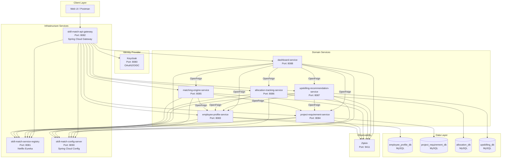
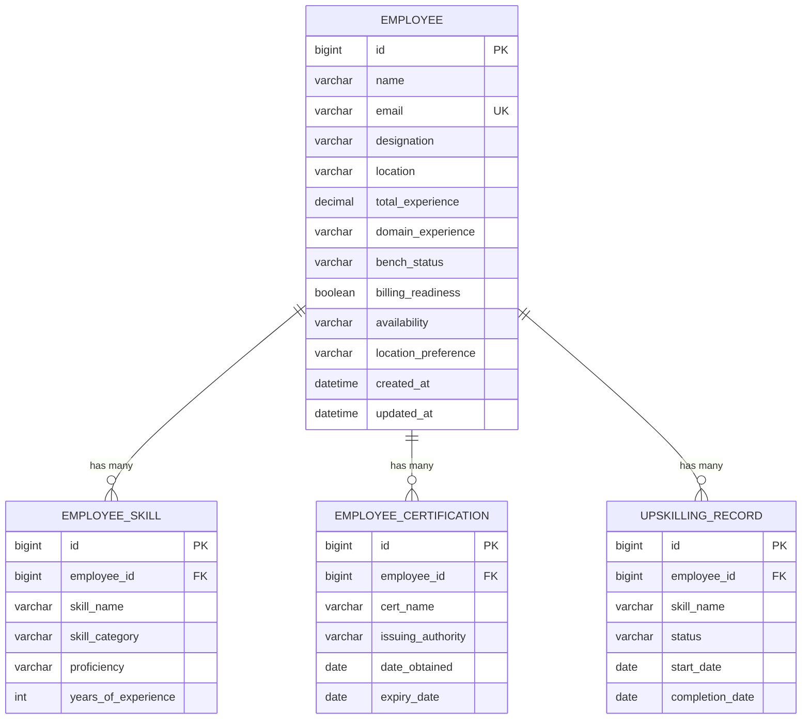
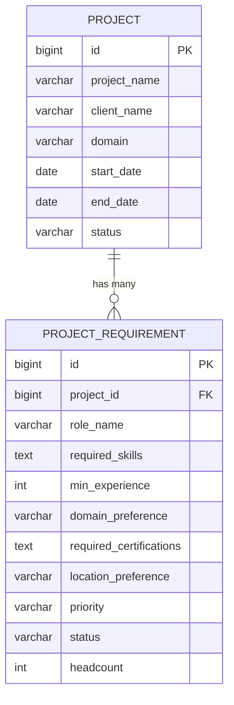
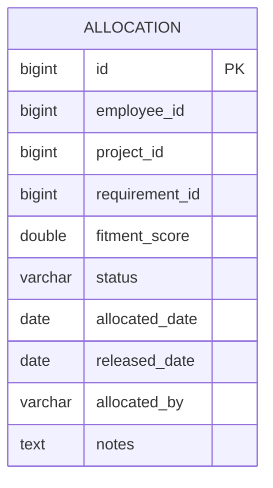
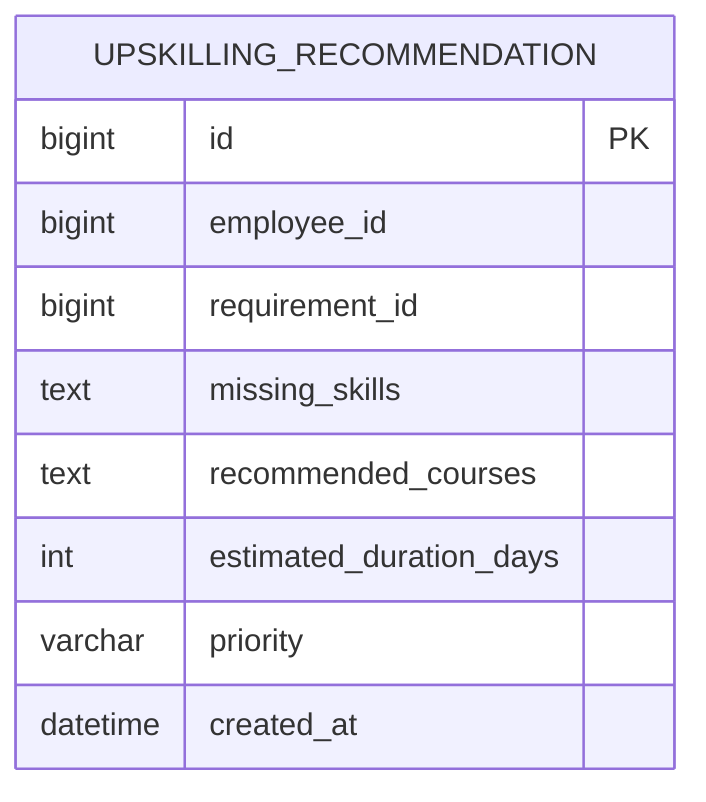

# Employee Skill Match Platform — End-to-End Design Document

## Table of Contents

- [1. Executive Summary](#1-executive-summary)
- [2. High-Level Architecture](#2-high-level-architecture)
- [3. Technology Stack Specifications](#3-technology-stack-specifications)
- [4. Infrastructure Services](#4-infrastructure-services)
- [5. Domain Services](#5-domain-services)
  - [5.1 Employee Profile Service](#51-employee-profile-service-port-8083)
  - [5.2 Project Requirement Service](#52-project-requirement-service-port-8084)
  - [5.3 Matching Engine Service](#53-matching-engine-service-port-8085)
  - [5.4 Allocation Tracking Service](#54-allocation-tracking-service-port-8086)
  - [5.5 Upskilling Recommendation Service](#55-upskilling-recommendation-service-port-8087)
  - [5.6 Dashboard Service](#56-dashboard-service-port-8088)
- [6. Database Design](#6-database-design)
- [7. API Gateway & Security](#7-api-gateway--security)
- [8. Fitment Score Algorithm](#8-fitment-score-algorithm)
- [9. Matching Factors Reference](#9-matching-factors-reference)
- [10. Docker Compose & Deployment](#10-docker-compose--deployment)
- [11. Project Directory Structure](#11-project-directory-structure)
- [12. Testing Strategy](#12-testing-strategy)
- [13. End-to-End Workflow](#13-end-to-end-workflow)
- [14. Postman Collection Specification](#14-postman-collection-specification)
- [15. Implementation Roadmap](#15-implementation-roadmap)

---

## 1. Executive Summary

### Business Problem

Service companies (IT consulting, staffing firms, system integrators) face critical workforce allocation challenges:

- **Skill mismatch**: Employees on the bench possess skills that don't align with open project demands, leading to prolonged bench time and revenue loss.
- **Delayed staffing**: Manual processes to identify suitable candidates for project requirements take days or weeks, causing project delays and client dissatisfaction.
- **Bench employees not matched to open demands**: Resource managers lack visibility into the full bench pool and open requirements simultaneously, resulting in missed allocation opportunities.
- **Manual Excel/email-based allocation**: Current processes rely on spreadsheets, email threads, and tribal knowledge — error-prone, non-auditable, and unscalable.

### Goal

Build a **rule-based matching engine** that recommends best-fit employees for project demands with **fitment scoring**. The platform will:

- Automatically match bench employees to open project requirements based on weighted criteria (skills, experience, domain, certifications, availability, location).
- Generate a fitment score (0–100) for each employee-requirement pair, enabling data-driven allocation decisions.
- Track allocations through their lifecycle (PROPOSED → CONFIRMED → RELEASED).
- Recommend upskilling paths for partial matches to increase future staffing options.
- Provide real-time dashboards for workforce analytics.

### Target Users

| User Role | Primary Use Cases |
|-----------|-------------------|
| **Delivery Managers** | View project staffing recommendations, confirm/reject allocations, track project fulfillment |
| **Resource Managers** | Manage bench pool, run matching for open demands, compare candidates, optimize utilization |
| **HR Teams** | Monitor bench metrics, track upskilling progress, generate workforce analytics reports |

---

## 2. High-Level Architecture

### System Architecture Diagram



### Architecture Principles

- **Database-per-service**: Each domain service owns its MySQL database. No shared schemas.
- **API Gateway as single entry point**: All external traffic enters via the Spring Cloud Gateway, which enforces OAuth2/JWT authentication before routing to downstream services.
- **Synchronous inter-service communication**: Services communicate via OpenFeign declarative REST clients, discovered dynamically through Eureka.
- **Centralized configuration**: All service configs are externalized to a Git-backed Spring Cloud Config Server.
- **Distributed tracing**: Every request is traced across services using Zipkin + Micrometer for end-to-end observability.

### High-Level Data Flow

1. **UI → API Gateway** (port 8082): All client requests enter through the gateway.
2. **API Gateway → Keycloak**: The gateway validates OAuth2/JWT tokens before routing.
3. **API Gateway → Domain Services**: Authenticated requests are forwarded with an `X-Auth-Id` header identifying the user.
4. **matching-engine-service → employee-profile-service + project-requirement-service**: The stateless matching engine fetches employee and requirement data via OpenFeign for fitment calculation.
5. **allocation-tracking-service → employee-profile-service**: When an allocation is confirmed/released, the allocation service updates the employee's bench status.
6. **dashboard-service → All Domain Services**: Aggregates data from all services for analytics dashboards.
7. **All services → service-registry**: Every service registers with Eureka and discovers peers dynamically.
8. **All services → config-server**: Configuration is pulled at startup via `bootstrap.yml` profiles.

---

## 3. Technology Stack Specifications

### Reference Architecture

All technology choices and dependency patterns are derived directly from the existing **Internet Banking Microservices** codebase:

- **Build configuration pattern**: `core-banking-service/build.gradle` (lines 1–68) — standard Spring Boot 3.2.4 + Spring Cloud 2023.0.0 setup with Eureka, Config, Flyway, MySQL, H2 test, Lombok, and Zipkin tracing.
- **OpenFeign pattern**: `internet-banking-fund-transfer-service/build.gradle` (lines 1–63) — adds Spring Cloud OpenFeign for inter-service communication.
- **Controller pattern**: `internet-banking-user-service/.../UserController.java` — `@RestController` with `@Tag`, `@Operation`, `@RequestMapping`, and `ResponseEntity` returns.
- **Service layer pattern**: `internet-banking-user-service/.../UserService.java` — `@Service` with `@RequiredArgsConstructor`, repository injection, mapper-based DTO conversion.
- **Exception handling pattern**: `core-banking-service/.../GlobalExceptionHandler.java` — `@ControllerAdvice` extending `ResponseEntityExceptionHandler` with custom and generic exception handlers.
- **Gateway pattern**: `internet-banking-api-gateway/.../GatewayConfiguration.java` — `GlobalFilter` bean that extracts the authenticated principal and propagates `X-Auth-Id` to downstream services.
- **Database migration pattern**: `core-banking-service/src/main/resources/db/migration/V1.0.20210427174638__create_base_table_structure.sql` — Flyway versioned migrations with MySQL DDL.
- **Docker Compose pattern**: `docker-compose/docker-compose.yml` — Zipkin, Keycloak + PostgreSQL, MySQL with init script, `wait-for-it.sh` entrypoints, custom bridge network (172.25.0.0/16).

### Technology Stack Table

| Layer | Technology | Version | Purpose |
|-------|-----------|---------|---------|
| **Language** | Java | 21 | Primary development language |
| **Framework** | Spring Boot | 3.2.4 | Application framework |
| **Cloud** | Spring Cloud | 2023.0.0 | Microservices infrastructure |
| **Build** | Gradle | 8.6 | Build automation (per-service wrapper) |
| **Service Discovery** | Netflix Eureka | Spring Cloud managed | Dynamic service registration and lookup |
| **API Gateway** | Spring Cloud Gateway | Spring Cloud managed | Edge routing and security enforcement |
| **Configuration** | Spring Cloud Config Server | Spring Cloud managed | Externalized centralized configuration |
| **Inter-Service Comm** | OpenFeign | Spring Cloud managed | Declarative REST clients between services |
| **Identity/Auth** | Keycloak | 23.0.7 | OAuth2/OIDC identity provider |
| **Database** | MySQL | 8.4 | Persistent relational data storage |
| **ORM** | Spring Data JPA + Hibernate | Spring Boot managed | Object-relational mapping |
| **Migrations** | Flyway | 10.12.0 | Database schema versioning and migrations |
| **Tracing** | Zipkin + Micrometer | 3 / Spring Boot managed | Distributed tracing across services |
| **API Documentation** | SpringDoc OpenAPI | 2.1.0 | Swagger UI and OpenAPI specification |
| **Containerization** | Docker + Docker Compose | Latest | Service containerization and orchestration |
| **Code Generation** | Lombok | Spring Boot managed | Boilerplate reduction (getters, builders, etc.) |
| **Testing** | JUnit 5 + Mockito + H2 | H2 2.2.224 | Unit and integration testing |

### Dependency Categories per Service Type

| Service Type | JPA/MySQL | OpenFeign | Eureka Client | Config Client | Actuator/Tracing | OpenAPI | Lombok |
|-------------|-----------|-----------|---------------|---------------|------------------|---------|--------|
| **Database-backed domain services** (employee, project, allocation, upskilling) | ✅ | ✅ (where calling others) | ✅ | ✅ | ✅ | ✅ | ✅ |
| **Stateless computation services** (matching-engine) | ❌ | ✅ | ✅ | ✅ | ✅ | ✅ | ✅ |
| **Aggregation-only services** (dashboard) | ❌ | ✅ | ✅ | ✅ | ✅ | ✅ | ✅ |
| **Infrastructure services** (registry, config, gateway) | ❌ | ❌ | Server/Client | Server/Client | ✅ | ❌ | ❌ |

---

## 4. Infrastructure Services

### 4.1 skill-match-service-registry (Port 8081)

**Purpose**: Netflix Eureka server for dynamic service registration and discovery. All microservices register themselves here at startup and discover peer services by name.

**Implementation**: A standalone Spring Boot application with `@EnableEurekaServer`. No business logic — purely infrastructure.

### 4.2 skill-match-config-server (Port 8090)

**Purpose**: Spring Cloud Config Server that serves externalized configuration properties from a Git repository. All services connect to this at startup via `bootstrap.yml` to load environment-specific settings (`dev`, `docker` profiles).

**Implementation**: A standalone Spring Boot application with `@EnableConfigServer` pointing to a Git repository containing `{service-name}-{profile}.yml` files.

### 4.3 skill-match-api-gateway (Port 8082)

**Purpose**: Single entry point for all external REST traffic. Handles OAuth2/JWT token validation via Keycloak, routes requests to the appropriate downstream service, and propagates the `X-Auth-Id` header.

**Implementation**:
- Spring Cloud Gateway with route definitions mapping URL prefixes to Eureka service names.
- OAuth2 resource server configuration pointing to the Keycloak realm.
- A `GlobalFilter` bean that extracts the authenticated principal and adds `X-Auth-Id` to proxied requests (following the pattern from `GatewayConfiguration.java`).

**Route Mappings**:

| URL Prefix | Target Service |
|-----------|----------------|
| `/employee/**` | employee-profile-service |
| `/project/**` | project-requirement-service |
| `/match/**` | matching-engine-service |
| `/allocation/**` | allocation-tracking-service |
| `/upskilling/**` | upskilling-recommendation-service |
| `/dashboard/**` | dashboard-service |

---

## 5. Domain Services

### 5.1 Employee Profile Service (Port 8083)

#### Purpose

Manages the complete lifecycle of employee profiles including skills inventory, certifications, upskilling records, and availability status. Acts as the **system of record** for all employee-related data used in the matching process.

#### Package Structure

`com.skillmatch.employee` with sub-packages: `controller`, `service`, `model.entity`, `model.dto`, `model.mapper`, `repository`, `exception`, `configuration`.

#### Entities

**Employee**

| Field | Type | Description |
|-------|------|-------------|
| id | Long (PK, auto-generated) | Primary key |
| name | String (not blank) | Full name |
| email | String (unique) | Corporate email |
| designation | String | Current job title |
| location | String | Current work location |
| totalExperience | BigDecimal | Total years of professional experience |
| domainExperience | String | Primary domain (Banking, Healthcare, Retail, etc.) |
| benchStatus | Enum: `BENCH`, `BILLABLE` | Current billing status |
| billingReadiness | Boolean | Whether employee is immediately deployable |
| availability | Enum: `AVAILABLE`, `PARTIALLY_AVAILABLE`, `NOT_AVAILABLE` | Current availability |
| locationPreference | String | Preferred work location |
| createdAt | LocalDateTime | Record creation timestamp |
| updatedAt | LocalDateTime | Last update timestamp |

**EmployeeSkill**

| Field | Type | Description |
|-------|------|-------------|
| id | Long (PK) | Primary key |
| employeeId | Long (FK → Employee) | Employee reference |
| skillName | String | Name of the skill (e.g., "Java", "Spring Boot") |
| skillCategory | Enum: `PRIMARY`, `SECONDARY` | Skill classification |
| proficiency | Enum: `BEGINNER`, `INTERMEDIATE`, `EXPERT` | Proficiency level |
| yearsOfExperience | Integer | Years using this skill |

**EmployeeCertification**

| Field | Type | Description |
|-------|------|-------------|
| id | Long (PK) | Primary key |
| employeeId | Long (FK → Employee) | Employee reference |
| certName | String | Certification name |
| issuingAuthority | String | Issuing organization |
| dateObtained | LocalDate | Date earned |
| expiryDate | LocalDate (nullable) | Expiry date |

**UpskillingRecord**

| Field | Type | Description |
|-------|------|-------------|
| id | Long (PK) | Primary key |
| employeeId | Long (FK → Employee) | Employee reference |
| skillName | String | Skill being learned |
| status | Enum: `IN_PROGRESS`, `COMPLETED` | Training status |
| startDate | LocalDate | Training start date |
| completionDate | LocalDate (nullable) | Completion date |

#### Key Repository Queries

- `findByBenchStatusAndAvailability(BenchStatus, Availability)` — find employees by bench status and availability combination.
- `findBySkillsAndBenchStatus(List<String> skills, BenchStatus status)` — custom JPQL query joining Employee with EmployeeSkill to find employees possessing specific skills.
- `findAllAvailableEmployees()` — custom query for BENCH employees with AVAILABLE or PARTIALLY_AVAILABLE status.

#### REST API Endpoints

| Method | Path | Description | Status Codes |
|--------|------|-------------|--------------|
| POST | `/api/v1/employees` | Create new employee profile | 200, 400 |
| GET | `/api/v1/employees/{id}` | Get employee by ID | 200, 404 |
| GET | `/api/v1/employees?status=BENCH&skills=Java,Spring Boot` | Search employees by status and skills | 200 |
| PATCH | `/api/v1/employees/{id}` | Partially update employee profile | 200, 404 |
| GET | `/api/v1/employees/{id}/skills` | Get all skills for an employee | 200, 404 |
| POST | `/api/v1/employees/{id}/skills` | Add a skill to an employee | 200, 404 |
| GET | `/api/v1/employees/available` | Get all available bench employees | 200 |

**Sample — Create Employee Request/Response:**

| Field | Request | Response |
|-------|---------|----------|
| name | "Rajesh Kumar" | "Rajesh Kumar" |
| email | "rajesh.kumar@company.com" | "rajesh.kumar@company.com" |
| designation | "Senior Software Engineer" | "Senior Software Engineer" |
| location | "Bangalore" | "Bangalore" |
| totalExperience | 8.0 | 8.0 |
| domainExperience | "Banking" | "Banking" |
| benchStatus | "BENCH" | "BENCH" |
| billingReadiness | true | true |
| availability | "AVAILABLE" | "AVAILABLE" |
| id | — | 1 (auto-generated) |
| skills | — | [] (empty initially) |
| createdAt | — | "2024-01-15T10:30:00" |

#### Implementation Notes

- **Controller pattern**: Follow `UserController.java` — use `@Slf4j`, `@Tag`, `@Operation`, `@RestController`, `@RequestMapping`, `@RequiredArgsConstructor`. Return `ResponseEntity<T>`.
- **Service pattern**: Follow `UserService.java` — use `@Service`, inject repositories and mapper, throw custom exceptions for not-found cases.
- **Exception handling**: Follow `GlobalExceptionHandler.java` — use `@ControllerAdvice` extending `ResponseEntityExceptionHandler`, handle domain-specific exceptions with structured `ErrorResponse` (code + message), and a generic `Exception.class` catch-all.

---

### 5.2 Project Requirement Service (Port 8084)

#### Purpose

Manages projects and their staffing requirements. Stores project metadata (client, domain, dates) and detailed requirement specifications (skills needed, experience levels, headcount) that the matching engine uses to find suitable candidates.

#### Package Structure

`com.skillmatch.project` with sub-packages: `controller`, `service`, `model.entity`, `model.dto`, `model.mapper`, `repository`, `exception`, `configuration`.

#### Entities

**Project**

| Field | Type | Description |
|-------|------|-------------|
| id | Long (PK) | Primary key |
| projectName | String (not blank) | Project name |
| clientName | String (not blank) | Client organization |
| domain | String | Industry domain |
| startDate | LocalDate | Project start date |
| endDate | LocalDate | Expected end date |
| status | Enum: `OPEN`, `IN_PROGRESS`, `CLOSED` | Current status |

**ProjectRequirement**

| Field | Type | Description |
|-------|------|-------------|
| id | Long (PK) | Primary key |
| projectId | Long (FK → Project) | Project reference |
| roleName | String (not blank) | Role title (e.g., "Senior Java Developer") |
| requiredSkills | TEXT (JSON array) | Required skills as JSON |
| minExperience | Integer | Minimum years of experience |
| domainPreference | String | Preferred domain experience |
| requiredCertifications | TEXT (JSON array) | Required certifications as JSON |
| locationPreference | String | Preferred location |
| priority | Enum: `HIGH`, `MEDIUM`, `LOW` | Requirement urgency |
| status | Enum: `OPEN`, `FILLED`, `PARTIALLY_FILLED` | Fulfillment status |
| headcount | Integer | Number of positions |

#### REST API Endpoints

| Method | Path | Description | Status Codes |
|--------|------|-------------|--------------|
| POST | `/api/v1/projects` | Create a new project | 200, 400 |
| GET | `/api/v1/projects/{id}` | Get project by ID | 200, 404 |
| GET | `/api/v1/projects?status=OPEN` | List projects by status | 200 |
| POST | `/api/v1/projects/{id}/requirements` | Add requirement to a project | 200, 404 |
| GET | `/api/v1/projects/{id}/requirements` | Get all requirements for a project | 200, 404 |
| GET | `/api/v1/requirements/open` | Get all open requirements | 200 |

**Sample — Create Project:**

| Field | Value |
|-------|-------|
| projectName | "Project Alpha" |
| clientName | "TechBank" |
| domain | "Banking" |
| startDate | "2024-03-01" |
| endDate | "2024-12-31" |
| status | "OPEN" |

**Sample — Add Requirement:**

| Field | Value |
|-------|-------|
| roleName | "Senior Java Developer" |
| requiredSkills | `["Java", "Spring Boot", "Microservices", "Kafka", "AWS"]` |
| minExperience | 5 |
| domainPreference | "Banking" |
| requiredCertifications | `["AWS Solutions Architect"]` |
| locationPreference | "Bangalore" |
| priority | "HIGH" |
| headcount | 2 |

#### Implementation Notes

- **Controller pattern**: Follow `FundTransferController.java` — concise `@RestController` with `@PostMapping` and `@GetMapping`.
- Repository for `ProjectRequirement` should include a custom query to find all OPEN requirements ordered by priority descending.

---

### 5.3 Matching Engine Service (Port 8085)

#### Purpose

**Stateless computation service** that calculates fitment scores by comparing employee profiles against project requirements. This service does **NOT have its own database or JPA** — it retrieves all data via OpenFeign calls to the employee and project services.

#### Package Structure

`com.skillmatch.matching` with sub-packages: `controller`, `service`, `client`, `model.dto`, `exception`, `configuration`.

#### Dependencies (No JPA/MySQL)

This service only needs: `spring-boot-starter-web`, `spring-cloud-starter-openfeign`, `spring-cloud-starter-netflix-eureka-client`, `spring-cloud-starter-config`, `spring-cloud-starter-bootstrap`, `spring-boot-starter-actuator`, `micrometer-tracing-bridge-brave`, `zipkin-reporter-brave`, `feign-micrometer`, `springdoc-openapi`, `lombok`.

#### OpenFeign Clients

- **EmployeeServiceClient** (`@FeignClient(name = "employee-profile-service")`):
  - `GET /api/v1/employees/{id}` — get employee by ID
  - `GET /api/v1/employees/available` — get all available employees
  - `GET /api/v1/employees?status={status}&skills={skills}` — search employees
  - `GET /api/v1/employees/{id}/skills` — get employee skills

- **ProjectServiceClient** (`@FeignClient(name = "project-requirement-service")`):
  - `GET /api/v1/projects/{id}` — get project by ID
  - `GET /api/v1/projects/{id}/requirements` — get project requirements
  - `GET /api/v1/requirements/open` — get all open requirements

#### Fitment Score Calculator

A `@Component` that implements the weighted scoring algorithm (see [Section 8](#8-fitment-score-algorithm) for full details). Takes an employee DTO and a requirement DTO, returns a `MatchResultDto`.

#### Output: MatchResultDto

| Field | Type | Description |
|-------|------|-------------|
| employeeId | Long | Matched employee's ID |
| employeeName | String | Employee name |
| fitmentScore | Double | Score from 0–100 |
| matchedSkills | List\<String\> | Skills the employee has that match the requirement |
| missingSkills | List\<String\> | Skills required but not possessed |
| recommendation | String | "STRONG_MATCH" (≥80), "GOOD_MATCH" (≥60), "PARTIAL_MATCH" (≥40), "WEAK_MATCH" (<40) |

#### REST API Endpoints

| Method | Path | Description | Status Codes |
|--------|------|-------------|--------------|
| GET | `/api/v1/match/project/{projectId}/requirement/{reqId}` | Match all available employees to a specific requirement, return sorted by fitment score | 200, 404 |
| POST | `/api/v1/match/bulk` | Bulk match: match employees to multiple requirements at once | 200 |
| GET | `/api/v1/match/employee/{employeeId}` | Find all matching open requirements for a specific employee | 200, 404 |

#### Implementation Notes

- The matching service should fetch available employees and the target requirement, then call `FitmentScoreCalculator.calculateFitment()` for each employee, sort results descending by score, and return the top matches.
- For bulk matching, iterate over all requirement IDs and return a map of `requirementId → List<MatchResultDto>`.

---

### 5.4 Allocation Tracking Service (Port 8086)

#### Purpose

Tracks the lifecycle of employee-to-project allocations from initial proposal through confirmation to release. Manages the status workflow and triggers side-effects (updating employee bench status) via OpenFeign calls to `employee-profile-service`.

#### Package Structure

`com.skillmatch.allocation` with sub-packages: `controller`, `service`, `client`, `model.entity`, `model.dto`, `model.mapper`, `repository`, `exception`, `configuration`.

#### Entity: Allocation

| Field | Type | Description |
|-------|------|-------------|
| id | Long (PK) | Primary key |
| employeeId | Long | Employee reference |
| projectId | Long | Project reference |
| requirementId | Long | Project requirement reference |
| fitmentScore | Double | Score at time of allocation |
| status | Enum: `PROPOSED`, `CONFIRMED`, `REJECTED`, `RELEASED` | Allocation status |
| allocatedDate | LocalDate | Date of allocation |
| releasedDate | LocalDate (nullable) | Date of release |
| allocatedBy | String | User who made the allocation |
| notes | TEXT | Additional notes |

#### Status Workflow

```
PROPOSED → CONFIRMED  (Manager approves the allocation)
PROPOSED → REJECTED   (Manager rejects the allocation)
CONFIRMED → RELEASED  (Employee released from the project)
```

**Side Effects (via OpenFeign to employee-profile-service):**

| Transition | Action |
|-----------|--------|
| **→ CONFIRMED** | Update employee: `benchStatus = BILLABLE`, `availability = NOT_AVAILABLE` |
| **→ RELEASED** | Update employee: `benchStatus = BENCH`, `availability = AVAILABLE` |

#### REST API Endpoints

| Method | Path | Description | Status Codes |
|--------|------|-------------|--------------|
| POST | `/api/v1/allocations` | Create new allocation (status = PROPOSED) | 200, 400 |
| GET | `/api/v1/allocations?status=CONFIRMED` | List allocations by status | 200 |
| PATCH | `/api/v1/allocations/{id}/status` | Update allocation status (with transition validation) | 200, 400, 404 |
| GET | `/api/v1/allocations/employee/{employeeId}` | Get all allocations for an employee | 200 |
| GET | `/api/v1/allocations/project/{projectId}` | Get all allocations for a project | 200 |

#### Implementation Notes

- Validate status transitions: reject invalid transitions (e.g., REJECTED → CONFIRMED) with an `InvalidStatusTransitionException`.
- On CONFIRMED, call employee-profile-service via OpenFeign to update bench/availability status.
- On RELEASED, reverse the employee status change.

---

### 5.5 Upskilling Recommendation Service (Port 8087)

#### Purpose

Identifies skill gaps between employees and project requirements, then generates targeted upskilling recommendations with estimated timelines. Uses **rule-based course mapping** to suggest specific training paths.

#### Package Structure

`com.skillmatch.upskilling` with sub-packages: `controller`, `service`, `client`, `model.entity`, `model.dto`, `model.mapper`, `repository`, `exception`, `configuration`.

#### Entity: UpskillingRecommendation

| Field | Type | Description |
|-------|------|-------------|
| id | Long (PK) | Primary key |
| employeeId | Long | Employee reference |
| requirementId | Long | Project requirement reference |
| missingSkills | TEXT (JSON) | JSON array of skills the employee lacks |
| recommendedCourses | TEXT (JSON) | JSON array of course recommendations |
| estimatedDurationDays | Integer | Total estimated training duration |
| priority | Enum: `HIGH`, `MEDIUM`, `LOW` | Training priority |
| createdAt | LocalDateTime | Recommendation creation timestamp |

#### Rule-Based Course Mapping

The service maintains a static mapping of skills to recommended courses:

| Missing Skill | Recommended Course | Duration (days) |
|---------------|-------------------|-----------------|
| Kafka | Apache Kafka for Developers | 15 |
| AWS | AWS Solutions Architect Associate | 30 |
| Microservices | Microservices Architecture with Spring Cloud | 20 |
| Docker | Docker & Container Orchestration | 10 |
| Kubernetes | Certified Kubernetes Application Developer | 25 |
| Spring Boot | Spring Boot 3 Masterclass | 15 |
| React | React.js Advanced Patterns | 20 |
| Angular | Angular Enterprise Development | 20 |
| Python | Python for Enterprise Applications | 15 |
| ML | Machine Learning Engineering with Python | 45 |
| Node.js | Node.js Backend Development | 15 |
| TypeScript | TypeScript for Enterprise Apps | 10 |
| GraphQL | GraphQL API Design & Development | 12 |
| MongoDB | MongoDB for Developers | 10 |
| PostgreSQL | Advanced PostgreSQL | 12 |

#### REST API Endpoints

| Method | Path | Description | Status Codes |
|--------|------|-------------|--------------|
| GET | `/api/v1/upskilling/employee/{id}/requirement/{reqId}` | Get recommendations for employee vs requirement | 200, 404 |
| GET | `/api/v1/upskilling/employee/{id}` | Get all recommendations for an employee | 200 |
| POST | `/api/v1/upskilling/generate` | Generate new upskilling recommendations | 200, 400 |

#### Implementation Notes

- Fetch employee skills via OpenFeign, compare against requirement's required skills, identify the delta (missing skills).
- Map each missing skill to a course using the rule-based mapping table.
- Calculate total estimated duration by summing course durations.
- Persist the recommendation and return it.

---

### 5.6 Dashboard Service (Port 8088)

#### Purpose

**Aggregation-only service** that provides analytics and summary views by calling all other domain services via OpenFeign. Does **NOT have its own database**.

#### Package Structure

`com.skillmatch.dashboard` with sub-packages: `controller`, `service`, `client` (5 Feign clients), `model.dto`, `exception`, `configuration`.

#### OpenFeign Clients

- **EmployeeServiceClient** — fetch bench employees, skills data
- **ProjectServiceClient** — fetch open projects and requirements
- **MatchingServiceClient** — fetch match results for recommendations
- **AllocationServiceClient** — fetch allocation statistics
- **UpskillingServiceClient** — fetch upskilling recommendations

#### REST API Endpoints

| Method | Path | Description | Response Summary |
|--------|------|-------------|-----------------|
| GET | `/api/v1/dashboard/bench-summary` | Bench employee analytics | Total bench count, available/partial/not-available breakdown, by-domain distribution, top skills on bench |
| GET | `/api/v1/dashboard/open-requirements-summary` | Open requirements overview | Total open requirements, by-priority breakdown, top demanded skills, by-domain distribution |
| GET | `/api/v1/dashboard/allocation-stats` | Allocation statistics | Total/confirmed/proposed/rejected/released counts, avg fitment score, bench utilization rate |
| GET | `/api/v1/dashboard/skill-heatmap` | Skill supply vs demand | For each skill: bench count, demand count, gap ratio (positive = demand exceeds supply) |
| GET | `/api/v1/dashboard/project/{projectId}/recommendations` | Top recommendations for project | Top matched employees per requirement with fitment scores |

---

## 6. Database Design

### ER Diagrams

#### employee_profile_db



#### project_requirement_db



#### allocation_db



#### upskilling_db



### Flyway Migration Files

All DDL follows the Flyway versioned migration pattern from the reference codebase (`V{version}__{description}.sql`). Each database service has its own `src/main/resources/db/migration/` folder.

#### employee_profile_db Tables

| Table | Primary Key | Foreign Keys | Key Columns |
|-------|-------------|-------------|-------------|
| `employee` | `id` (bigint, auto-increment) | — | `email` (unique), `bench_status` (varchar 50, default 'BENCH'), `availability` (varchar 50, default 'AVAILABLE'), `total_experience` (decimal 5,2) |
| `employee_skill` | `id` (bigint, auto-increment) | `employee_id` → `employee(id)` | `skill_name`, `skill_category` (default 'PRIMARY'), `proficiency` (default 'INTERMEDIATE'), `years_of_experience` |
| `employee_certification` | `id` (bigint, auto-increment) | `employee_id` → `employee(id)` | `cert_name`, `issuing_authority`, `date_obtained`, `expiry_date` |
| `upskilling_record` | `id` (bigint, auto-increment) | `employee_id` → `employee(id)` | `skill_name`, `status` (default 'IN_PROGRESS'), `start_date`, `completion_date` |

#### project_requirement_db Tables

| Table | Primary Key | Foreign Keys | Key Columns |
|-------|-------------|-------------|-------------|
| `project` | `id` (bigint, auto-increment) | — | `project_name`, `client_name`, `domain`, `status` (default 'OPEN') |
| `project_requirement` | `id` (bigint, auto-increment) | `project_id` → `project(id)` | `role_name`, `required_skills` (text/JSON), `min_experience`, `priority` (default 'MEDIUM'), `status` (default 'OPEN'), `headcount` |

#### allocation_db Tables

| Table | Primary Key | Indexes | Key Columns |
|-------|-------------|---------|-------------|
| `allocation` | `id` (bigint, auto-increment) | `idx_allocation_employee`, `idx_allocation_project`, `idx_allocation_status` | `employee_id`, `project_id`, `requirement_id`, `fitment_score`, `status` (default 'PROPOSED') |

#### upskilling_db Tables

| Table | Primary Key | Indexes | Key Columns |
|-------|-------------|---------|-------------|
| `upskilling_recommendation` | `id` (bigint, auto-increment) | `idx_upskilling_employee`, `idx_upskilling_requirement` | `employee_id`, `requirement_id`, `missing_skills` (text), `recommended_courses` (text), `estimated_duration_days`, `priority` |

### Sample Seed Data

The seed migration files should include:

**Employees (18 records):**

| Name | Designation | Location | Experience | Domain | Status | Skills (Primary) |
|------|------------|----------|------------|--------|--------|-------------------|
| Rajesh Kumar | Senior Software Engineer | Bangalore | 8 yr | Banking | BENCH | Java (8yr), Spring Boot (5yr), Microservices (4yr) |
| Priya Sharma | Data Scientist | Hyderabad | 6 yr | Healthcare | BENCH | Python (6yr), ML (3yr) |
| Amit Patel | Software Engineer | Pune | 5 yr | Banking | BENCH | Java (5yr), Spring Boot (3yr), Microservices (2yr) |
| Sneha Reddy | Full Stack Developer | Bangalore | 4 yr | Retail | BENCH (partial) | Angular (3yr), TypeScript (3yr), Node.js (2yr) |
| Vikram Singh | DevOps Engineer | Chennai | 7 yr | Telecom | BENCH | Docker (5yr), Kubernetes (4yr), AWS (5yr) |
| Ananya Mishra | Frontend Developer | Mumbai | 3.5 yr | Insurance | BENCH | React (3yr), TypeScript (3yr) |
| Karthik Nair | Tech Lead | Bangalore | 10 yr | Banking | BILLABLE | Java (10yr), Spring Boot (7yr), Microservices (6yr) |
| Deepa Iyer | Backend Developer | Hyderabad | 5.5 yr | Healthcare | BENCH | Python (5yr), Django (3yr) |
| Rohit Mehta | Cloud Architect | Pune | 9 yr | Banking | BENCH | AWS (7yr), Java (9yr), Spring Boot (6yr), Kafka (3yr), Microservices (5yr) |
| Neha Gupta | QA Automation Engineer | Noida | 4.5 yr | Retail | BENCH | Selenium (4yr), Java (3yr) |
| Suresh Babu | Microservices Developer | Chennai | 6.5 yr | Banking | BENCH | Java (6yr), Spring Boot (4yr), Microservices (5yr) |
| Lakshmi Venkat | ML Engineer | Bangalore | 5 yr | Healthcare | BENCH (partial) | Python (5yr), ML (4yr), TensorFlow (3yr) |
| Arjun Kapoor | Java Developer | Mumbai | 3 yr | Insurance | BENCH | Java (3yr), Spring Boot (1yr) |
| Meera Joshi | Senior Data Engineer | Hyderabad | 7.5 yr | Telecom | BENCH | Python (6yr), SQL (7yr), Kafka (3yr), Spark (4yr) |
| Sanjay Rao | Solutions Architect | Bangalore | 12 yr | Banking | BENCH | Java (12yr), Spring Boot (8yr), Microservices (7yr), AWS (5yr) |
| Divya Krishnan | Angular Developer | Chennai | 4 yr | Retail | BENCH | Angular (4yr), TypeScript (3yr) |
| Pranav Desai | Node.js Developer | Pune | 3.5 yr | Insurance | BENCH | Node.js (3yr), TypeScript (3yr) |
| Kavitha Ram | Spring Boot Developer | Bangalore | 5.5 yr | Banking | BENCH | Java (5yr), Spring Boot (5yr) |

**Certifications:** AWS Solutions Architect (Rajesh, Rohit, Vikram), CKA (Vikram), Google ML Engineer (Priya), Spring Professional (Rohit).

**Upskilling Records:** Rajesh — Kafka (IN_PROGRESS), Amit — Kafka (IN_PROGRESS), Amit — AWS (IN_PROGRESS).

**Projects (6 records):**

| Project | Client | Domain | Status | Requirements |
|---------|--------|--------|--------|-------------|
| Project Alpha | TechBank | Banking | OPEN | Senior Java Developer (Java, Spring Boot, Microservices, Kafka, AWS — 5yr — HIGH — 2 headcount), DevOps Engineer (Docker, K8s, AWS, Terraform — 4yr — MEDIUM — 1) |
| Project Beta | HealthPlus | Healthcare | OPEN | ML Engineer (Python, ML, TensorFlow, AWS — 4yr — HIGH — 2), Data Engineer (Python, SQL, Kafka, Spark — 5yr — MEDIUM — 1) |
| Project Gamma | RetailMax | Retail | IN_PROGRESS | Full Stack Developer (Angular, TypeScript, Node.js, MongoDB — 3yr — HIGH — 2), React Developer (React, TypeScript, Node.js — 3yr — MEDIUM — 1) |
| Project Delta | InsureCo | Insurance | OPEN | Java Microservices Developer (Java, Spring Boot, Microservices, Docker — 3yr — MEDIUM — 3) |
| Project Epsilon | TeleConnect | Telecom | OPEN | Cloud Architect (AWS, K8s, Docker, Terraform, Microservices — 7yr — HIGH — 1) |
| Project Zeta | FinServe | Banking | OPEN | (additional requirements) |

---

## 7. API Gateway & Security

### Route Definitions

The API Gateway uses Spring Cloud Gateway route definitions to map URL path prefixes to Eureka-registered service names using load-balanced URIs (`lb://service-name`).

| Route ID | Predicate | Target | Rewrite |
|----------|-----------|--------|---------|
| employee-profile-service | `/employee/**` | `lb://employee-profile-service` | Strip `/employee` prefix |
| project-requirement-service | `/project/**` | `lb://project-requirement-service` | Strip `/project` prefix |
| matching-engine-service | `/match/**` | `lb://matching-engine-service` | Strip `/match` prefix |
| allocation-tracking-service | `/allocation/**` | `lb://allocation-tracking-service` | Strip `/allocation` prefix |
| upskilling-recommendation-service | `/upskilling/**` | `lb://upskilling-recommendation-service` | Strip `/upskilling` prefix |
| dashboard-service | `/dashboard/**` | `lb://dashboard-service` | Strip `/dashboard` prefix |

### Keycloak OAuth2 Integration

- **Realm**: `skill-match-realm`
- **Client**: `skill-match-client`
- **JWT Issuer URI**: `http://keycloak_web:8080/realms/skill-match-realm`
- **JWK Set URI**: `http://keycloak_web:8080/realms/skill-match-realm/protocol/openid-connect/certs`

The gateway is configured as an OAuth2 resource server that validates JWT tokens from Keycloak before routing requests.

### X-Auth-Id Header Propagation

Following the `GatewayConfiguration.java` pattern from the reference codebase:

- A `GlobalFilter` bean extracts the authenticated principal name from the JWT.
- If unauthenticated, defaults to `"SYSTEM USER"`.
- Adds the `X-Auth-Id` header to all proxied requests so downstream services know who the caller is without needing to re-parse the JWT.

---

## 8. Fitment Score Algorithm

### Weighted Scoring Model

The fitment score is a **weighted composite of 9 matching factors**, each scored from 0.0 to 1.0 and multiplied by its weight to produce a final score (0–100).

| # | Factor | Weight | Scoring Logic |
|---|--------|--------|---------------|
| 1 | Primary Skill Match | **25%** | (matched primary skills ÷ total required skills) |
| 2 | Secondary Skill Match | **10%** | (matched secondary skills ÷ total required skills) |
| 3 | Years of Experience | **15%** | min(1.0, employee_experience ÷ required_experience). Defaults to 1.0 if no minimum required. |
| 4 | Domain Experience | **15%** | 1.0 if exact domain match, 0.5 if related domain, 0.0 otherwise |
| 5 | Certifications | **10%** | (matched certifications ÷ required certifications). Defaults to 1.0 if none required. |
| 6 | Availability | **10%** | AVAILABLE = 1.0, PARTIALLY_AVAILABLE = 0.5, NOT_AVAILABLE = 0.0 |
| 7 | Location Preference | **5%** | 1.0 if same city, 0.5 if same region, 0.0 otherwise |
| 8 | Billing Readiness | **5%** | 1.0 if billing-ready, 0.0 otherwise |
| 9 | Upskilling Status | **5%** | 1.0 if completed upskilling on a missing skill, 0.5 if in-progress, 0.0 otherwise |

**Total = 100%**

### Scoring Algorithm (Pseudocode)

1. Parse required skills from the requirement's JSON array.
2. Separate employee skills into PRIMARY and SECONDARY sets.
3. Calculate each factor score (0.0–1.0) based on the rules above.
4. Compute weighted sum: `Σ(factor_score × weight)`.
5. Scale to 0–100: `fitmentScore = weightedSum × 100`.
6. Categorize: ≥80 = STRONG_MATCH, ≥60 = GOOD_MATCH, ≥40 = PARTIAL_MATCH, <40 = WEAK_MATCH.
7. Return `MatchResultDto` with score, matched/missing skills, and recommendation.

### Worked Example

**Employee: Rajesh Kumar**
- Primary skills: Java (8yr), Spring Boot (5yr), Microservices (4yr)
- Secondary skills: AWS (3yr), Docker (3yr), MySQL (6yr)
- Domain: Banking | Certifications: AWS Solutions Architect Associate
- Availability: AVAILABLE | Location: Bangalore | Billing ready: true
- Upskilling: Kafka (IN_PROGRESS)

**Requirement: Project Alpha — Senior Java Developer**
- Required: Java, Spring Boot, Microservices, Kafka, AWS | Min 5 years | Banking domain
- Required cert: AWS Solutions Architect | Location: Bangalore

| Factor | Calculation | Score |
|--------|-------------|-------|
| Primary Skill Match | {Java, Spring Boot, Microservices} matched out of 5 required = 3/5 | 0.60 |
| Secondary Skill Match | {AWS} matched out of 5 required = 1/5 | 0.20 |
| Years of Experience | min(1.0, 8.0/5) = 1.0 | 1.00 |
| Domain Experience | "Banking" == "Banking" → exact match | 1.00 |
| Certifications | "AWS SA Associate" matches "AWS SA" → 1/1 | 1.00 |
| Availability | AVAILABLE | 1.00 |
| Location Preference | "Bangalore" == "Bangalore" | 1.00 |
| Billing Readiness | true | 1.00 |
| Upskilling Status | "Kafka" missing and IN_PROGRESS | 0.50 |

**Weighted Sum:**

| Factor | Score × Weight | Contribution |
|--------|---------------|--------------|
| Primary Skill | 0.60 × 0.25 | 0.150 |
| Secondary Skill | 0.20 × 0.10 | 0.020 |
| Experience | 1.00 × 0.15 | 0.150 |
| Domain | 1.00 × 0.15 | 0.150 |
| Certifications | 1.00 × 0.10 | 0.100 |
| Availability | 1.00 × 0.10 | 0.100 |
| Location | 1.00 × 0.05 | 0.050 |
| Billing | 1.00 × 0.05 | 0.050 |
| Upskilling | 0.50 × 0.05 | 0.025 |
| **Total** | | **0.795** |

**Fitment Score = 0.795 × 100 = 79.5 → GOOD_MATCH** (just below the 80 threshold for STRONG_MATCH)

### Edge Cases

| Scenario | Handling |
|----------|----------|
| Zero required skills | Primary and secondary skill scores default to 1.0 |
| Zero experience required | Experience score defaults to 1.0 |
| No certifications required | Certification score defaults to 1.0 |
| Employee has zero experience | Experience score = 0.0 |
| No matching skills at all | Primary = 0.0, secondary = 0.0 → low fitment |
| Upskilling completed for missing skill | Full 1.0 bonus for upskilling factor |
| Partially available employee | 50% availability score reduces overall fitment |

---

## 9. Matching Factors Reference

| # | Factor | Definition | Weight | Possible Values |
|---|--------|-----------|--------|-----------------|
| 1 | **Primary Skills** | Core technical competencies classified as PRIMARY in the employee's profile. Primary drivers of project delivery capability. | 25% | 0.0 – 1.0 (ratio) |
| 2 | **Secondary Skills** | Supporting competencies classified as SECONDARY. Supplement primary skills for versatility. | 10% | 0.0 – 1.0 (ratio) |
| 3 | **Years of Experience** | Total professional experience vs. the requirement's minimum. Capped at 1.0. | 15% | 0.0 – 1.0 |
| 4 | **Domain Experience** | Industry/vertical expertise match (Banking, Healthcare, Retail, etc.). | 15% | 0.0, 0.5, 1.0 |
| 5 | **Certifications** | Professional certifications validating expertise, matched against requirements. | 10% | 0.0 – 1.0 (ratio) |
| 6 | **Current Availability** | Employee's current capacity for new project work. | 10% | 0.0, 0.5, 1.0 |
| 7 | **Location Preference** | Geographic alignment between employee preference and project requirement. | 5% | 0.0, 0.5, 1.0 |
| 8 | **Billing Readiness** | Whether the employee is immediately deployable without additional onboarding. | 5% | 0.0, 1.0 |
| 9 | **Upskilling Status** | Whether the employee is actively learning or has completed training for required skills. | 5% | 0.0, 0.5, 1.0 |

**Additional Context Factors (used for prioritization, not scoring):**

| Factor | Definition | Usage |
|--------|-----------|-------|
| **Project Demand/Priority** | Urgency level (HIGH/MEDIUM/LOW) of the requirement | Determines which requirements are matched first |
| **Role Requirement** | Specific job title being staffed | Used for filtering and display |
| **Bench/Billable Status** | Whether employee is currently on bench | Pre-filter: only BENCH employees are considered |

---

## 10. Docker Compose & Deployment

### Container Layout

Following the pattern from `docker-compose/docker-compose.yml` in the reference architecture, all services run in a custom bridge network (`172.25.0.0/16`).

| Container | Image | Port | IP | Notes |
|-----------|-------|------|-----|-------|
| skill_match_zipkin | openzipkin/zipkin:3 | 9411 | 172.25.0.20 | Distributed tracing |
| skill_match_keycloak | quay.io/keycloak/keycloak:23.0.7 | 8080 | 172.25.0.19 | Identity provider with realm import |
| skill_match_keycloak_db | postgres:15 | — (internal) | 172.25.0.18 | Keycloak backing store |
| skill_match_mysql | Custom (mysql:8.4 + init script) | 3306 | 172.25.0.17 | Application databases |
| skill-match-config-server | skillmatch/skill-match-config-server | 8090 | 172.25.0.16 | Centralized config |
| skill-match-service-registry | skillmatch/skill-match-service-registry | 8081 | 172.25.0.15 | Eureka |
| skill-match-api-gateway | skillmatch/skill-match-api-gateway | 8082 | 172.25.0.14 | Edge gateway |
| employee-profile-service | skillmatch/employee-profile-service | 8083 | 172.25.0.13 | Domain service |
| project-requirement-service | skillmatch/project-requirement-service | 8084 | 172.25.0.12 | Domain service |
| matching-engine-service | skillmatch/matching-engine-service | 8085 | 172.25.0.11 | Stateless service (no DB wait) |
| allocation-tracking-service | skillmatch/allocation-tracking-service | 8086 | 172.25.0.10 | Domain service |
| upskilling-recommendation-service | skillmatch/upskilling-recommendation-service | 8087 | 172.25.0.9 | Domain service |
| dashboard-service | skillmatch/dashboard-service | 8088 | 172.25.0.8 | Aggregation service (no DB wait) |

### Startup Ordering

All domain services use `wait-for-it.sh` entrypoints (following the reference architecture pattern) to wait for:
1. **service-registry** (port 8081) — for Eureka registration
2. **config-server** (port 8090) — for configuration loading
3. **mysql_db** (port 3306) — for database connectivity (only services with JPA)

Stateless services (matching-engine, dashboard) only wait for service-registry and config-server.

### MySQL Init Script

The MySQL container's `privileges.sql` creates the application user and four databases:

| Database | Used By |
|----------|---------|
| `employee_profile_db` | employee-profile-service |
| `project_requirement_db` | project-requirement-service |
| `allocation_db` | allocation-tracking-service |
| `upskilling_db` | upskilling-recommendation-service |

### Dockerfile Pattern

Each service uses a slim JDK base image (`eclipse-temurin:21-jre-alpine`), copies the built JAR, includes `wait-for-it.sh`, and exposes the appropriate port.

---

## 11. Project Directory Structure

### Full Multi-Project Gradle Layout

```
employee-skill-match-platform/
├── skill-match-config-server/           # Infrastructure: config server
│   ├── src/main/java/.../
│   ├── src/main/resources/
│   ├── Dockerfile
│   ├── build.gradle
│   └── gradlew
├── skill-match-service-registry/        # Infrastructure: Eureka
│   ├── src/main/java/.../
│   ├── src/main/resources/
│   ├── Dockerfile
│   ├── build.gradle
│   └── gradlew
├── skill-match-api-gateway/             # Infrastructure: gateway + security
│   ├── src/main/java/.../
│   │   └── configuration/GatewayConfiguration.java
│   ├── src/main/resources/
│   ├── Dockerfile
│   ├── build.gradle
│   └── gradlew
├── employee-profile-service/            # Domain: employee profiles
│   ├── src/main/java/.../
│   │   ├── controller/
│   │   ├── service/
│   │   ├── model/entity/, dto/, mapper/
│   │   ├── repository/
│   │   ├── exception/
│   │   └── configuration/
│   ├── src/main/resources/db/migration/
│   ├── src/test/java/.../
│   ├── Dockerfile
│   ├── build.gradle
│   └── gradlew
├── project-requirement-service/         # Domain: projects & requirements
│   ├── (same structure as above)
│   └── ...
├── matching-engine-service/             # Domain: stateless matching (no JPA)
│   ├── src/main/java/.../
│   │   ├── controller/
│   │   ├── service/ (FitmentScoreCalculator)
│   │   ├── client/ (OpenFeign clients)
│   │   ├── model/dto/
│   │   ├── exception/
│   │   └── configuration/
│   ├── src/test/java/.../
│   ├── Dockerfile
│   ├── build.gradle
│   └── gradlew
├── allocation-tracking-service/         # Domain: allocation lifecycle
│   ├── (same structure as employee-profile + client/)
│   └── ...
├── upskilling-recommendation-service/   # Domain: skill gap & courses
│   ├── (same structure as employee-profile + client/)
│   └── ...
├── dashboard-service/                   # Domain: aggregation only (no JPA)
│   ├── (same structure as matching-engine with 5 Feign clients)
│   └── ...
├── docker-compose/
│   ├── docker-compose.yml
│   ├── keycloak/skill-match-realm.json
│   └── mysql/
│       ├── Dockerfile
│       └── privileges.sql
├── postman_collection/
│   ├── Employee_Skill_Match_Platform.postman_collection.json
│   └── SKILL_MATCH_LOCAL_DOCKER.postman_environment.json
├── settings.gradle
├── build.gradle
└── README.md
```

### Package Structure Convention

Every domain service follows this internal structure:

| Package | Contents |
|---------|----------|
| `controller/` | REST controllers with `@RestController`, `@Tag`, `@Operation` annotations |
| `service/` | Business logic with `@Service`, `@RequiredArgsConstructor` |
| `model/entity/` | JPA entities with `@Entity`, `@Table`, `@Id`, `@GeneratedValue` |
| `model/dto/` | Data transfer objects with `@Data`, `@Builder` (Lombok) |
| `model/mapper/` | Entity ↔ DTO conversion classes |
| `repository/` | Spring Data JPA interfaces with custom `@Query` methods |
| `exception/` | `GlobalExceptionHandler`, domain-specific exceptions, `ErrorResponse` |
| `client/` | OpenFeign `@FeignClient` interfaces (for services calling others) |
| `configuration/` | OpenAPI config, custom beans |

---

## 12. Testing Strategy

### Test Levels

| Level | Tool | Database | Scope |
|-------|------|----------|-------|
| **Unit Tests** | JUnit 5 + Mockito | None (mocked) | Individual classes (e.g., FitmentScoreCalculator, service methods) |
| **Service Layer Tests** | JUnit 5 + Mockito | None (mocked repositories) | Business logic with mocked dependencies |
| **Controller Tests** | MockMvc + `@WebMvcTest` | None (mocked service) | REST endpoint contracts (HTTP methods, paths, status codes, JSON shapes) |
| **Integration Tests** | `@SpringBootTest` + H2 | H2 in-memory (`com.h2database:h2:2.2.224`) | Full-stack per-service testing with real DB |

### Key Test Scenarios

**FitmentScoreCalculator (Unit Tests):**
- All criteria match → STRONG_MATCH (≥80)
- Majority of skills missing → PARTIAL_MATCH or WEAK_MATCH
- Zero skills match → minimum score
- Zero experience required → experience score = 1.0
- Upskilling bonus applied → score higher than without
- Partially available → lower score than fully available
- No certifications required → cert score = 1.0

**Service Layer Tests (Mockito):**
- Create entity → repository.save called with correct entity
- Entity not found → appropriate exception thrown
- Status transition validation (allocation service)

**Controller Tests (MockMvc):**
- Correct endpoint returns 200 with expected JSON structure
- Not-found scenarios return 400 (following existing error handling pattern)
- Correct request mapping and parameter binding

### Test Configuration

- Test profile uses H2 in-memory database: `jdbc:h2:mem:testdb`
- Flyway disabled in test profile (`spring.flyway.enabled=false`), with `ddl-auto=create-drop` for schema generation from entities.

---

## 13. End-to-End Workflow

### Scenario: Staffing a Banking Project

| Step | Actor | Action | System Behavior |
|------|-------|--------|----------------|
| **1** | Resource Manager | Creates "Project Alpha" (TechBank, Banking domain) and adds requirement: Senior Java Developer (Java, Spring Boot, Microservices, Kafka, AWS — 5yr min — HIGH priority — 2 headcount) | Project and requirement persisted in project_requirement_db |
| **2** | Resource Manager | Triggers matching for the new requirement | matching-engine-service fetches available bench employees from employee-profile-service and the requirement from project-requirement-service, calculates fitment for each |
| **3** | System | Returns top 5 recommendations sorted by fitment score | Rohit Mehta (92.5 — STRONG_MATCH), Rajesh Kumar (79.5 — GOOD_MATCH), Sanjay Rao (76.0 — GOOD_MATCH), Suresh Babu (68.5 — GOOD_MATCH), Amit Patel (55.0 — PARTIAL_MATCH) |
| **4** | Resource Manager | Reviews recommendations and creates allocation for Rohit Mehta → status PROPOSED. Delivery Manager confirms → status CONFIRMED | Allocation persisted in allocation_db with status transitions |
| **5** | System | On CONFIRMED: calls employee-profile-service to update Rohit Mehta | `benchStatus = BILLABLE`, `availability = NOT_AVAILABLE` |
| **6** | System | Generates upskilling recommendation for Rajesh Kumar (missing Kafka) | Recommends "Apache Kafka for Developers" (15 days). Persisted in upskilling_db |
| **7** | Any User | Checks dashboard for updated statistics | bench-summary shows updated counts, allocation-stats shows 1 confirmed, skill-heatmap shows Kafka demand-supply gap |

### Reverse Flow: Employee Release

| Step | Action | Result |
|------|--------|--------|
| 1 | Manager updates allocation to RELEASED | Allocation status → RELEASED, releasedDate set |
| 2 | System calls employee-profile-service | Employee `benchStatus = BENCH`, `availability = AVAILABLE` |
| 3 | Employee becomes available for future matching | Will appear in subsequent matching queries |

---

## 14. Postman Collection Specification

### Collection Structure

```
Employee Skill Match Platform
├── Authentication
│   └── Get Access Token (Keycloak)
├── Employee Profile Service
│   ├── Create Employee
│   ├── Get Employee by ID
│   ├── Search Employees (by status & skills)
│   ├── Update Employee
│   ├── Get Employee Skills
│   ├── Add Employee Skill
│   └── Get Available Employees
├── Project Requirement Service
│   ├── Create Project
│   ├── Get Project by ID
│   ├── List Projects (by status)
│   ├── Add Requirement to Project
│   ├── Get Project Requirements
│   └── Get Open Requirements
├── Matching Engine Service
│   ├── Match Employees to Requirement
│   ├── Bulk Match
│   └── Find Matching Requirements for Employee
├── Allocation Tracking Service
│   ├── Create Allocation (Propose)
│   ├── List Allocations by Status
│   ├── Update Allocation Status (Confirm)
│   ├── Update Allocation Status (Reject)
│   ├── Update Allocation Status (Release)
│   ├── Get Allocations by Employee
│   └── Get Allocations by Project
├── Upskilling Recommendation Service
│   ├── Get Recommendations for Employee vs Requirement
│   ├── Get All Recommendations for Employee
│   └── Generate Recommendations
└── Dashboard Service
    ├── Get Bench Summary
    ├── Get Open Requirements Summary
    ├── Get Allocation Stats
    ├── Get Skill Heatmap
    └── Get Project Recommendations
```

### Demo Workflow Calls (10 steps)

| # | Method | URL (via Gateway) | Description |
|---|--------|-------------------|-------------|
| 1 | POST | `localhost:8080/realms/skill-match-realm/protocol/openid-connect/token` | Authenticate with Keycloak, receive JWT |
| 2 | POST | `localhost:8082/project/api/v1/projects` | Create "Project Alpha" |
| 3 | POST | `localhost:8082/project/api/v1/projects/1/requirements` | Add Senior Java Developer requirement |
| 4 | GET | `localhost:8082/match/api/v1/match/project/1/requirement/1` | Run matching — get ranked recommendations |
| 5 | POST | `localhost:8082/allocation/api/v1/allocations` | Propose allocation for top candidate |
| 6 | PATCH | `localhost:8082/allocation/api/v1/allocations/1/status` | Confirm allocation |
| 7 | POST | `localhost:8082/upskilling/api/v1/upskilling/generate` | Generate upskilling for partial match |
| 8 | GET | `localhost:8082/dashboard/api/v1/dashboard/bench-summary` | View bench analytics |
| 9 | GET | `localhost:8082/dashboard/api/v1/dashboard/skill-heatmap` | View skill supply vs demand |
| 10 | GET | `localhost:8082/dashboard/api/v1/dashboard/allocation-stats` | View allocation statistics |

### Environment Variables

| Variable | Value |
|----------|-------|
| `base_url` | `http://localhost:8082` |
| `keycloak_url` | `http://localhost:8080` |
| `access_token` | (auto-populated from auth response) |

---

## 15. Implementation Roadmap

### Phase 1: Foundation (Weeks 1–2)

| Task | Description |
|------|-------------|
| Set up multi-project Gradle build | Create `settings.gradle` and root `build.gradle` with shared dependency management |
| Implement infrastructure services | `skill-match-service-registry`, `skill-match-config-server`, `skill-match-api-gateway` |
| Set up Docker Compose | MySQL (with init script), Keycloak (with realm JSON), PostgreSQL, Zipkin, bridge network |
| Configure Keycloak realm | Create `skill-match-realm`, `skill-match-client`, test users, roles |

### Phase 2: Core Domain Services (Weeks 3–5)

| Task | Description |
|------|-------------|
| Implement `employee-profile-service` | Entities, repositories, service, controller, Flyway migrations, seed data |
| Implement `project-requirement-service` | Entities, repositories, service, controller, Flyway migrations, seed data |
| Implement `matching-engine-service` | OpenFeign clients, FitmentScoreCalculator, MatchingService, controller |
| Write unit tests | FitmentScoreCalculator tests, service layer tests, controller tests |

### Phase 3: Workflow & Analytics (Weeks 6–7)

| Task | Description |
|------|-------------|
| Implement `allocation-tracking-service` | Entity, repository, status workflow, OpenFeign side-effects |
| Implement `upskilling-recommendation-service` | Entity, repository, course mapping engine, OpenFeign gap analysis |
| Implement `dashboard-service` | Five OpenFeign clients, aggregation logic, analytics endpoints |
| Write integration tests | End-to-end workflow tests with H2 database |

### Phase 4: Polish & Documentation (Week 8)

| Task | Description |
|------|-------------|
| Build all Docker images | Dockerfiles for all 9 services, test full `docker-compose up` |
| Create Postman collection | All endpoints with sample data, environment configuration |
| API documentation | Verify SpringDoc OpenAPI / Swagger UI for all services |
| Load testing | Verify matching performance with full seed data |

---

*This design document is based on the reference architecture from the Internet Banking Microservices codebase (`ts-java-spring-boot-internet-banking-microservices`). All patterns, conventions, and technology choices are directly derived from the existing implementation.*
