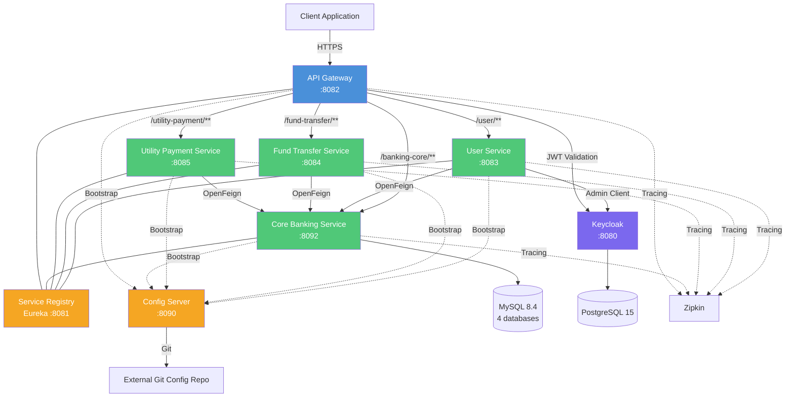

# Application Knowledge Base

## Table of Contents

- [Architecture Overview](#architecture-overview)
- [Data Model Documentation](#data-model-documentation)
- [API Surface Map](#api-surface-map)
- [Key Business Logic Inventory](#key-business-logic-inventory)
- [Integration Points](#integration-points)
- [Build and Deployment Pipeline](#build-and-deployment-pipeline)

---

## Architecture Overview

The Internet Banking platform is a Spring Cloud microservices application composed of **7 services**: 4 business services and 3 infrastructure services.

### Service Inventory

| Service | Type | Port | Description |
|---------|------|------|-------------|
| `core-banking-service` | Business | 8092 | Authoritative ledger, account system of record, transaction processing |
| `internet-banking-user-service` | Business | 8083 | User lifecycle management and Keycloak integration |
| `internet-banking-fund-transfer-service` | Business | 8084 | Fund transfer orchestration between accounts |
| `internet-banking-utility-payment-service` | Business | 8085 | Third-party biller payment processing |
| `internet-banking-api-gateway` | Infrastructure | 8082 | Central request router and OAuth2 security filter |
| `internet-banking-service-registry` | Infrastructure | 8081 | Netflix Eureka server for service discovery |
| `internet-banking-config-server` | Infrastructure | 8090 | Centralized configuration management |

### Key Architectural Decisions

- **Communication**: Synchronous only via **Spring Cloud OpenFeign**. No async messaging is implemented (RabbitMQ is mentioned in the README but has zero presence in the codebase — no dependencies, no producers, no consumers).
- **Service Discovery**: Netflix Eureka (`internet-banking-service-registry` on port 8081). All business services register as Eureka clients and use logical service names for inter-service calls.
- **Configuration**: Spring Cloud Config Server pulling from an external Git repository: `https://github.com/JavatoDev-com/internet-banking-microservices-configurations.git`
- **API Gateway**: Spring Cloud Gateway with OAuth2 resource server (Keycloak JWT validation).
- **Gateway Routes**: Path prefixes `/user/**`, `/fund-transfer/**`, `/utility-payment/**`, `/banking-core/**` route to their respective services.
- **Auth Flow**: Gateway extracts JWT principal name → injects `X-Auth-Id` header → downstream services read via `AppAuthUserFilter` and store in `ApiRequestContextHolder`.

### Architecture Diagram



---

## Data Model Documentation

### Core Banking Service

**Database**: `banking_core_service` (MySQL)
**Schema Management**: Flyway (3 migration scripts in `core-banking-service/src/main/resources/db/migration/`)

#### `banking_core_user`

| Column | Type | Description |
|--------|------|-------------|
| `id` | BIGINT (PK, auto) | Primary key |
| `email` | VARCHAR | User email address |
| `first_name` | VARCHAR | First name |
| `last_name` | VARCHAR | Last name |
| `identification_number` | VARCHAR | National identification number (NIC) |

#### `banking_core_account`

| Column | Type | Description |
|--------|------|-------------|
| `id` | BIGINT (PK, auto) | Primary key |
| `number` | VARCHAR | Account number |
| `type` | ENUM | `SAVINGS_ACCOUNT`, `FIXED_DEPOSIT`, `LOAN_ACCOUNT` |
| `status` | ENUM | `ACTIVE`, `INACTIVE`, `CLOSED` |
| `actual_balance` | DECIMAL | Actual balance |
| `available_balance` | DECIMAL | Available balance |
| `user_id` | BIGINT (FK) | References `banking_core_user.id` |

#### `banking_core_transaction`

| Column | Type | Description |
|--------|------|-------------|
| `id` | BIGINT (PK, auto) | Primary key |
| `amount` | DECIMAL | Transaction amount (negative for debits) |
| `transaction_type` | ENUM | `FUND_TRANSFER`, `UTILITY_PAYMENT` |
| `reference_number` | VARCHAR | Reference to counterparty account/provider |
| `transaction_id` | VARCHAR (UUID) | Unique transaction identifier |
| `account_id` | BIGINT (FK) | References `banking_core_account.id` |

#### `banking_core_utility_account`

| Column | Type | Description |
|--------|------|-------------|
| `id` | BIGINT (PK, auto) | Primary key |
| `number` | VARCHAR | Utility account number |
| `provider_name` | VARCHAR | Utility provider name |

### Fund Transfer Service

**Database**: `banking_core_fund_transfer_service` (MySQL)
**Schema Management**: JPA auto-DDL (no Flyway migrations)

#### `fund_transfer`

| Column | Type | Description |
|--------|------|-------------|
| `id` | BIGINT (PK, auto) | Primary key |
| `transaction_reference` | VARCHAR | Reference number |
| `from_account` | VARCHAR | Source account number |
| `to_account` | VARCHAR | Destination account number |
| `amount` | DECIMAL | Transfer amount |
| `status` | ENUM | `PENDING`, `PROCESSING`, `SUCCESS`, `FAILED` |
| `created_date` | TIMESTAMP | Audit: creation timestamp |
| `created_by` | VARCHAR | Audit: creator |
| `modified_date` | TIMESTAMP | Audit: last modification |
| `modified_by` | VARCHAR | Audit: last modifier |
| `version` | BIGINT | Optimistic locking version |

> Audit fields are inherited from the `AuditAware` superclass.

### User Service

**Database**: `banking_core_user_service` (MySQL)
**Schema Management**: JPA auto-DDL (no Flyway migrations)

#### `user`

| Column | Type | Description |
|--------|------|-------------|
| `id` | BIGINT (PK, auto) | Primary key |
| `auth_id` | VARCHAR | Keycloak user ID |
| `identification` | VARCHAR | National identification number |
| `status` | ENUM | `PENDING`, `APPROVED` |
| `created_date` | TIMESTAMP | Audit field |
| `created_by` | VARCHAR | Audit field |
| `modified_date` | TIMESTAMP | Audit field |
| `modified_by` | VARCHAR | Audit field |
| `version` | BIGINT | Optimistic locking version |

### Utility Payment Service

**Database**: `banking_core_utility_payment_service` (MySQL)
**Schema Management**: JPA auto-DDL (no Flyway migrations)

#### `utility_payment`

| Column | Type | Description |
|--------|------|-------------|
| `id` | BIGINT (PK, auto) | Primary key |
| `provider_id` | BIGINT | Utility provider reference |
| `amount` | DECIMAL | Payment amount |
| `reference_number` | VARCHAR | Payment reference |
| `account` | VARCHAR | Source account number |
| `transaction_id` | VARCHAR | Transaction identifier |
| `status` | ENUM | `PENDING`, `PROCESSING`, `SUCCESS`, `FAILED` |
| `created_date` | TIMESTAMP | Audit field |
| `created_by` | VARCHAR | Audit field |
| `modified_date` | TIMESTAMP | Audit field |
| `modified_by` | VARCHAR | Audit field |
| `version` | BIGINT | Optimistic locking version |

---

## API Surface Map

### Core Banking Service (`/api/v1/`)

| Method | Path | Description | Request Body | Response |
|--------|------|-------------|-------------|----------|
| GET | `/api/v1/account/bank-account/{account_number}` | Get bank account by number | - | `BankAccount` (id, number, type, status, availableBalance, actualBalance, user) |
| GET | `/api/v1/account/util-account/{account_name}` | Get utility account by provider name | - | `UtilityAccount` (id, number, providerName) |
| POST | `/api/v1/transaction/fund-transfer` | Process fund transfer | `FundTransferRequest` (fromAccount, toAccount, amount) | `FundTransferResponse` (message, transactionId) |
| POST | `/api/v1/transaction/util-payment` | Process utility payment | `UtilityPaymentRequest` (providerId, amount, referenceNumber, account) | `UtilityPaymentResponse` (message, transactionId) |
| GET | `/api/v1/user/{identification}` | Get user by identification number | - | `User` (id, firstName, lastName, email, identificationNumber, bankAccounts) |
| GET | `/api/v1/user` | List users (paginated) | Pageable query params | `List<User>` |

### User Service (`/api/v1/bank-users/`)

| Method | Path | Description | Request Body | Response |
|--------|------|-------------|-------------|----------|
| POST | `/api/v1/bank-users/register` | Register new user | `User` (email, identification, password) | `User` |
| PATCH | `/api/v1/bank-users/update/{id}` | Update user status | `UserUpdateRequest` (status) | `User` |
| GET | `/api/v1/bank-users` | List users (paginated) | Pageable query params | `List<User>` |
| GET | `/api/v1/bank-users/{id}` | Get user by ID | - | `User` |

### Fund Transfer Service (`/api/v1/transfer`)

| Method | Path | Description | Request Body | Response |
|--------|------|-------------|-------------|----------|
| POST | `/api/v1/transfer` | Initiate fund transfer | `FundTransferRequest` (fromAccount, toAccount, amount, authID) | `FundTransferResponse` |
| GET | `/api/v1/transfer` | List fund transfers (paginated) | Pageable query params | `List<FundTransfer>` |

### Utility Payment Service (`/api/v1/utility-payment`)

| Method | Path | Description | Request Body | Response |
|--------|------|-------------|-------------|----------|
| POST | `/api/v1/utility-payment` | Process utility payment | `UtilityPaymentRequest` (providerId, amount, referenceNumber, account) | `UtilityPaymentResponse` |
| GET | `/api/v1/utility-payment` | List utility payments (paginated) | Pageable query params | `List<UtilityPayment>` |

### Gateway Routing

All endpoints are accessible through the API Gateway (port 8082) with the following path prefixes:

| Gateway Prefix | Target Service |
|---------------|----------------|
| `/user/**` | `internet-banking-user-service` |
| `/fund-transfer/**` | `internet-banking-fund-transfer-service` |
| `/utility-payment/**` | `internet-banking-utility-payment-service` |
| `/banking-core/**` | `core-banking-service` |

> **Public endpoint**: `/user/api/v1/bank-users/register` is publicly accessible without JWT.
> All other endpoints require a valid JWT token.

---

## Key Business Logic Inventory

### Fund Transfer Flow

```
User Service → Fund Transfer Service (saves with PENDING status)
    → Core Banking Service:
        1. Validates sender balance (actualBalance >= 0 AND actualBalance >= transferAmount)
        2. Debits sender account (actualBalance -= amount)
        3. Creates debit transaction record (negative amount)
        4. Credits receiver account (actualBalance += amount)
        5. Creates credit transaction record (positive amount)
    → Fund Transfer Service (updates status to SUCCESS)
```

**Balance Validation**: Checks `actualBalance >= 0` AND `actualBalance >= transferAmount`. Throws `InsufficientFundsException` if either condition fails.

### Utility Payment Flow

Similar to fund transfer but debits from one account to a utility provider:
1. Validates sender balance
2. Debits sender account
3. Creates 1 transaction record with negative amount
4. No credit to utility provider account (assumed external)

### User Registration Flow

1. Validates email not already registered in Keycloak
2. Validates identification number exists in Core Banking Service
3. Creates Keycloak user (disabled, email unverified)
4. Saves local user record with `PENDING` status

### User Approval Flow

1. Admin updates user status to `APPROVED`
2. Keycloak user is enabled and email marked as verified

### CRITICAL BUG: Balance Double-Subtraction

In `TransactionService.internalFundTransfer()` (lines 90-91) and `utilPayment()` (lines 63-64), the `availableBalance` is set to `actualBalance - amount` **after** `actualBalance` was already reduced by `amount`, causing a double-subtraction.

**Example**: Transferring 100 from an account with balance 200:
- `actualBalance` = 200 - 100 = **100** (correct)
- `availableBalance` = 100 - 100 = **0** (incorrect — should be 100)

```java
// Line 90-91 in TransactionService.java
fromBankAccountEntity.setActualBalance(fromBankAccountEntity.getActualBalance().subtract(amount));
fromBankAccountEntity.setAvailableBalance(fromBankAccountEntity.getActualBalance().subtract(amount));
// At this point, getActualBalance() already returns the reduced value
```

The same bug exists for the receiver side (lines 99-100) where the `availableBalance` gets an extra addition:
- `actualBalance` = 0 + 100 = **100** (correct)
- `availableBalance` = 100 + 100 = **200** (incorrect — should be 100)

---

## Integration Points

### Keycloak (Identity & Access Management)

- **Library**: `keycloak-admin-client:24.0.4`
- **Service**: `internet-banking-user-service` uses the Keycloak Admin API for user CRUD operations
- **Configuration**: `server-url`, `realm` (`javatodev-internet-banking`), `clientId` (`internet-banking-api-client`), `client-secret`
- **Gateway**: Validates JWTs via `spring.security.oauth2.resourceserver.jwt.jwk-set-uri`
- **Known Issue**: The `KeycloakProperties.getInstance()` singleton pattern is not thread-safe (no synchronization, no volatile)

### MySQL 8.4.0

- Single MySQL instance hosting **4 databases**:
  - `banking_core_service`
  - `banking_core_fund_transfer_service`
  - `banking_core_user_service`
  - `banking_core_utility_payment_service`
- **Credentials**: User `javatodev_development` / Password `oPItyPticIAt` (hardcoded in `docker-compose/mysql/privileges.sql`)

### PostgreSQL 15

- Used **exclusively** by Keycloak for its own internal data storage
- Not directly accessed by any application service

### Zipkin (Distributed Tracing)

- All 4 business services + the API Gateway include tracing dependencies
- **Libraries**: Micrometer Tracing Bridge Brave + `zipkin-reporter-brave`
- Provides distributed trace correlation across service calls

### Eureka (Service Discovery)

- All business services register as Eureka clients
- Service-to-service calls use logical service names resolved by Eureka (e.g., `core-banking-service`)
- Eureka server runs on port 8081

### Spring Cloud Config (External Configuration)

- External Git-based configuration repository
- Services use `spring-cloud-starter-bootstrap` to fetch configuration on startup
- Config source: `https://github.com/JavatoDev-com/internet-banking-microservices-configurations.git`

### RabbitMQ

- **Mentioned in README but NOT implemented in code**
- No RabbitMQ dependency in any `build.gradle` file
- No message producers or consumers in the codebase
- No AMQP configuration in any service

---

## Build and Deployment Pipeline

### Build System

- **Gradle** with Spring Boot plugin `3.2.4` and Spring dependency management `1.1.4`
- Each service is an **independent Gradle project** (no multi-project build)
- No `settings.gradle` at the repository root
- Each service must be built independently: `cd <service> && ./gradlew build`

### Java Version

- **Java 21** (Eclipse Temurin 21.0.2_13)

### Docker

- Each service has a `Dockerfile` based on `eclipse-temurin:21.0.2_13-jre-alpine`
- Uses `wait-for-it.sh` for startup dependency ordering

### Docker Compose

- **Two compose files**:
  - `docker-compose.yml` — Full stack (all 7 services + infrastructure)
  - `docker-compose-support-apps.yml` — Infrastructure only (MySQL, Keycloak, Zipkin, etc.)
- Custom bridge network `javatodev_ib_network` with static IPs (`172.25.0.0/16`)

### CI/CD

- **None**. The `.github/` directory contains only `FUNDING.yml`
- No GitHub Actions workflows, no Jenkinsfile, no pipeline configuration
- No automated build, test, or deployment pipeline
