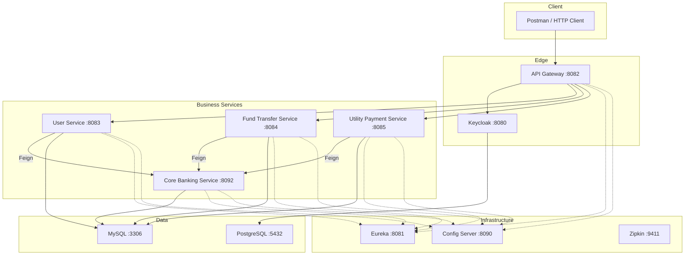
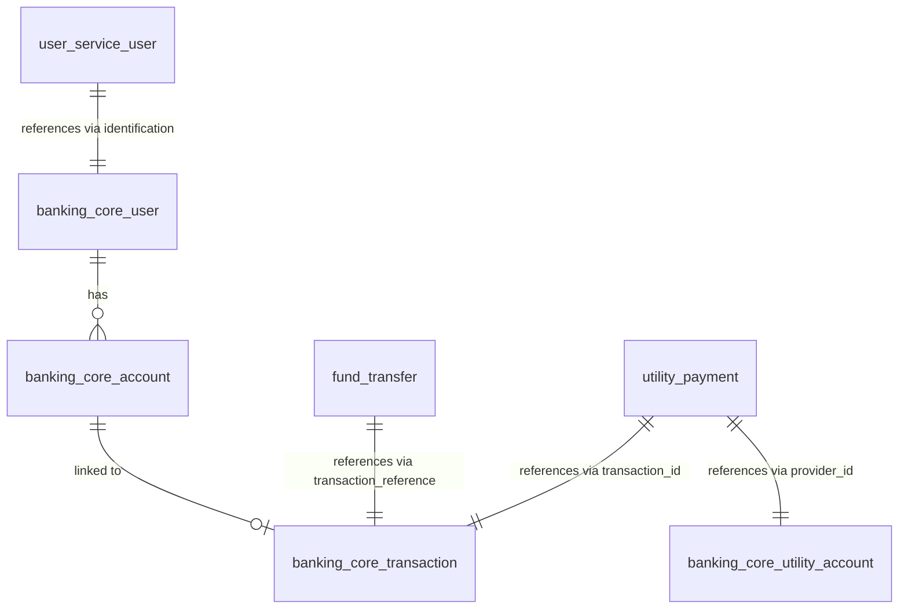

# Application Knowledge Base

## 1. Architecture Overview

### 1.1 Services

| Service | Port | Type | Description |
|---|---|---|---|
| `internet-banking-api-gateway` | 8082 | Infrastructure | Single entry point; OAuth2 security via Keycloak, routes to downstream services |
| `internet-banking-service-registry` | 8081 | Infrastructure | Netflix Eureka discovery server |
| `internet-banking-config-server` | 8090 | Infrastructure | Spring Cloud Config backed by Git repo (`https://github.com/JavatoDev-com/internet-banking-microservices-configurations.git`) |
| `internet-banking-user-service` | 8083 | Business | User registration/management; integrates with Keycloak Admin API |
| `internet-banking-fund-transfer-service` | 8084 | Business | Account-to-account fund transfers |
| `internet-banking-utility-payment-service` | 8085 | Business | Utility bill payments |
| `core-banking-service` | 8092 | Business | System of record — accounts, users, transactions, balance management |

### 1.2 Communication Patterns

- **Client → Gateway**: HTTP/REST through API Gateway (port 8082)
- **Gateway → Services**: Routed via Eureka service discovery
- **Business Services → Core Banking**: Synchronous HTTP via **OpenFeign** clients
  - `internet-banking-fund-transfer-service` → `BankingCoreFeignClient` → `core-banking-service`
  - `internet-banking-user-service` → `BankingCoreRestClient` → `core-banking-service`
  - `internet-banking-utility-payment-service` → `BankingCoreRestClient` → `core-banking-service`
- **RabbitMQ**: Mentioned in README for notification service but **not implemented** in code
- **Notification Service**: Listed in architecture but marked as **PENDING Development**

### 1.3 Infrastructure Components

| Component | Technology | Purpose |
|---|---|---|
| Identity Provider | Keycloak 23.0.7 | OAuth2/OIDC authentication; realm `javatodev-internet-banking` |
| Service Discovery | Netflix Eureka | Service registration and lookup |
| Centralized Config | Spring Cloud Config Server | Externalized configuration from Git |
| Distributed Tracing | Zipkin + Micrometer Tracing (Brave) | Request tracing across services |
| Database | MySQL (single instance) | Shared by core-banking-service and business services |
| Keycloak DB | PostgreSQL 15 | Keycloak's backing store |
| Containerization | Docker Compose | All services on bridge network `javatodev_ib_network` (172.25.0.0/16) |

### 1.4 Architecture Diagram

---

## 2. Data Model Documentation

### 2.1 Core Banking Service (System of Record)

**`banking_core_user`** — Bank customers

| Column | Type | Notes |
|---|---|---|
| `id` | BIGINT PK AUTO_INCREMENT | |
| `first_name` | VARCHAR(255) | |
| `last_name` | VARCHAR(255) | |
| `email` | VARCHAR(255) | |
| `identification_number` | VARCHAR(255) | National ID |

**`banking_core_account`** — Bank accounts

| Column | Type | Notes |
|---|---|---|
| `id` | BIGINT PK AUTO_INCREMENT | |
| `number` | VARCHAR(255) | Account number |
| `type` | VARCHAR(255) | Enum: `SAVINGS_ACCOUNT` |
| `status` | VARCHAR(255) | Enum: `ACTIVE` |
| `actual_balance` | DECIMAL(19,2) | |
| `available_balance` | DECIMAL(19,2) | |
| `user_id` | BIGINT FK → `banking_core_user.id` | |

**`banking_core_utility_account`** — Utility providers

| Column | Type | Notes |
|---|---|---|
| `id` | BIGINT PK AUTO_INCREMENT | |
| `number` | VARCHAR(255) | Provider account number |
| `provider_name` | VARCHAR(255) | e.g., VODAFONE, VERIZON |

**`banking_core_transaction`** — Transaction ledger

| Column | Type | Notes |
|---|---|---|
| `id` | BIGINT PK AUTO_INCREMENT | |
| `amount` | DECIMAL(19,2) | Negative for debits |
| `transaction_type` | VARCHAR(30) | `FUND_TRANSFER`, `UTILITY_PAYMENT` |
| `reference_number` | VARCHAR(50) | |
| `transaction_id` | VARCHAR(50) | UUID |
| `account_id` | BIGINT FK → `banking_core_account.id` | |

### 2.2 User Service

**`user`** table (JPA-managed, extends `AuditAware`)

| Column | Type | Notes |
|---|---|---|
| `id` | BIGINT PK AUTO_INCREMENT | |
| `auth_id` | VARCHAR | Keycloak user ID |
| `identification` | VARCHAR | National ID |
| `status` | VARCHAR | Enum: `PENDING`, `APPROVED` |
| `created_date`, `created_by`, `modified_date`, `modified_by` | Audit fields | From `AuditAware` |
| `version` | BIGINT | Optimistic locking |

### 2.3 Fund Transfer Service

**`fund_transfer`** table (JPA-managed, extends `AuditAware`)

| Column | Type | Notes |
|---|---|---|
| `id` | BIGINT PK AUTO_INCREMENT | |
| `transaction_reference` | VARCHAR | Core banking transaction ID |
| `from_account` | VARCHAR | Source account number |
| `to_account` | VARCHAR | Destination account number |
| `amount` | DECIMAL | |
| `status` | VARCHAR | Enum: `PENDING`, `SUCCESS` |
| Audit + version fields | | From `AuditAware` |

### 2.4 Utility Payment Service

**`utility_payment`** table (JPA-managed, extends `AuditAware`)

| Column | Type | Notes |
|---|---|---|
| `id` | BIGINT PK AUTO_INCREMENT | |
| `provider_id` | BIGINT | Utility provider ID |
| `amount` | DECIMAL | |
| `reference_number` | VARCHAR | |
| `account` | VARCHAR | Source account number |
| `transaction_id` | VARCHAR | Core banking transaction ID |
| `status` | VARCHAR | Enum: `PROCESSING`, `SUCCESS` |
| Audit + version fields | | From `AuditAware` |

### 2.5 Entity Relationship Diagram

---

## 3. API Surface Map

### 3.1 Core Banking Service (`:8092`)

| Method | Endpoint | Request Body | Response | Description |
|---|---|---|---|---|
| GET | `/api/v1/account/bank-account/{account_number}` | — | `BankAccount` | Get bank account by number |
| GET | `/api/v1/account/util-account/{account_name}` | — | `UtilityAccount` | Get utility account by provider name |
| POST | `/api/v1/transaction/fund-transfer` | `FundTransferRequest{fromAccount, toAccount, amount}` | `FundTransferResponse{message, transactionId}` | Process fund transfer |
| POST | `/api/v1/transaction/util-payment` | `UtilityPaymentRequest{providerId, amount, referenceNumber, account}` | `UtilityPaymentResponse{message, transactionId}` | Process utility payment |
| GET | `/api/v1/user/{identification}` | — | `User` | Get user by identification number |
| GET | `/api/v1/user` | `Pageable` query params | `Page<User>` | List users (paginated) |

### 3.2 User Service (`:8083`)

| Method | Endpoint | Request Body | Response | Description |
|---|---|---|---|---|
| POST | `/api/v1/bank-users/register` | `User{email, identification, password}` | `User` | Register new user (creates in Keycloak + local DB) |
| PATCH | `/api/v1/bank-users/update/{id}` | `UserUpdateRequest{status}` | `User` | Update user (approve/reject) |
| GET | `/api/v1/bank-users` | `Pageable` query params | `List<User>` | List users (paginated) |
| GET | `/api/v1/bank-users/{id}` | — | `User` | Get user by ID |

### 3.3 Fund Transfer Service (`:8084`)

| Method | Endpoint | Request Body | Response | Description |
|---|---|---|---|---|
| POST | `/api/v1/transfer` | `FundTransferRequest{fromAccount, toAccount, amount, authID}` | `FundTransferResponse` | Initiate fund transfer |
| GET | `/api/v1/transfer` | `Pageable` query params | `List<FundTransfer>` | List fund transfers |

### 3.4 Utility Payment Service (`:8085`)

| Method | Endpoint | Request Body | Response | Description |
|---|---|---|---|---|
| POST | `/api/v1/utility-payment` | `UtilityPaymentRequest{providerId, amount, referenceNumber, account}` | `UtilityPaymentResponse` | Process utility payment |
| GET | `/api/v1/utility-payment` | `Pageable` query params | `List<UtilityPayment>` | List utility payments |

### 3.5 Infrastructure Endpoints

| Service | Endpoint | Description |
|---|---|---|
| All services | `/actuator/health` | Health check (Spring Boot Actuator) |
| All services | `/actuator/info` | Application info |
| Service Registry | `/eureka` | Eureka dashboard |
| Keycloak | `/realms/javatodev-internet-banking/protocol/openid-connect/token` | OAuth2 token endpoint |

---

## 4. Key Business Logic Inventory

### 4.1 User Registration Flow (`UserService.createUser`)
1. Check if email already exists in Keycloak → throw `UserAlreadyRegisteredException`
2. Look up user in core banking by identification number via Feign
3. Validate email matches core banking record → throw `InvalidEmailException`
4. Create user in Keycloak (disabled, email unverified)
5. Save user locally with `PENDING` status
6. Admin later approves via `updateUser` → enables Keycloak account

### 4.2 Fund Transfer Flow (`FundTransferService.fundTransfer`)
1. Save transfer record with `PENDING` status
2. Call core banking service via Feign (`/api/v1/transaction/fund-transfer`)
3. Core banking validates balance (actual balance >= amount)
4. Core banking debits source account, credits destination account
5. Core banking creates two transaction records (debit + credit)
6. Update local record to `SUCCESS` with transaction reference

### 4.3 Utility Payment Flow (`UtilityPaymentService.utilPayment`)
1. Save payment record with `PROCESSING` status
2. Call core banking service via Feign (`/api/v1/transaction/util-payment`)
3. Core banking validates balance
4. Core banking debits source account
5. Core banking creates transaction record
6. Update local record to `SUCCESS` with transaction ID

### 4.4 Balance Validation Rule
- `actualBalance` must be >= 0 AND >= transfer/payment amount
- Throws `InsufficientFundsException` on failure

### 4.5 Known Bug: Double-Subtraction in Balance Update
In `TransactionService.internalFundTransfer` and `utilPayment`, `availableBalance` is set to `actualBalance.subtract(amount)` AFTER `actualBalance` has already been decremented, causing a double-subtraction error.

---

## 5. Integration Points

### 5.1 Keycloak
- **Realm**: `javatodev-internet-banking`
- **Clients**: `javatodev-internet-banking-api-client` (confidential, service accounts enabled), `javatodev-internet-banking-kc-api-client` (for admin operations)
- **Admin Client**: Used by User Service via `keycloak-admin-client:24.0.4` library
- **Gateway**: OAuth2 resource server + client configuration
- **Test Credentials**: `ib_admin@javatodev.com / 5V7huE3G86uB`

### 5.2 RabbitMQ
- Listed in tech stack but **not implemented** in any service code
- Intended for notification service (PENDING development)

### 5.3 Zipkin
- All services include `micrometer-tracing-bridge-brave` and `zipkin-reporter-brave`
- Zipkin server at `172.25.0.12:9411`
- Feign calls instrumented via `feign-micrometer`

### 5.4 Database Connections
- **MySQL** (`172.25.0.9:3306`): Used by core-banking-service, user-service, fund-transfer-service, utility-payment-service
- **PostgreSQL** (`172.25.0.10:5432`): Used by Keycloak only
- Core banking uses **Flyway** for schema migrations (3 migration files)
- Other services rely on JPA auto-DDL (Hibernate)

### 5.5 Spring Cloud Config
- Config server fetches from: `https://github.com/JavatoDev-com/internet-banking-microservices-configurations.git`
- Branch: `main`, search path: `configuration`
- All business services use `spring-cloud-starter-config` + `spring-cloud-starter-bootstrap`

---

## 6. Build and Deployment Pipeline Summary

### 6.1 Build System
- **Gradle** (per-service `build.gradle`, no multi-project build)
- Each service is an independent Gradle project with its own `gradlew` wrapper
- Common plugins: `java`, `org.springframework.boot:3.2.4`, `io.spring.dependency-management:1.1.4`, `com.gorylenko.gradle-git-properties:2.4.2`
- No shared/common library module

### 6.2 Docker Compose Deployment
- `docker-compose/docker-compose.yml` orchestrates all 11 containers
- Static IP assignment on bridge network `172.25.0.0/16`
- `wait-for-it.sh` scripts handle startup ordering (wait for Eureka, Config Server, MySQL)
- Docker images: `javatodev/<service-name>` (pre-built, pulled from registry)
- MySQL uses custom Dockerfile from `docker-compose/mysql/`

### 6.3 CI/CD
- **No CI/CD pipeline exists** — `.github/` directory is empty
- No Dockerfiles in service directories (images are pre-built externally)
- No automated testing in pipeline
