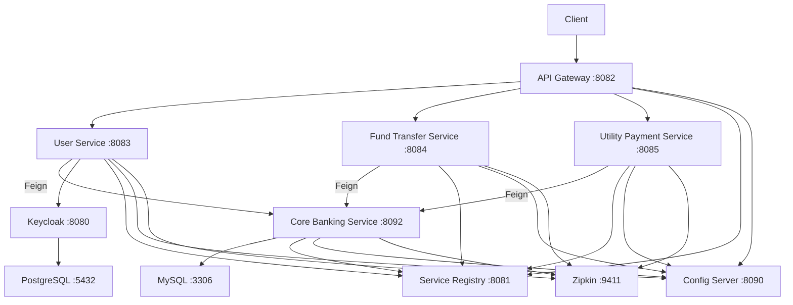

# Knowledge Base — Internet Banking Microservices

## Architecture Overview

**Stack:** Java 21, Spring Boot 3.2.4, Spring Cloud 2023.0.0, Gradle, Docker Compose

| Service | Port | Role |
|---|---|---|
| `internet-banking-service-registry` | 8081 | Eureka server — service discovery |
| `internet-banking-api-gateway` | 8082 | Spring Cloud Gateway, OAuth2 resource server, JWT validation |
| `internet-banking-user-service` | 8083 | User registration/management via Keycloak admin-client; Feign → core-banking |
| `internet-banking-fund-transfer-service` | 8084 | Fund transfer orchestration; Feign → core-banking |
| `internet-banking-utility-payment-service` | 8085 | Utility payment orchestration; Feign → core-banking |
| `internet-banking-config-server` | 8090 | Git-backed Spring Cloud Config |
| `core-banking-service` | 8092 | Ledger: users, accounts, transactions. Flyway migrations. |

All inter-service communication is **synchronous REST via OpenFeign + Eureka discovery**. RabbitMQ is mentioned in the README but is **not implemented** in any service. Distributed tracing is via Micrometer Brave → Zipkin.

---

## Data Model

### core-banking-service

#### `banking_core_user`
| Column | Type | Notes |
|---|---|---|
| `id` | BIGINT PK AUTO_INCREMENT | |
| `email` | VARCHAR(255) | |
| `first_name` | VARCHAR(255) | |
| `last_name` | VARCHAR(255) | |
| `identification_number` | VARCHAR(255) | |

Entity: `UserEntity` — `@OneToMany` → `BankAccountEntity` (mapped by `user`, LAZY, cascade ALL)

#### `banking_core_account`
| Column | Type | Notes |
|---|---|---|
| `id` | BIGINT PK AUTO_INCREMENT | |
| `number` | VARCHAR(255) | Account number |
| `type` | VARCHAR(255) | Enum: `AccountType` (e.g. SAVINGS_ACCOUNT) |
| `status` | VARCHAR(255) | Enum: `AccountStatus` (e.g. ACTIVE) |
| `actual_balance` | DECIMAL(19,2) | |
| `available_balance` | DECIMAL(19,2) | |
| `user_id` | BIGINT FK → `banking_core_user.id` | |

Entity: `BankAccountEntity` — `@ManyToOne` → `UserEntity`

#### `banking_core_transaction`
| Column | Type | Notes |
|---|---|---|
| `id` | BIGINT PK AUTO_INCREMENT | |
| `amount` | DECIMAL(19,2) | |
| `transaction_type` | VARCHAR(30) | Enum: `TransactionType` (FUND_TRANSFER, UTILITY_PAYMENT) |
| `reference_number` | VARCHAR(50) | |
| `transaction_id` | VARCHAR(50) | UUID |
| `account_id` | BIGINT FK → `banking_core_account.id` | |

Entity: `TransactionEntity` — **BUG:** uses `@OneToOne(cascade=CascadeType.ALL)` to `BankAccountEntity`. Should be `@ManyToOne` with no cascade.

#### `banking_core_utility_account`
| Column | Type | Notes |
|---|---|---|
| `id` | BIGINT PK AUTO_INCREMENT | |
| `number` | VARCHAR(255) | |
| `provider_name` | VARCHAR(255) | e.g. VODAFONE, VERIZON, SINGTEL |

Entity: `UtilityAccountEntity`

### internet-banking-fund-transfer-service

#### `fund_transfer`
Entity: `FundTransferEntity` extends `AuditAware`

| Field | Type |
|---|---|
| `id` | Long (PK) |
| `transactionReference` | String |
| `fromAccount` | String |
| `toAccount` | String |
| `amount` | BigDecimal |
| `status` | TransactionStatus (PENDING, SUCCESS) |

### internet-banking-utility-payment-service

#### `utility_payment`
Entity: `UtilityPaymentEntity` extends `AuditAware`

| Field | Type |
|---|---|
| `id` | Long (PK) |
| `providerId` | Long |
| `amount` | BigDecimal |
| `referenceNumber` | String |
| `account` | String |
| `status` | TransactionStatus (PROCESSING, SUCCESS) |
| `transactionId` | String |

### internet-banking-user-service

Entity: `UserEntity` (local DB, separate from core-banking)

| Field | Type |
|---|---|
| `id` | Long (PK) |
| `email` | String |
| `identification` | String |
| `authId` | String (Keycloak user ID) |
| `status` | Status (PENDING, APPROVED) |

---

## API Surface Map

### core-banking-service (`:8092`)

| Method | Path | Request Body | Response |
|---|---|---|---|
| GET | `/api/v1/account/bank-account/{account_number}` | — | `BankAccount` |
| GET | `/api/v1/account/util-account/{account_name}` | — | `UtilityAccount` |
| POST | `/api/v1/transaction/fund-transfer` | `FundTransferRequest { fromAccount, toAccount, amount }` | `FundTransferResponse { message, transactionId }` |
| POST | `/api/v1/transaction/util-payment` | `UtilityPaymentRequest { account, providerId, amount, referenceNumber }` | `UtilityPaymentResponse { message, transactionId }` |
| GET | `/api/v1/user/{identification}` | — | `User` |
| GET | `/api/v1/user` | Pageable params | `List<User>` |

### internet-banking-user-service (`:8083`)

| Method | Path | Request Body | Response |
|---|---|---|---|
| POST | `/api/v1/bank-users/register` | `User { email, identification, password }` | `User` |
| PATCH | `/api/v1/bank-users/update/{id}` | `UserUpdateRequest { status }` | `User` |
| GET | `/api/v1/bank-users` | Pageable params | `List<User>` |
| GET | `/api/v1/bank-users/{id}` | — | `User` |

### internet-banking-fund-transfer-service (`:8084`)

| Method | Path | Request Body | Response |
|---|---|---|---|
| POST | `/api/v1/transfer` | `FundTransferRequest { fromAccount, toAccount, amount }` | `FundTransferResponse { message, transactionId }` |
| GET | `/api/v1/transfer` | Pageable params | `List<FundTransfer>` |

### internet-banking-utility-payment-service (`:8085`)

| Method | Path | Request Body | Response |
|---|---|---|---|
| POST | `/api/v1/utility-payment` | `UtilityPaymentRequest { providerId, amount, referenceNumber, account }` | `UtilityPaymentResponse { message, transactionId }` |
| GET | `/api/v1/utility-payment` | Pageable params | `List<UtilityPayment>` |

---

## Business Logic Inventory

### Fund Transfer Flow

1. Client → `POST /api/v1/transfer` on **fund-transfer-service**
2. `FundTransferService` saves a `FundTransferEntity` with status `PENDING`
3. Feign call → `POST /api/v1/transaction/fund-transfer` on **core-banking-service**
4. `TransactionService.fundTransfer()`:
   - Reads from/to `BankAccount` via `AccountService`
   - Validates sender has sufficient `actualBalance`
   - Calls `internalFundTransfer()`:
     - Subtracts `amount` from sender's `actualBalance`
     - **BUG (line 91):** Sets `availableBalance = actualBalance.subtract(amount)` — but `actualBalance` was already reduced on line 90, so `availableBalance` is double-subtracted (reduced by `2 × amount`)
     - Adds `amount` to receiver's `actualBalance`
     - **BUG (line 100):** Sets receiver's `availableBalance = actualBalance.add(amount)` — but `actualBalance` was already increased on line 99, so `availableBalance` is double-added (increased by `2 × amount`)
     - Saves two `TransactionEntity` records (debit + credit)
5. Fund-transfer-service updates entity to `SUCCESS` with `transactionReference`

### Utility Payment Flow

1. Client → `POST /api/v1/utility-payment` on **utility-payment-service**
2. `UtilityPaymentService` saves a `UtilityPaymentEntity` with status `PROCESSING`
3. Feign call → `POST /api/v1/transaction/util-payment` on **core-banking-service**
4. `TransactionService.utilPayment()`:
   - Reads `BankAccount` and validates balance
   - Reads `UtilityAccount` by provider ID
   - Subtracts `amount` from `actualBalance` (line 63)
   - **BUG (line 64):** Sets `availableBalance = actualBalance.subtract(amount)` — double-subtraction, same pattern as fund transfer
   - Saves one `TransactionEntity` record
5. Utility-payment-service updates entity to `SUCCESS` with `transactionId`

**Neither flow has compensation/rollback logic.** If the Feign call succeeds but the local DB save fails, the system is left in an inconsistent state.

### User Registration Flow

1. Client → `POST /api/v1/bank-users/register` on **user-service**
2. `UserService.createUser()`:
   - Checks Keycloak for existing user by email
   - Feign call → `GET /api/v1/user/{identification}` on **core-banking-service** to validate the user exists in the core ledger
   - Validates email matches core banking record
   - Creates `UserRepresentation` in Keycloak with password credentials
   - If Keycloak returns 201, saves `UserEntity` locally with status `PENDING`
3. Admin approves via `PATCH /api/v1/bank-users/update/{id}` with `status: APPROVED` → enables Keycloak user

---

## Integration Points

| System | Usage | Notes |
|---|---|---|
| **Keycloak 23.0.7** | User identity management. user-service uses admin-client to create/update users. API Gateway validates JWTs. | Realm: `javatodev-internet-banking`. Clients: `javatodev-internet-banking-api-client`, `javatodev-internet-banking-kc-api-client` |
| **MySQL** | Core banking ledger (users, accounts, transactions). Also used by fund-transfer, utility-payment, and user services for local entities. | Single MySQL instance shared across services. Flyway manages core-banking schema. |
| **PostgreSQL 15** | Keycloak's backing database | Separate from application MySQL |
| **Zipkin 3** | Distributed tracing via Micrometer Brave + `zipkin-reporter-brave` | All 4 business services + gateway report traces |
| **Eureka** | Service discovery | All services register; Feign clients resolve by service name |
| **Spring Cloud Config** | Centralized configuration from Git-backed config server | All services bootstrap from config server on port 8090 |
| **RabbitMQ** | **NOT IMPLEMENTED** — mentioned in README for notifications but no RabbitMQ dependency or code exists | |

---

## Build & Deployment

- **Build:** Gradle (per-service `build.gradle`, no multi-project root build). Each service is an independent Spring Boot application.
- **Docker Compose:** `docker-compose/docker-compose.yml` orchestrates all services + infrastructure on a custom bridge network (`172.25.0.0/16`). Services use `wait-for-it.sh` to wait for registry, config server, and MySQL.
- **Images:** Pre-built images from `javatodev/*` Docker Hub repositories.
- **CI/CD:** None configured. No GitHub Actions, Jenkinsfile, or similar.
- **Profiles:** Services start with `-Dspring.profiles.active=docker` in Docker Compose.
