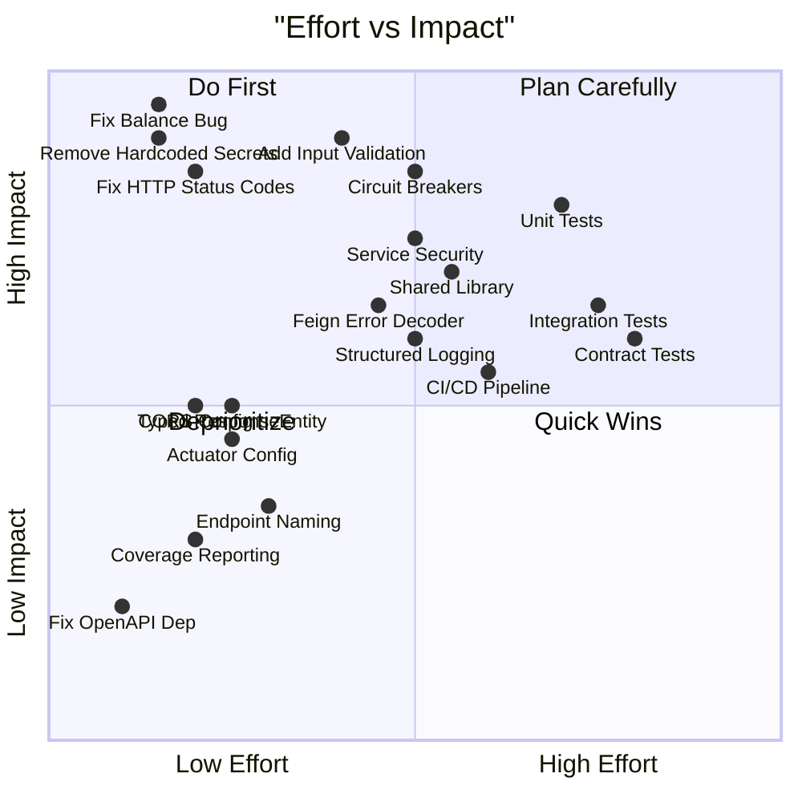

# Remediation Roadmap

## Overview

This roadmap organizes the 31 identified gaps into three implementation phases based on severity and effort. Each item includes a ready-to-use Devin prompt.

| Phase | Focus | Gaps Addressed | Estimated Effort |
|---|---|---|---|
| Phase 1 | Critical fixes | 5 Critical gaps | Small–Medium |
| Phase 2 | Important improvements | 12 High-severity gaps | Medium–Large |
| Phase 3 | Polish | 14 Medium/Low gaps | Small–Large |

---

## Phase 1: Critical Fixes (Do First)

### 1.1 Fix Double-Subtraction Balance Bug (GAP: Known Bug §4.5)
**Gaps**: Known Bug §4.5 | **Severity**: Critical | **Effort**: Small

**Devin Prompt**:
> In `core-banking-service/src/main/java/com/javatodev/finance/service/TransactionService.java`, fix the `internalFundTransfer` method (around lines 65-75) and `utilPayment` method (around lines 95-105). The bug: `availableBalance` is set to `actualBalance.subtract(amount)` AFTER `actualBalance` has already been decremented by `amount`. This causes a double-subtraction. The fix: set `availableBalance` equal to the already-updated `actualBalance` (i.e., `account.setAvailableBalance(account.getActualBalance())`) OR compute `availableBalance` before decrementing `actualBalance`. Apply the same fix in both methods. Add a comment explaining the balance invariant: `availableBalance` should equal `actualBalance` after each transaction (simplified model — no holds). Write a unit test in `TransactionServiceTest` that transfers 100 from an account with balance 500, then asserts `actualBalance == 400` and `availableBalance == 400` (not 300, which is the current buggy behavior). Also verify the same for utility payments. Reference: `TransactionService.java` lines 65-75 and lines 95-105 (approximate — find the `.subtract(amount)` calls on `availableBalance`). Do NOT change the transaction recording logic, only the balance update logic. Run the existing tests in `core-banking-service` (`./gradlew test`) to ensure nothing breaks (current tests at `src/test/java/com/javatodev/finance/service/TransactionServiceTest.java`, lines 99-100). Update the existing unit tests in `TransactionServiceTest` to assert correct balance values after transfers.

### 1.2 Fix HTTP Status Codes in Error Handlers (GAP-EH-1, GAP-EH-2)
**Gaps**: GAP-EH-1, GAP-EH-2, GAP-EH-4 | **Severity**: Critical | **Effort**: Small

**Devin Prompt**:
> In all four services that have a `GlobalExceptionHandler` (core-banking-service, internet-banking-user-service, internet-banking-fund-transfer-service, internet-banking-utility-payment-service), update the exception handlers: (1) `EntityNotFoundException` should return HTTP 404, (2) `InsufficientFundsException` should return HTTP 422, (3) Business validation exceptions (`UserAlreadyRegisteredException`, `InvalidEmailException`, `InvalidBankingUserException`) should return HTTP 409 or 422 as appropriate, (4) The generic `Exception` catch-all should return HTTP 500 with a generic message like `{"code": "INTERNAL_ERROR", "message": "An unexpected error occurred"}` — do NOT include the exception details in the response body. Ensure all error responses use the `ErrorResponse{code, message}` format consistently.

### 1.3 Remove Hardcoded Secrets (GAP-S-2)
**Gaps**: GAP-S-2 | **Severity**: Critical | **Effort**: Small

**Devin Prompt**:
> In `docker-compose/docker-compose.yml`, replace all hardcoded passwords and secrets with environment variable references using `${VARIABLE_NAME:-default_value}` syntax. Specifically: MySQL root password, Keycloak admin password, Keycloak DB credentials. Create a `.env.example` file in the `docker-compose/` directory documenting all required environment variables with placeholder values. Add `.env` to `.gitignore`. Remove the hardcoded test credentials from `README.md` and reference the `.env.example` file instead.

### 1.4 Add Input Validation (GAP-S-1, GAP-S-5)
**Gaps**: GAP-S-1, GAP-S-5 | **Severity**: Critical | **Effort**: Medium

**Devin Prompt**:
> Add `spring-boot-starter-validation` dependency to the `build.gradle` of all four business services (core-banking-service, internet-banking-user-service, internet-banking-fund-transfer-service, internet-banking-utility-payment-service). Then add Bean Validation annotations to all request DTOs: (1) `FundTransferRequest`: `@NotBlank` on `fromAccount` and `toAccount`, `@NotNull @Positive` on `amount`. (2) `UtilityPaymentRequest`: `@NotNull` on `providerId`, `@NotNull @Positive` on `amount`, `@NotBlank` on `referenceNumber` and `account`. (3) `User` DTO in user-service: `@NotBlank @Email` on `email`, `@NotBlank` on `identification`, `@NotBlank` on `password`. Add `@Valid` annotation to all `@RequestBody` parameters in controllers. Add a `MethodArgumentNotValidException` handler in each `GlobalExceptionHandler` that returns HTTP 400 with field-level error details.

### 1.5 Fix OpenAPI Dependency (GAP-CO-5)
**Gaps**: GAP-CO-5 | **Severity**: Low | **Effort**: Small

**Devin Prompt**:
> In the `build.gradle` files of core-banking-service, internet-banking-user-service, internet-banking-fund-transfer-service, and internet-banking-utility-payment-service, change the Swagger dependency from `org.springdoc:springdoc-openapi-starter-webflux-ui:2.1.0` to `org.springdoc:springdoc-openapi-starter-webmvc-ui:2.5.0` since these are Spring MVC (not WebFlux) applications. Verify the Swagger UI loads at `/swagger-ui.html`.

---

## Phase 2: Important (High-severity gaps, Medium effort)

### 2.1 Add Circuit Breakers and Timeouts (GAP-R-1, GAP-R-2, GAP-R-3, GAP-R-4)
**Gaps**: GAP-R-1, GAP-R-2, GAP-R-3, GAP-R-4 | **Severity**: Critical/High | **Effort**: Medium

**Devin Prompt**:
> Add Resilience4j circuit breaker support to the three services that use Feign clients (internet-banking-user-service, internet-banking-fund-transfer-service, internet-banking-utility-payment-service). (1) Add `spring-cloud-starter-circuitbreaker-resilience4j` to each service's `build.gradle`. (2) Enable Feign circuit breaker integration by adding `spring.cloud.openfeign.circuitbreaker.enabled=true` to each service's `application.yml`. (3) Configure Feign timeouts in `application.yml`: `spring.cloud.openfeign.client.config.default.connect-timeout=5000` and `read-timeout=10000`. (4) Create fallback classes for each Feign client that return meaningful error responses. (5) Configure Resilience4j circuit breaker properties: `slidingWindowSize=10`, `failureRateThreshold=50`, `waitDurationInOpenState=30s`.

### 2.2 Add Unit Tests for Business Services (GAP-T-1)
**Gaps**: GAP-T-1 | **Severity**: Critical | **Effort**: Large

**Devin Prompt**:
> Add comprehensive unit tests for the three business services that currently have no tests. For each service, create test classes using JUnit 5 and Mockito: (1) `internet-banking-user-service`: Create `UserServiceTest` testing `createUser` (success, duplicate email, invalid email, user not found in core), `readUsers`, `readUser`, `updateUser` (approve flow, entity not found). Create `KeycloakUserServiceTest` testing CRUD operations with mocked `KeycloakManager`. (2) `internet-banking-fund-transfer-service`: Create `FundTransferServiceTest` testing `fundTransfer` (success, Feign failure) and `readAllTransfers`. (3) `internet-banking-utility-payment-service`: Create `UtilityPaymentServiceTest` testing `utilPayment` (success, Feign failure) and `readPayments`. Mock all Feign clients and repositories. Each test class should have at least 5 test methods covering happy path and error scenarios.

### 2.3 Create Shared Common Library (GAP-CO-1, GAP-CO-2)
**Gaps**: GAP-CO-1, GAP-CO-2 | **Severity**: High | **Effort**: Medium

**Devin Prompt**:
> Create a new Gradle module called `banking-common` at the root of the project. (1) Create `settings.gradle` at the project root that includes all service modules and the new `banking-common` module. (2) Move the following shared classes into `banking-common/src/main/java/com/javatodev/finance/common/`: `AuditAware`, `SimpleBankingGlobalException`, `GlobalExceptionHandler`, `ErrorResponse`, `GlobalErrorCode`, `EntityNotFoundException`. (3) Add `banking-common` as a dependency in each business service's `build.gradle`: `implementation project(':banking-common')`. (4) Remove the duplicated classes from each service and update imports. (5) Create a root `build.gradle` with shared dependency management using `subprojects {}` block for common Spring Boot and Spring Cloud versions.

### 2.4 Add Security to Business Services (GAP-S-3)
**Gaps**: GAP-S-3 | **Severity**: High | **Effort**: Medium

**Devin Prompt**:
> Add Spring Security with OAuth2 resource server configuration to the four business services (core-banking-service, internet-banking-user-service, internet-banking-fund-transfer-service, internet-banking-utility-payment-service). (1) Add `spring-boot-starter-oauth2-resource-server` and `spring-boot-starter-security` to each service's `build.gradle`. (2) Create a `SecurityConfig` class in each service that configures JWT validation against the Keycloak issuer URI. (3) Permit unauthenticated access to `/actuator/health` and `/swagger-ui/**` endpoints. (4) Require authentication for all `/api/**` endpoints. (5) Update test configurations to disable security for unit tests using `@MockBean` for `SecurityFilterChain` or test security profiles.

### 2.5 Add Feign Error Decoder (GAP-EH-3)
**Gaps**: GAP-EH-3 | **Severity**: High | **Effort**: Medium

**Devin Prompt**:
> Create a custom Feign `ErrorDecoder` in the shared `banking-common` module (or in each service if the shared module isn't created yet). The decoder should: (1) Parse the error response body from core-banking-service into an `ErrorResponse` object. (2) Map HTTP 404 responses to `EntityNotFoundException`. (3) Map HTTP 422 responses to appropriate business exceptions. (4) Map HTTP 500 responses to a new `ServiceUnavailableException`. (5) Register the decoder as a Spring bean in each service's Feign configuration class (`CustomFeignClientConfiguration`). (6) Add unit tests for the error decoder.

### 2.6 Add Structured Logging (GAP-O-1)
**Gaps**: GAP-O-1 | **Severity**: High | **Effort**: Medium

**Devin Prompt**:
> Configure structured JSON logging across all services. (1) Add `net.logstash.logback:logstash-logback-encoder:7.4` to each service's `build.gradle`. (2) Create a shared `logback-spring.xml` in each service's `src/main/resources/` that outputs JSON format in non-local profiles and console format for local development. (3) Include trace ID and span ID from Micrometer in the MDC pattern. (4) Set consistent log levels: `INFO` for application code, `WARN` for Spring framework, `ERROR` for exceptions.

### 2.7 Type-Safe ResponseEntity and Pagination (GAP-AD-1, GAP-AD-2)
**Gaps**: GAP-AD-1, GAP-AD-2 | **Severity**: High/Medium | **Effort**: Small

**Devin Prompt**:
> Update all controller methods across all services to use typed `ResponseEntity<T>` instead of raw `ResponseEntity`. For example, change `public ResponseEntity readUser(...)` to `public ResponseEntity<User> readUser(...)`. For paginated endpoints, change the return type to return `Page<T>` instead of `List<T>` so that pagination metadata (totalElements, totalPages, number, size) is included in the response. Update the service methods accordingly to return `Page<T>` from the repository calls instead of extracting `.getContent()`.

---

## Phase 3: Polish (Medium/Low severity, improves maintainability)

### 3.1 Add Integration Tests (GAP-T-2)
**Gaps**: GAP-T-2 | **Severity**: High | **Effort**: Large

**Devin Prompt**:
> Add integration tests for each business service using `@SpringBootTest` with `@AutoConfigureMockMvc` and H2 in-memory database (already in test dependencies). For each service, create an integration test class that: (1) Starts the Spring context with test profile. (2) Tests actual HTTP endpoints using `MockMvc`. (3) Mocks Feign clients using `@MockBean`. (4) Verifies database state after operations. Create at least 3 integration tests per service covering the main API endpoints. Use the existing `src/test/resources/application.yml` test configurations.

### 3.2 Add Contract Tests (GAP-T-3)
**Gaps**: GAP-T-3 | **Severity**: High | **Effort**: Large

**Devin Prompt**:
> Add Spring Cloud Contract tests between the business services and core-banking-service. (1) Add `spring-cloud-starter-contract-verifier` to core-banking-service's `build.gradle`. (2) Create contract DSL files in `core-banking-service/src/test/resources/contracts/` for each endpoint consumed by Feign clients: `GET /api/v1/account/bank-account/{account_number}`, `POST /api/v1/transaction/fund-transfer`, `POST /api/v1/transaction/util-payment`, `GET /api/v1/user/{identification}`. (3) Add `spring-cloud-starter-contract-stub-runner` to consumer services' test dependencies. (4) Create consumer-side contract tests that verify Feign clients work against the generated stubs.

### 3.3 Add Test Coverage Reporting (GAP-T-4)
**Gaps**: GAP-T-4 | **Severity**: Medium | **Effort**: Small

**Devin Prompt**:
> Add JaCoCo test coverage reporting to all services. (1) Add the `jacoco` plugin to each service's `build.gradle`. (2) Configure `jacocoTestReport` task to generate HTML and XML reports. (3) Add a `jacocoTestCoverageVerification` task with minimum coverage thresholds: 60% line coverage for service classes, 80% for controller classes. (4) Make the `check` task depend on `jacocoTestCoverageVerification`.

### 3.4 Configure Actuator Endpoints (GAP-O-2, GAP-O-3)
**Gaps**: GAP-O-2, GAP-O-3 | **Severity**: Medium | **Effort**: Small

**Devin Prompt**:
> Configure Spring Boot Actuator endpoints in each service's `application.yml` (or in the centralized config repo). (1) Expose health, info, metrics, and prometheus endpoints: `management.endpoints.web.exposure.include=health,info,metrics,prometheus`. (2) Enable health details: `management.endpoint.health.show-details=when-authorized`. (3) Add `@Timed` annotations to all service methods in `FundTransferService`, `UtilityPaymentService`, `UserService`, and `TransactionService` for method-level timing metrics. (4) Add Prometheus dependency `io.micrometer:micrometer-registry-prometheus` to each service's `build.gradle`.

### 3.5 Standardize Endpoint Naming (GAP-AD-4)
**Gaps**: GAP-AD-4 | **Severity**: Medium | **Effort**: Small

**Devin Prompt**:
> Standardize REST endpoint naming across all services to follow consistent conventions: (1) Use kebab-case for multi-word path segments. (2) Use plural nouns for resource collections. (3) Remove verbs from URLs — change `/api/v1/bank-users/register` to `POST /api/v1/bank-users` (the HTTP method already implies creation). (4) Standardize path variable naming to camelCase: change `{account_number}` to `{accountNumber}`, `{account_name}` to `{accountName}`. (5) Update all Feign client mappings to match the new endpoint paths. (6) Update the Postman collection if present.

### 3.6 Add CI/CD Pipeline
**Gaps**: No CI/CD | **Severity**: Medium | **Effort**: Medium

**Devin Prompt**:
> Create a GitHub Actions CI pipeline in `.github/workflows/ci.yml`. The pipeline should: (1) Trigger on push to `main` and on pull requests. (2) Use Java 21 and Gradle. (3) Run `./gradlew build` for each service (or use the multi-project build if GAP-CO-2 has been addressed). (4) Run tests with `./gradlew test`. (5) Upload test reports as artifacts. (6) Add a Dockerfile to each service directory using a multi-stage build (Gradle build stage + JRE runtime stage). (7) Add a `docker-compose.build.yml` that builds images locally instead of pulling pre-built ones.

### 3.7 Add CORS Configuration (GAP-S-4)
**Gaps**: GAP-S-4 | **Severity**: High | **Effort**: Small

**Devin Prompt**:
> Add CORS configuration to each business service. Create a `WebConfig` class annotated with `@Configuration` that implements `WebMvcConfigurer` and overrides `addCorsMappings`. Configure allowed origins (parameterized via application properties), allowed methods (GET, POST, PATCH, PUT, DELETE), allowed headers, and credentials support. Add the CORS properties to each service's `application.yml` with sensible defaults.

---

## Priority Matrix

