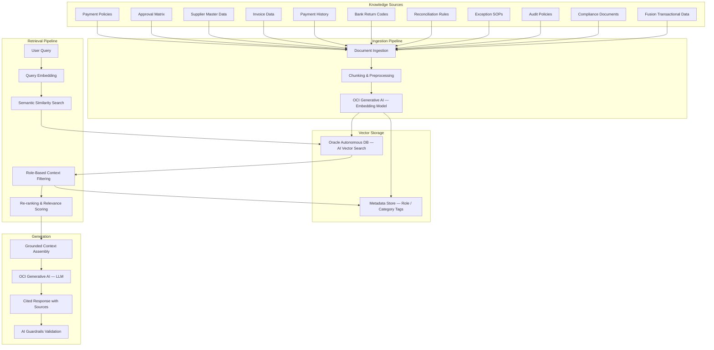
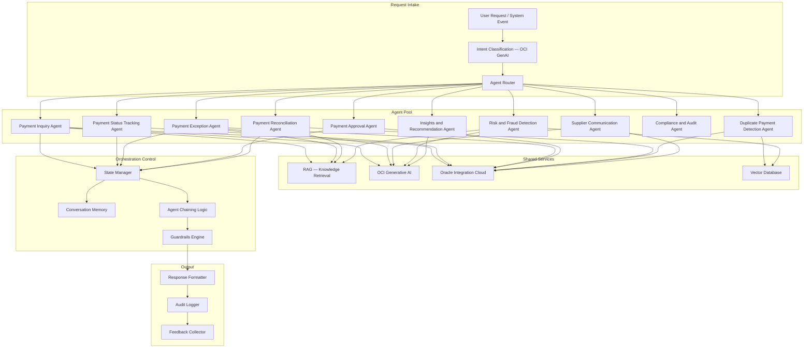
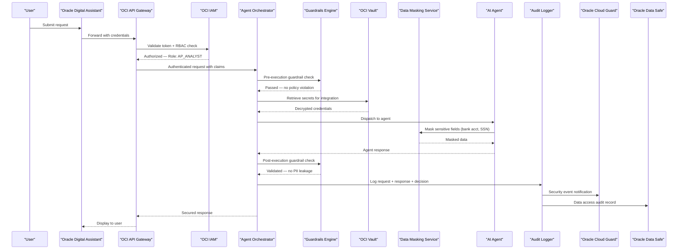
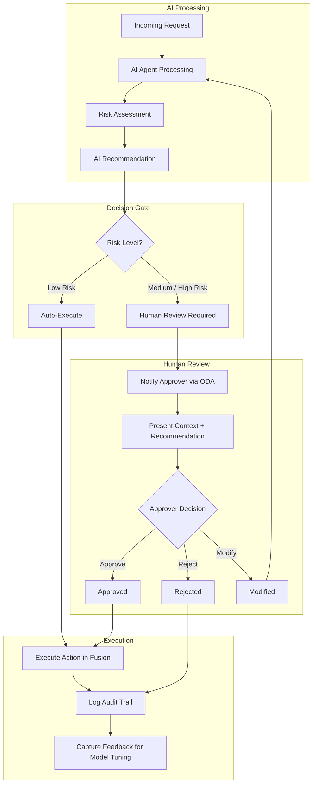
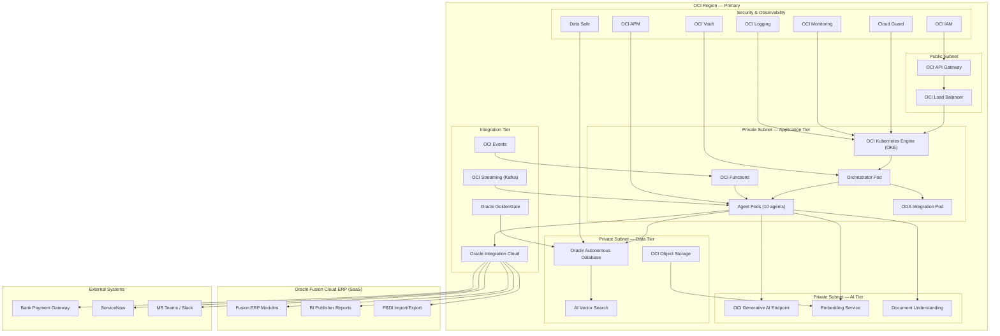
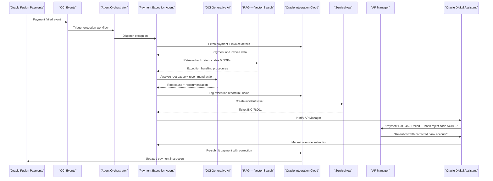

# High-Level Design (HLD) — Oracle AI-Powered Payment Agent

| Document Attribute | Value |
|---|---|
| **Document Title** | High-Level Design — AI-Powered Payment Agent |
| **Version** | 1.0 |
| **Status** | Draft |
| **Classification** | Confidential — Internal Use Only |
| **Last Updated** | 2026-07-06 |

---

## Table of Contents

1. [Executive Summary](#1-executive-summary)
2. [Business Problem Statement](#2-business-problem-statement)
3. [Business Objectives](#3-business-objectives)
4. [Target Users and Personas](#4-target-users-and-personas)
5. [Current-State Challenges](#5-current-state-challenges)
6. [Future-State Vision](#6-future-state-vision)
7. [Scope and Out-of-Scope](#7-scope-and-out-of-scope)
8. [Key Business Use Cases](#8-key-business-use-cases)
9. [Functional Capabilities](#9-functional-capabilities)
10. [Non-Functional Requirements](#10-non-functional-requirements)
11. [End-to-End Solution Architecture](#11-end-to-end-solution-architecture)
12. [Oracle Fusion ERP Integration Architecture](#12-oracle-fusion-erp-integration-architecture)
13. [AI and GenAI Architecture](#13-ai-and-genai-architecture)
14. [Agentic AI Architecture](#14-agentic-ai-architecture)
15. [Multi-Agent Orchestration Design](#15-multi-agent-orchestration-design)
16. [Data Flow Architecture](#16-data-flow-architecture)
17. [Security Architecture](#17-security-architecture)
18. [IAM Approach](#18-iam-approach)
19. [Compliance and Audit Architecture](#19-compliance-and-audit-architecture)
20. [Human-in-the-Loop Approval Model](#20-human-in-the-loop-approval-model)
21. [Observability and Monitoring Architecture](#21-observability-and-monitoring-architecture)
22. [Deployment Architecture](#22-deployment-architecture)
23. [Integration Architecture](#23-integration-architecture)
24. [Exception Handling Architecture](#24-exception-handling-architecture)
25. [Risk and Control Framework](#25-risk-and-control-framework)
26. [Business Value and KPI Measurement](#26-business-value-and-kpi-measurement)
27. [Implementation Roadmap](#27-implementation-roadmap)
28. [MVP/POC/Production Rollout Plan](#28-mvppocproduction-rollout-plan)
29. [Architecture Views](#29-architecture-views)
30. [AI Agent Detailed Specifications](#30-ai-agent-detailed-specifications)
31. [Automation Capabilities](#31-automation-capabilities)
32. [Technology Stack](#32-technology-stack)
33. [Final Section — Assumptions, Risks, and Checklists](#33-final-section--assumptions-risks-and-checklists)

---

## 1. Executive Summary

This document presents the High-Level Design for an **AI-Powered Payment Agent** built on Oracle Fusion Cloud ERP, Oracle Cloud Infrastructure (OCI) AI services, Oracle Digital Assistant, Oracle Integration Cloud, and native AI/GenAI capabilities. The solution addresses the critical operational challenges in enterprise payment processing within banking and financial services organizations.

The Payment Agent employs a **multi-agent orchestration architecture** comprising ten specialized AI agents that automate, augment, and accelerate payment operations across the full invoice-to-payment lifecycle. Each agent is purpose-built for a specific domain — from payment inquiry and status tracking to fraud detection, reconciliation, and compliance auditing — and is grounded in enterprise data through a Retrieval-Augmented Generation (RAG) architecture backed by Oracle Autonomous Database with AI Vector Search.

The solution integrates deeply with **Oracle Fusion Cloud ERP modules** (Accounts Payable, Accounts Receivable, General Ledger, Cash Management, Subledger Accounting, Payments, Supplier Management, Procurement, Expenses, and Financial Reporting) via Oracle Integration Cloud (OIC) adapters, REST APIs, business events, and file-based import/export (FBDI/BI Publisher). External system integration covers bank payment gateways, bank statement files, ServiceNow ticketing, Microsoft Teams/Slack, and enterprise data lakes.

The architecture enforces strict **AI guardrails**, a **human-in-the-loop approval model** for high-risk actions, comprehensive **audit logging**, and full compliance with SOX, PCI DSS, and GDPR requirements. Every AI recommendation is explainable, grounded in approved data sources, and traceable through a complete audit chain.

**Key business outcomes** include a projected 60–80% reduction in manual payment inquiry resolution time, 40–60% improvement in exception handling throughput, near-real-time duplicate payment detection, and automated reconciliation of over 90% of bank statement line items.

---

## 2. Business Problem Statement

Enterprise payment operations in banking and financial services organizations face significant challenges that impact operational efficiency, compliance posture, and financial risk management:

1. **High Volume of Manual Payment Inquiries** — Finance teams spend 40–60% of their time responding to repetitive payment status inquiries from internal stakeholders and external suppliers, diverting resources from value-added activities.

2. **Fragmented Exception Handling** — Payment exceptions (bank rejects, validation failures, insufficient funds) are handled through manual email chains and spreadsheet tracking, resulting in delayed resolution, missed SLAs, and increased financial exposure.

3. **Approval Bottlenecks** — Payment approval workflows rely on sequential manual review without intelligent routing, risk-based prioritization, or contextual recommendations, causing delays in critical disbursements.

4. **Duplicate Payment Risk** — Traditional rule-based duplicate detection misses semantic duplicates and partial matches, exposing the organization to financial loss and supplier relationship strain.

5. **Reconciliation Burden** — Manual reconciliation of bank statements against ERP records consumes significant treasury resources and introduces errors that propagate through financial close cycles.

6. **Limited Fraud Detection** — Existing controls are largely retrospective and rule-based, unable to detect sophisticated anomalies or emerging fraud patterns in real time.

7. **Compliance Gaps** — Maintaining continuous compliance with SOX, PCI DSS, and internal audit requirements across distributed payment processes requires extensive manual evidence collection and reporting.

8. **Lack of Proactive Insights** — Finance leadership lacks real-time visibility into payment operations performance, risk exposure, and optimization opportunities.

---

## 3. Business Objectives

| ID | Objective | Target Metric |
|---|---|---|
| BO-01 | Automate payment inquiry resolution | 60–80% reduction in manual inquiry handling time |
| BO-02 | Accelerate exception resolution | 40–60% improvement in exception-to-resolution cycle time |
| BO-03 | Eliminate duplicate payments | >95% detection rate for duplicate/near-duplicate payments |
| BO-04 | Automate bank reconciliation | >90% straight-through reconciliation rate |
| BO-05 | Enable real-time fraud detection | <5 minutes from anomaly detection to alert |
| BO-06 | Strengthen compliance posture | 100% audit trail coverage for AI-assisted decisions |
| BO-07 | Improve supplier satisfaction | 50% reduction in supplier payment inquiry response time |
| BO-08 | Optimize working capital | Identify 5–10% additional early payment discount capture |
| BO-09 | Reduce operational cost | 30–40% reduction in payment operations FTE effort |
| BO-10 | Enable data-driven decisions | Real-time KPI dashboards for payment operations leadership |

---

## 4. Target Users and Personas

| Persona | Role | Department | Primary Use Cases | Access Level |
|---|---|---|---|---|
| **Finance Analyst** | Accounts Payable Analyst | Finance — AP | Payment inquiries, invoice matching, exception research | Read + limited action |
| **AP Manager** | AP Team Lead / Manager | Finance — AP | Exception approval, escalation management, team performance | Full AP operations |
| **Treasury Manager** | Treasury Operations Lead | Treasury | Reconciliation review, cash position, bank integration | Treasury operations |
| **Procurement Manager** | Procurement Lead | Procurement | Supplier payment status, PO-to-payment tracking | Read + procurement ops |
| **Supplier** | External vendor/supplier contact | External | Payment status inquiry, remittance advice, dispute submission | Self-service portal (limited) |
| **Auditor** | Internal/External Audit | Audit / Compliance | Audit trail review, compliance evidence, policy validation | Read-only audit access |
| **CFO / Finance Director** | Finance Leadership | Executive | Dashboard insights, KPI monitoring, risk overview | Executive read-only |
| **IT Administrator** | Platform Administrator | IT | System configuration, integration monitoring, agent management | Full system admin |

---

## 5. Current-State Challenges

| Challenge Area | Current State | Impact |
|---|---|---|
| Payment Inquiries | Manual lookup across multiple Fusion screens; email-based responses | 15–30 minutes per inquiry; high FTE cost |
| Status Tracking | No unified tracking dashboard; status checks require ERP access | Delays; supplier dissatisfaction |
| Exception Handling | Spreadsheet-based tracking; manual root-cause analysis | 2–5 day resolution cycle; missed SLAs |
| Approvals | Sequential BPM workflow; no risk-based routing | 1–3 day approval delays; bottlenecks |
| Reconciliation | Semi-manual matching in Cash Management; Excel-based exceptions | 3–5 days per month-end cycle |
| Duplicate Detection | Rule-based matching on invoice number + amount only | 15–20% miss rate for semantic duplicates |
| Supplier Communication | Manual email drafting for remittance and dispute responses | Inconsistent communication; delays |
| Fraud Detection | Post-facto review; limited real-time controls | Late detection; financial exposure |
| Compliance | Manual evidence collection; periodic audit sampling | Incomplete coverage; audit findings |
| Reporting | Static BI Publisher reports; no real-time analytics | Stale insights; reactive management |

---

## 6. Future-State Vision

The AI-Powered Payment Agent transforms payment operations from a **manual, reactive, and fragmented process** into an **intelligent, proactive, and unified autonomous operation** grounded in enterprise data and governed by strict controls.

**Key elements of the future state:**

- **Conversational Interface**: Finance users interact with the Payment Agent through Oracle Digital Assistant (ODA), Microsoft Teams, Slack, or the Oracle Supplier Portal using natural language queries. The agent understands context, retrieves real-time data from Oracle Fusion, and responds with grounded, citation-backed answers.

- **Multi-Agent Intelligence**: Ten specialized AI agents collaborate through an orchestration layer to handle the full spectrum of payment operations — from simple status inquiries to complex fraud investigations and reconciliation workflows.

- **Autonomous Operations**: Low-risk, high-frequency tasks (status inquiries, standard reconciliation matches, routine classifications) are handled autonomously by agents. Medium and high-risk actions (payment approvals, exception overrides, suspicious transactions) are routed through human-in-the-loop review with AI-generated recommendations.

- **Real-Time Risk Management**: Continuous monitoring of payment flows for anomalies, fraud patterns, and compliance violations using OCI Generative AI and Oracle AI services, with instant alerts and escalation.

- **Enterprise-Grade Compliance**: Every AI action, recommendation, and decision is logged in an immutable audit trail with full explainability, satisfying SOX, PCI DSS, and GDPR requirements.

- **Data-Driven Optimization**: Oracle Analytics Cloud dashboards provide real-time visibility into payment operations KPIs, agent performance, exception trends, and cash optimization opportunities.

---

## 7. Scope and Out-of-Scope

### In Scope

| Area | Details |
|---|---|
| Payment inquiry automation | Natural language queries for payment status, invoice details, supplier history |
| Status tracking | Real-time payment lifecycle tracking across all stages |
| Exception handling | Automated root-cause analysis, resolution recommendation, ticket creation |
| Approval support | AI-assisted approval with risk scoring and policy validation |
| Reconciliation | Automated bank statement matching and exception management |
| Duplicate detection | Semantic and rule-based duplicate identification |
| Supplier communication | Automated remittance advice and dispute response generation |
| Fraud and risk detection | Real-time anomaly detection and risk scoring |
| Compliance and audit | Automated audit trail, evidence generation, and compliance monitoring |
| Insights and recommendations | Proactive analytics, cash discount optimization, SLA monitoring |
| Oracle Fusion integration | AP, AR, GL, Cash Management, SLA, Payments, Supplier Management, Procurement, Expenses, Financial Reporting |
| External integration | Bank payment gateways, bank statements, ServiceNow, Teams/Slack |
| RAG architecture | Grounded responses using enterprise knowledge base and Fusion data |
| Human-in-the-loop | Configurable approval workflows for medium/high-risk actions |

### Out of Scope

| Area | Rationale |
|---|---|
| Payment execution | The agent advises and assists but does not independently execute payments without human/system approval |
| ERP module implementation | Assumes Oracle Fusion Cloud ERP is deployed and operational |
| Bank onboarding | Bank connectivity and payment file format setup are prerequisites |
| Custom ERP extensions | No modifications to Fusion Cloud ERP core; uses published APIs and extension points only |
| Non-payment finance processes | Budgeting, forecasting, fixed assets, and revenue recognition are excluded |
| Physical infrastructure | OCI provides all infrastructure; no on-premises components |

---

## 8. Key Business Use Cases

### UC-01: Payment Inquiry Automation
A finance analyst asks the Payment Agent: "What is the status of payment for invoice INV-2026-4521?" The agent retrieves the invoice, PO, and payment records from Oracle Fusion AP via OIC, generates a natural language summary with settlement date, bank reference, and remittance details, and responds within seconds.

### UC-02: Payment Status Tracking
An AP manager requests a list of all payments pending settlement for supplier ACME Corp. The agent queries Oracle Payments and Cash Management, presents a real-time status dashboard with lifecycle stages, and proactively alerts on any payments approaching SLA breach.

### UC-03: Invoice-to-Payment Lifecycle Visibility
A procurement manager traces the full lifecycle of PO-2026-8832 from requisition through invoice receipt, validation, approval, payment, and bank settlement. The agent assembles data from Procurement, AP, Payments, and Cash Management modules and presents a unified timeline.

### UC-04: Supplier/Vendor Payment Assistance
A supplier contacts the portal asking about unpaid invoices. The agent authenticates the supplier, retrieves their payment history from Fusion Supplier Management, identifies pending invoices, and provides estimated payment dates based on payment terms and approval pipeline status.

### UC-05: Exception Handling and Resolution
A bank returns payment PAY-60234 with reject code AC04 (closed account). The Payment Exception Agent receives the event, retrieves the supplier bank details, cross-references with the supplier master, identifies the root cause, recommends corrective action, creates a ServiceNow ticket, and notifies the responsible AP analyst.

### UC-06: Approval Support with AI Recommendation
Payment batch PB-2026-0715 totaling USD 2.4M requires AP Manager approval. The Payment Approval Agent presents the batch with a risk assessment, policy compliance check, duplicate scan results, and an AI-generated recommendation with supporting evidence. The approver reviews and approves within the ODA interface.

### UC-07: Reconciliation Support
The Treasury Manager initiates month-end bank reconciliation. The Payment Reconciliation Agent ingests MT940 bank statement files, matches 1,247 of 1,270 line items automatically, generates resolution recommendations for 23 unmatched items, and presents a reconciliation summary for review.

### UC-08: Duplicate Payment Detection
A new payment instruction is created for invoice INV-2026-8832. The Duplicate Payment Detection Agent performs semantic similarity search against payment history, identifies a matching payment settled on 2026-06-15, places the new payment on hold, and alerts the analyst with evidence.

### UC-09: Failed Payment Investigation
Payment PAY-60189 fails at the bank gateway. The agent performs root-cause analysis by examining the payment instruction, bank file format, supplier bank details, and recent successful payments to the same supplier, then generates a diagnostic report with recommended corrective actions.

### UC-10: Remittance Explanation
A supplier requests explanation of a partial payment. The agent retrieves the remittance advice, maps it to invoices, deductions, and credit notes applied, and generates a clear natural language explanation with line-item details.

### UC-11: Cash Discount / Early Payment Recommendation
The Insights Agent identifies USD 1.2M in eligible invoices where capturing the 2/10 Net 30 early payment discount would save USD 24,000. It presents the recommendation to the Treasury Manager with a cash impact analysis and approval workflow.

### UC-12: Fraud / Risk / Anomaly Detection
The Risk and Fraud Detection Agent identifies an unusual pattern: three invoices from supplier XYZ-Corp with incrementally increasing amounts just below the auto-approval threshold. It flags the pattern, assigns a risk score, and escalates to the AP Manager with detailed evidence.

### UC-13: SLA Monitoring and Escalation
The agent continuously monitors payment processing against defined SLAs. When payment PAY-60301 approaches its 48-hour SLA for exception resolution, it auto-escalates to the AP Manager with a priority notification and context summary.

### UC-14: Natural Language Query Support
The CFO asks: "What is our average payment cycle time for the last quarter, and how does it compare to the prior quarter?" The Insights Agent queries payment history, performs the analysis, and returns a formatted summary with trend visualization data.

### UC-15: Human-in-the-Loop Review
A high-value payment of USD 5M requires multi-level approval. The agent routes through the configured approval hierarchy, presents risk assessments and AI recommendations at each level, captures approver decisions with timestamps, and maintains the full approval chain in the audit trail.

### UC-16: Audit / Compliance / Traceability
An internal auditor requests all AI-assisted payment decisions for Q2 2026. The Compliance and Audit Agent queries the audit log, generates an evidence package with decision rationale, supporting data, approver identities, and timestamps, and exports it in a SOX-compliant format.

---

## 9. Functional Capabilities

The Payment Agent delivers 16 core functional capabilities mapped to the business use cases above:

| ID | Capability | Description | Primary Agent(s) |
|---|---|---|---|
| FC-01 | Payment Inquiry Automation | NL-based payment status and detail retrieval | Payment Inquiry Agent |
| FC-02 | Status Tracking | Real-time payment lifecycle stage tracking | Payment Status Tracking Agent |
| FC-03 | Invoice-to-Payment Lifecycle Visibility | End-to-end PO → Invoice → Payment → Settlement tracing | Payment Inquiry Agent, Payment Status Tracking Agent |
| FC-04 | Supplier/Vendor Payment Assistance | Self-service payment info for suppliers via portal/chatbot | Supplier Communication Agent, Payment Inquiry Agent |
| FC-05 | Exception Handling | Automated root-cause analysis, recommendation, ticketing | Payment Exception Agent |
| FC-06 | Approval Support | AI-assisted approval with risk scoring and policy check | Payment Approval Agent |
| FC-07 | Reconciliation Support | Automated bank statement matching and exception management | Payment Reconciliation Agent |
| FC-08 | Duplicate Detection | Semantic + rule-based duplicate identification and hold | Duplicate Payment Detection Agent |
| FC-09 | Failed Payment Investigation | Root-cause diagnosis and corrective action for bank rejects | Payment Exception Agent |
| FC-10 | Remittance Explanation | NL explanation of remittance advice line items | Supplier Communication Agent |
| FC-11 | Cash Discount / Early Payment Recommendation | Proactive discount capture opportunity identification | Insights and Recommendation Agent |
| FC-12 | Fraud / Risk / Anomaly Detection | Real-time anomaly detection and risk scoring | Risk and Fraud Detection Agent |
| FC-13 | SLA Monitoring and Escalation | Continuous SLA tracking with auto-escalation | Payment Status Tracking Agent, Insights Agent |
| FC-14 | Natural Language Query Support | Ad-hoc NL queries against payment operations data | All agents via Orchestrator |
| FC-15 | Human-in-the-Loop Review | Configurable human approval for medium/high-risk actions | Payment Approval Agent |
| FC-16 | Audit / Compliance / Traceability | Immutable audit trail and compliance evidence generation | Compliance and Audit Agent |

---

## 10. Non-Functional Requirements

| ID | Category | Requirement | Target |
|---|---|---|---|
| NFR-01 | Performance | Agent response time for simple inquiries | < 3 seconds (P95) |
| NFR-02 | Performance | Agent response time for complex analysis | < 10 seconds (P95) |
| NFR-03 | Performance | Batch reconciliation processing | 10,000 records/minute |
| NFR-04 | Availability | System uptime | 99.9% (excluding planned maintenance) |
| NFR-05 | Availability | Recovery Time Objective (RTO) | < 1 hour |
| NFR-06 | Availability | Recovery Point Objective (RPO) | < 15 minutes |
| NFR-07 | Scalability | Concurrent user support | 500+ concurrent sessions |
| NFR-08 | Scalability | Agent horizontal scaling | Auto-scale 1–20 agent pods per type |
| NFR-09 | Security | Authentication | OAuth2 + SSO via OCI IAM / Fusion roles |
| NFR-10 | Security | Data encryption in transit | TLS 1.3 |
| NFR-11 | Security | Data encryption at rest | AES-256 via OCI Vault |
| NFR-12 | Security | PII/financial data masking | All sensitive fields masked in logs/responses |
| NFR-13 | Compliance | Audit trail retention | 7 years (configurable) |
| NFR-14 | Compliance | SOX compliance | Full segregation of duties; maker-checker controls |
| NFR-15 | Compliance | PCI DSS | Tokenized bank account data; no raw storage |
| NFR-16 | Compliance | GDPR | Right to erasure; consent management; data minimization |
| NFR-17 | Reliability | Message delivery guarantee | At-least-once delivery via OCI Streaming |
| NFR-18 | Maintainability | Configuration change deployment | < 30 minutes with zero downtime |
| NFR-19 | Observability | Monitoring coverage | 100% of agent actions tracked with telemetry |
| NFR-20 | Observability | Alert response time | < 5 minutes for critical alerts |

---

## 11. End-to-End Solution Architecture

The solution architecture follows a layered approach with clear separation of concerns:

```mermaid
graph TB
    subgraph "User Channels"
        U1["Finance Analyst"]
        U2["AP Manager"]
        U3["Treasury Manager"]
        U4["Supplier"]
        U5["Auditor"]
    end

    subgraph "Interaction Layer"
        ODA["Oracle Digital Assistant"]
        TEAMS["Microsoft Teams / Slack"]
        PORTAL["Oracle Supplier Portal"]
        EMAIL["Email / Notification Service"]
    end

    subgraph "API Gateway & Security"
        APIGW["OCI API Gateway"]
        IAM["OCI IAM / OAuth2 / SSO"]
    end

    subgraph "AI Agent Orchestration Layer"
        ORCH["Multi-Agent Orchestrator"]
        PA1["Payment Inquiry Agent"]
        PA2["Payment Status Tracking Agent"]
        PA3["Payment Exception Agent"]
        PA4["Payment Approval Agent"]
        PA5["Payment Reconciliation Agent"]
        PA6["Duplicate Payment Detection Agent"]
        PA7["Supplier Communication Agent"]
        PA8["Risk and Fraud Detection Agent"]
        PA9["Compliance and Audit Agent"]
        PA10["Insights and Recommendation Agent"]
    end

    subgraph "AI / GenAI Services"
        GENAI["OCI Generative AI Service"]
        AIAGENTS["Oracle AI Agents"]
        DOCAI["Oracle Document Understanding"]
        LANGSVC["Oracle Language Service"]
        VISION["Oracle Vision AI"]
    end

    subgraph "RAG & Knowledge Layer"
        VECDB["Oracle Autonomous DB — AI Vector Search"]
        EMBED["Embedding Pipeline"]
        KBASE["Enterprise Knowledge Base"]
    end

    subgraph "Oracle Fusion Cloud ERP"
        AP["Accounts Payable"]
        AR["Accounts Receivable"]
        GL["General Ledger"]
        CM["Cash Management"]
        SLA["Subledger Accounting"]
        PAY["Payments"]
        SM["Supplier Management"]
        PROC["Procurement"]
        EXP["Expenses"]
        FR["Financial Reporting"]
    end

    subgraph "Integration Layer"
        OIC["Oracle Integration Cloud"]
        EVENTS["OCI Events / Streaming"]
        FUNCS["OCI Functions"]
        GG["Oracle GoldenGate"]
    end

    subgraph "External Systems"
        BANK["Bank Payment Gateway"]
        BANKSTMT["Bank Statement Files"]
        SNOW["ServiceNow / Ticketing"]
        DL["Enterprise Data Lake"]
    end

    subgraph "Observability & Security"
        MON["OCI Monitoring / APM"]
        LOG["OCI Logging"]
        CG["Oracle Cloud Guard"]
        DS["Oracle Data Safe"]
        VAULT["OCI Vault"]
    end

    U1 --> ODA
    U2 --> ODA
    U3 --> ODA
    U4 --> PORTAL
    U5 --> ODA
    ODA --> APIGW
    TEAMS --> APIGW
    PORTAL --> APIGW
    EMAIL --> APIGW
    APIGW --> IAM
    IAM --> ORCH
    ORCH --> PA1
    ORCH --> PA2
    ORCH --> PA3
    ORCH --> PA4
    ORCH --> PA5
    ORCH --> PA6
    ORCH --> PA7
    ORCH --> PA8
    ORCH --> PA9
    ORCH --> PA10
    PA1 --> GENAI
    PA3 --> GENAI
    PA8 --> GENAI
    PA10 --> GENAI
    PA1 --> VECDB
    PA3 --> VECDB
    PA5 --> VECDB
    PA8 --> VECDB
    GENAI --> EMBED
    EMBED --> VECDB
    KBASE --> EMBED
    PA1 --> OIC
    PA2 --> OIC
    PA3 --> OIC
    PA4 --> OIC
    PA5 --> OIC
    PA6 --> OIC
    PA7 --> OIC
    PA8 --> OIC
    PA9 --> OIC
    PA10 --> OIC
    OIC --> AP
    OIC --> AR
    OIC --> GL
    OIC --> CM
    OIC --> SLA
    OIC --> PAY
    OIC --> SM
    OIC --> PROC
    OIC --> EXP
    OIC --> FR
    OIC --> BANK
    OIC --> BANKSTMT
    OIC --> SNOW
    OIC --> DL
    EVENTS --> FUNCS
    GG --> DL
    ORCH --> MON
    ORCH --> LOG
    CG --> ORCH
    DS --> VECDB
    VAULT --> ORCH
```

### Architecture Layers

1. **Interaction Layer** — Oracle Digital Assistant (ODA) serves as the primary conversational interface, with additional channels through Microsoft Teams, Slack, the Oracle Supplier Portal, and email. All channels route through the OCI API Gateway for unified security enforcement.

2. **API Gateway & Security** — OCI API Gateway provides rate limiting, request validation, and routing. OCI IAM enforces OAuth2/SSO authentication and RBAC/ABAC authorization before any request reaches the agent layer.

3. **Agent Orchestration Layer** — The Multi-Agent Orchestrator classifies incoming requests, routes them to the appropriate specialized agent(s), manages inter-agent communication, maintains conversation state, and enforces guardrails.

4. **AI/GenAI Services** — OCI Generative AI provides large language model capabilities for natural language understanding, response generation, and analysis. Oracle Document Understanding handles document parsing, Oracle Language Service provides NLP capabilities, and Oracle Vision AI processes visual documents.

5. **RAG & Knowledge Layer** — Oracle Autonomous Database with AI Vector Search stores embeddings of enterprise knowledge (policies, procedures, transactional data). The embedding pipeline ingests, chunks, and vectorizes documents for semantic retrieval.

6. **Oracle Fusion Cloud ERP** — The system of record for all payment operations data. Ten Fusion modules are integrated via OIC adapters, REST APIs, business events, and FBDI.

7. **Integration Layer** — Oracle Integration Cloud orchestrates all integrations with pre-built Fusion adapters. OCI Events and Streaming enable event-driven processing. OCI Functions provide serverless compute for lightweight transformations. Oracle GoldenGate replicates data to the enterprise data lake.

8. **Observability & Security** — OCI Monitoring, APM, and Logging provide full observability. Oracle Cloud Guard monitors security posture. Oracle Data Safe protects sensitive data. OCI Vault manages encryption keys and secrets.

---

## 12. Oracle Fusion ERP Integration Architecture

### Fusion Module Integration Map

| Oracle Fusion Module | Integration Purpose | Integration Method | Data Direction |
|---|---|---|---|
| **Accounts Payable** | Invoice lookup, payment instruction creation, holds management | REST API + OIC Adapter | Bidirectional |
| **Accounts Receivable** | Customer payment matching, receipt application | REST API | Read |
| **General Ledger** | GL entry validation, journal posting verification | REST API + BI Publisher | Read |
| **Cash Management** | Bank statement import, reconciliation, cash position | REST API + FBDI | Bidirectional |
| **Subledger Accounting** | Accounting event validation, SLA entry verification | REST API | Read |
| **Payments** | Payment status, payment process request, bank file generation | REST API + Business Events | Bidirectional |
| **Supplier Management** | Supplier master data, bank account details, site information | REST API + OIC Adapter | Read |
| **Procurement** | PO details, receipt matching, contract terms | REST API | Read |
| **Expenses** | Expense report payment status, reimbursement tracking | REST API | Read |
| **Financial Reporting** | Payment operations reports, analytics data extraction | BI Publisher + REST API | Read |

### Key Fusion REST API Endpoints

| API | Endpoint | Purpose |
|---|---|---|
| Invoices | `GET /fscmRestApi/resources/11.13.18.05/invoices` | Retrieve invoice details |
| Payments | `GET /fscmRestApi/resources/11.13.18.05/paymentProcessRequests` | Payment process status |
| Suppliers | `GET /fscmRestApi/resources/11.13.18.05/suppliers` | Supplier master data |
| Bank Accounts | `GET /fscmRestApi/resources/11.13.18.05/cashBankAccounts` | Bank account details |
| GL Journals | `GET /fscmRestApi/resources/11.13.18.05/journals` | General Ledger entries |
| Cash Transactions | `GET /fscmRestApi/resources/11.13.18.05/cashTransactions` | Cash Management records |
| Holds | `POST /fscmRestApi/resources/11.13.18.05/invoices/{id}/holds` | Apply/release invoice holds |
| Payment Methods | `GET /fscmRestApi/resources/11.13.18.05/paymentMethods` | Available payment methods |

### Integration Patterns

- **Real-time synchronous**: REST API calls for on-demand queries (payment status, invoice lookup, supplier details)
- **Event-driven asynchronous**: Oracle Business Events for payment lifecycle state changes (created, validated, approved, settled, rejected)
- **Batch file-based**: FBDI for bulk data import/export; BI Publisher for scheduled report extraction
- **Change Data Capture**: Oracle GoldenGate for near-real-time replication of transactional data to the analytics layer

---

## 13. AI and GenAI Architecture

### OCI Generative AI Integration

The Payment Agent leverages OCI Generative AI as the core intelligence engine for natural language understanding, response generation, analysis, and recommendation. The architecture uses the following AI services:

| Oracle AI Service | Usage | Purpose |
|---|---|---|
| **OCI Generative AI** | Primary LLM | Natural language understanding, response generation, analysis, summarization |
| **OCI Generative AI — Embedding** | Embedding model | Document and query vectorization for RAG retrieval |
| **Oracle Fusion AI** | Built-in ERP intelligence | Fusion-native AI features (intelligent document recognition, adaptive intelligence) |
| **Oracle Digital Assistant** | Conversational AI | Intent classification, dialog management, channel integration |
| **Oracle AI Agents** | Agent framework | Agent lifecycle management, orchestration, guardrails |
| **Oracle Document Understanding** | Document AI | Invoice/document parsing, field extraction, classification |
| **Oracle Language Service** | NLP | Sentiment analysis, key phrase extraction, language detection |
| **Oracle Vision AI** | Visual AI | Check image processing, document image analysis |

### RAG Architecture

The RAG (Retrieval-Augmented Generation) architecture ensures all AI responses are grounded in enterprise data and approved knowledge sources:

**Knowledge Sources** — 11 enterprise knowledge sources are ingested into the vector store:

1. **Payment Policies** — Corporate payment policies, terms, thresholds, and procedures
2. **Approval Matrix** — Multi-level approval rules based on amount, entity, supplier category, and risk
3. **Supplier Master Data** — Supplier profiles, bank details, contact information, payment terms
4. **Invoice Data** — Historical and current invoice records with line-item details
5. **Payment History** — Complete payment transaction history with status, dates, and references
6. **Bank Return Codes** — Standardized bank reject/return code descriptions and resolution procedures
7. **Reconciliation Rules** — Matching rules, tolerance thresholds, and exception categories
8. **Exception SOPs** — Standard operating procedures for each exception type
9. **Audit Policies** — Internal audit policies, SOX requirements, and compliance frameworks
10. **Compliance Documents** — Regulatory requirements (PCI DSS, GDPR) and internal compliance standards
11. **Fusion Transactional Data** — Real-time and near-real-time Fusion ERP transactional data via GoldenGate replication

**Embedding Strategy** — Documents are chunked using a semantic-aware strategy (512-token chunks with 50-token overlap), embedded using the OCI Generative AI embedding model (Cohere Embed v3), and stored in Oracle Autonomous Database with AI Vector Search. Each chunk is tagged with metadata including source, category, access-control role, entity, and timestamp.

**Retrieval Pipeline** — User queries are embedded, matched against the vector store using cosine similarity, filtered by the user's RBAC role (ensuring analysts cannot retrieve executive-only data), re-ranked for relevance, and assembled into a grounded context window for the LLM.

**Citation-Based Responses** — Every AI response includes source citations referencing the specific documents and data records used, enabling auditability and trust.

### Model Selection Strategy

| Use Case | Recommended Model | Rationale |
|---|---|---|
| General NL understanding/generation | OCI GenAI — Cohere Command R+ | Strong enterprise reasoning; native Oracle integration |
| Embedding | OCI GenAI — Cohere Embed v3 | High-quality multilingual embeddings; native Vector Search support |
| Document parsing | Oracle Document Understanding | Purpose-built for invoice/receipt extraction |
| Intent classification | Oracle Digital Assistant NLU | Optimized for conversational intent routing |
| Sentiment analysis | Oracle Language Service | Integrated NLP for supplier communication tone |

---

## 14. Agentic AI Architecture

### Agent Design Principles

The Payment Agent system follows these agentic AI design principles:

1. **Single Responsibility** — Each agent handles one well-defined domain of payment operations
2. **Autonomy with Guardrails** — Agents operate independently within defined boundaries; guardrails prevent unauthorized actions
3. **Grounded Intelligence** — All agent responses are grounded in enterprise data via RAG; no hallucinated outputs
4. **Explainability** — Every recommendation includes reasoning chain and supporting evidence
5. **Human Oversight** — Configurable human-in-the-loop checkpoints for risk-appropriate oversight
6. **Composability** — Agents can be chained for complex multi-step workflows
7. **Observability** — Full telemetry for every agent action, decision, and interaction
8. **Resilience** — Graceful degradation with fallback behaviors when services are unavailable

### Agent Lifecycle

Each agent follows a standardized lifecycle:

1. **Receive** — Accept dispatched request from orchestrator with context and user claims
2. **Retrieve** — Fetch required data from Fusion ERP via OIC and relevant context from RAG
3. **Reason** — Apply domain logic and GenAI analysis to process the request
4. **Guard** — Validate output against guardrails before returning
5. **Respond** — Return structured response with citations, confidence score, and recommended actions
6. **Record** — Log the complete interaction to the audit trail

---

## 15. Multi-Agent Orchestration Design

### Orchestration Architecture

### Orchestration Patterns

| Pattern | Description | Example |
|---|---|---|
| **Direct Dispatch** | Single agent handles the request end-to-end | Payment status inquiry → Payment Inquiry Agent |
| **Sequential Chain** | Multiple agents process in sequence; output of one feeds the next | Exception detected → Exception Agent → Risk Agent → Approval Agent |
| **Parallel Fan-out** | Multiple agents process simultaneously; results are aggregated | New payment → Duplicate Detection Agent + Risk Agent (parallel) → Approval Agent |
| **Conditional Routing** | Agent selection based on runtime conditions | Risk score > 0.7 → Route to human review; Risk score ≤ 0.7 → Auto-process |
| **Escalation** | Agent hands off to a higher-authority agent or human | Exception Agent cannot resolve → Escalate to AP Manager via Approval Agent |

### Intent Classification

The orchestrator uses OCI Generative AI for intent classification with the following taxonomy:

| Intent Category | Sub-Intents | Routed Agent |
|---|---|---|
| `payment.inquiry` | status, details, history, timeline | Payment Inquiry Agent |
| `payment.tracking` | lifecycle, eta, batch_status | Payment Status Tracking Agent |
| `payment.exception` | failure, reject, error, hold | Payment Exception Agent |
| `payment.approval` | approve, reject, escalate, delegate | Payment Approval Agent |
| `payment.reconciliation` | match, unmatch, bank_statement | Payment Reconciliation Agent |
| `payment.duplicate` | check, confirm, cancel | Duplicate Payment Detection Agent |
| `supplier.communication` | remittance, dispute, inquiry | Supplier Communication Agent |
| `risk.detection` | fraud, anomaly, suspicious | Risk and Fraud Detection Agent |
| `compliance.audit` | trail, evidence, report | Compliance and Audit Agent |
| `insights.analytics` | kpi, trend, recommendation, discount | Insights and Recommendation Agent |

### Conversation State Management

- **Session Context**: Maintained in Oracle Autonomous Database with configurable TTL (default: 4 hours)
- **Conversation Memory**: Last 20 turns preserved for multi-turn dialog continuity
- **Cross-Agent Context**: Shared context object passed between agents in a chain, containing accumulated data and decisions
- **User Preferences**: Stored per-user profile for personalized responses (preferred format, notification channel, language)

---

## 16. Data Flow Architecture

### Primary Data Flows

| Flow ID | Source | Destination | Trigger | Protocol | Volume |
|---|---|---|---|---|---|
| DF-01 | Oracle Fusion AP | Payment Agent | User inquiry | REST API (via OIC) | On-demand |
| DF-02 | Oracle Fusion Payments | Agent Orchestrator | Payment lifecycle event | Business Events → OCI Events | ~5,000 events/day |
| DF-03 | Bank Statement Files | Cash Management → Reconciliation Agent | Daily file ingestion | SFTP → OIC → FBDI | 1–50 files/day |
| DF-04 | Payment Agent | Oracle Fusion AP | Hold/release action | REST API (via OIC) | On-demand |
| DF-05 | Payment Agent | ServiceNow | Exception ticket creation | REST API (via OIC) | ~100 tickets/day |
| DF-06 | Enterprise Knowledge Base | Vector Store | Document update | Batch ingestion pipeline | Weekly refresh |
| DF-07 | Oracle Fusion (all modules) | Enterprise Data Lake | CDC replication | Oracle GoldenGate | Continuous |
| DF-08 | Agent Orchestrator | OCI Logging | Every agent action | OCI Logging SDK | Continuous |
| DF-09 | Oracle Fusion AP | Duplicate Detection Agent | New payment instruction | Business Event → OCI Events | ~2,000 events/day |
| DF-10 | Agent Orchestrator | Oracle Analytics Cloud | KPI metrics | OCI Streaming → Analytics | Near-real-time |

### Data Residency and Classification

| Data Category | Classification | Storage | Retention | Access Control |
|---|---|---|---|---|
| Payment transactions | Confidential — Financial | Oracle Fusion Cloud (SaaS) | Per ERP retention policy | Fusion roles + AP access |
| Supplier bank details | Restricted — PII/Financial | Oracle Fusion Cloud (encrypted) | Active + 7 years | Need-to-know; masked in agent responses |
| AI conversation logs | Internal — Operational | Oracle Autonomous DB | 90 days (configurable) | Admin + audit roles |
| Audit trail | Regulated — Compliance | Oracle Autonomous DB | 7 years (SOX) | Audit role (read-only) |
| Vector embeddings | Internal — Derived | Oracle Autonomous DB (Vector Search) | Refreshed with source | System access only |
| Agent telemetry | Internal — Operational | OCI Logging / APM | 30 days | Operations team |

---

## 17. Security Architecture

### Security Architecture Overview

### Security Controls Summary

| Control | Implementation | Oracle Service |
|---|---|---|
| Authentication | OAuth2 / OpenID Connect / SSO | OCI IAM, Oracle Fusion SSO |
| Authorization | RBAC + ABAC with fine-grained policies | OCI IAM Policies, Fusion Data Security |
| API Security | Rate limiting, request validation, threat protection | OCI API Gateway |
| Encryption in Transit | TLS 1.3 for all communications | OCI certificates |
| Encryption at Rest | AES-256 for all stored data | OCI Vault, Autonomous DB TDE |
| Key Management | Centralized key lifecycle management | OCI Vault (HSM-backed) |
| Secrets Management | Secure storage of integration credentials | OCI Vault Secrets |
| Data Masking | Dynamic masking of PII and financial data | Oracle Data Safe |
| Security Monitoring | Continuous threat detection and posture management | Oracle Cloud Guard |
| Vulnerability Scanning | Automated security scanning of containers and code | OCI Vulnerability Scanning |

### AI-Specific Security Controls

| Control | Description |
|---|---|
| Prompt injection prevention | Input sanitization and validation before LLM processing |
| Output validation | Post-generation guardrails to detect and block PII leakage, hallucination, or policy violation |
| Model access control | LLM endpoints accessible only from agent pods within private subnet |
| Prompt/response logging | Masked logging of all prompts and responses for audit (sensitive tokens redacted) |
| Token usage monitoring | Per-agent, per-user token consumption tracking and quota enforcement |
| Data boundary enforcement | RAG context filtering ensures users only access data within their authorized scope |

---

## 18. IAM Approach

### Identity and Access Management

The IAM architecture leverages OCI IAM as the identity provider with federation to Oracle Fusion Cloud roles:

| Component | Implementation |
|---|---|
| **Identity Provider** | OCI IAM with SAML 2.0 / OIDC federation to enterprise IdP (Azure AD, Okta) |
| **Authentication** | OAuth2 Authorization Code flow (interactive); Client Credentials (service-to-service) |
| **SSO** | Federated SSO across ODA, OCI console, and Oracle Fusion Cloud |
| **MFA** | Enforced for all human users; adaptive MFA for high-risk operations |
| **Service Accounts** | Dedicated OCI principals for each agent and integration with least-privilege policies |

### Role-Based Access Control (RBAC)

| Role | Permissions | Fusion Role Mapping |
|---|---|---|
| `PAYMENT_AGENT_VIEWER` | Read payment status, view inquiry responses | AP Inquiry Role |
| `PAYMENT_AGENT_ANALYST` | Viewer + submit exceptions, request research | AP Specialist Role |
| `PAYMENT_AGENT_APPROVER` | Analyst + approve/reject payment actions | AP Manager Role |
| `PAYMENT_AGENT_TREASURY` | Viewer + reconciliation review and approval | Cash Manager Role |
| `PAYMENT_AGENT_ADMIN` | Full agent configuration and management | IT Security Admin |
| `PAYMENT_AGENT_AUDITOR` | Read-only access to all audit trails and logs | Internal Auditor Role |
| `PAYMENT_AGENT_SUPPLIER` | Self-service payment inquiry (own data only) | Supplier Portal User |

### Attribute-Based Access Control (ABAC)

In addition to RBAC, ABAC policies enforce contextual access:

| Attribute | Policy Example |
|---|---|
| Business Unit | User can only query payments for their assigned business unit |
| Amount Threshold | Approver can only approve payments up to their delegated limit |
| Supplier Category | Analyst can only view suppliers in their assigned category |
| Time-of-Day | Bulk operations restricted to business hours |
| Geography | Data residency enforcement based on user location |

---

## 19. Compliance and Audit Architecture

### Compliance Framework

| Regulation | Requirements | Implementation |
|---|---|---|
| **SOX (Sarbanes-Oxley)** | Segregation of duties; maker-checker controls; complete audit trail; change management | Fusion approval workflows; immutable audit log; RBAC enforcement; deployment gates |
| **PCI DSS** | Protection of cardholder data; network segmentation; access control; monitoring | Tokenization of bank account data; private subnets; OCI IAM policies; Cloud Guard |
| **GDPR** | Data minimization; right to erasure; consent management; breach notification | Data masking; retention policies; Oracle Data Safe; incident response procedures |
| **Internal Audit** | Evidence collection; sampling; control testing; reporting | Automated evidence generation; audit trail API; compliance dashboards |

### Audit Trail Design

Every interaction with the Payment Agent generates an immutable audit record containing:

| Field | Description |
|---|---|
| `audit_id` | Unique identifier (UUID v4) |
| `timestamp` | ISO 8601 timestamp with timezone |
| `user_id` | Authenticated user identifier |
| `user_role` | RBAC role at time of action |
| `session_id` | Conversation/session identifier |
| `agent_id` | Agent that processed the request |
| `action_type` | Category (INQUIRY, RECOMMENDATION, APPROVAL, EXCEPTION, ALERT) |
| `request_summary` | Sanitized summary of user request (PII masked) |
| `response_summary` | Sanitized summary of agent response |
| `data_accessed` | List of Fusion entities/records accessed |
| `decision` | AI recommendation or human decision |
| `decision_rationale` | Explanation of reasoning (explainability) |
| `confidence_score` | Agent confidence in recommendation (0.0–1.0) |
| `risk_score` | Associated risk score if applicable |
| `human_override` | Whether human overrode AI recommendation |
| `source_citations` | References to source documents/data used |
| `ip_address` | Client IP (hashed for privacy) |
| `compliance_tags` | Applicable compliance frameworks (SOX, PCI, GDPR) |

### Segregation of Duties

| Function | Maker | Checker | Enforced By |
|---|---|---|---|
| Payment creation | AP Analyst | AP Manager | Fusion Approval Workflow |
| Payment approval | AP Manager | Treasury (high value) | Agent Approval Matrix |
| Exception override | AP Analyst | AP Manager | Agent Guardrails |
| Reconciliation match | Reconciliation Agent (AI) | Treasury Manager | Human-in-the-Loop |
| Agent configuration change | IT Admin | Security Admin | OCI IAM Policy |
| Audit trail access | Auditor | No checker (read-only) | RBAC (Auditor role) |

---

## 20. Human-in-the-Loop Approval Model

### Approval Decision Framework

### Risk-Based Routing Rules

| Risk Level | Criteria | Action | Human Involvement |
|---|---|---|---|
| **Low** (Score 0.0–0.3) | Standard inquiry; routine status check; known pattern | Auto-execute | None — logged for audit |
| **Medium** (Score 0.3–0.7) | Exception resolution; moderate-value approval; reconciliation recommendation | Present recommendation; require single approval | AP Manager or Treasury Manager |
| **High** (Score 0.7–1.0) | High-value payment (>USD 1M); fraud alert; policy override; new supplier | Present recommendation; require multi-level approval | AP Manager + Treasury + Finance Director |

### Approval Channels

| Channel | Use Case | SLA |
|---|---|---|
| Oracle Digital Assistant (ODA) | Primary interactive approval | Real-time |
| Microsoft Teams / Slack | Notification + quick approve/reject | 15 minutes |
| Email | Fallback notification with approval link | 4 hours |
| Oracle Fusion Worklist | Formal approval for compliance-critical items | Per business policy |

### Timeout and Escalation

| Level | Timeout | Escalation Action |
|---|---|---|
| L1 — Primary Approver | 4 hours | Escalate to L2 approver + notify L1 |
| L2 — Escalated Approver | 8 hours | Escalate to Department Head + alert |
| L3 — Department Head | 24 hours | Auto-hold payment + notify Finance Director |

---

## 21. Observability and Monitoring Architecture

### Observability Stack

| Layer | Oracle Service | Purpose |
|---|---|---|
| Infrastructure Monitoring | OCI Monitoring | CPU, memory, network, storage metrics for OKE pods and ADB |
| Application Performance | OCI APM | Distributed tracing, transaction performance, error tracking |
| Logging | OCI Logging | Centralized log aggregation from all services and agents |
| Custom AI Telemetry | OCI Custom Metrics + Logging | Agent-specific metrics: token usage, response latency, confidence distribution |
| Security Monitoring | Oracle Cloud Guard | Threat detection, security posture assessment, remediation |
| Data Security | Oracle Data Safe | Database activity monitoring, audit reporting |
| Business Analytics | Oracle Analytics Cloud | KPI dashboards, trend analysis, executive reporting |

### AI-Specific Telemetry

| Metric | Description | Alert Threshold |
|---|---|---|
| `agent.response_latency_ms` | Time from request receipt to response delivery | P95 > 5,000 ms |
| `agent.token_usage` | LLM tokens consumed per request (input + output) | > 8,000 tokens/request |
| `agent.confidence_score` | Model confidence in recommendation | < 0.4 (low confidence alert) |
| `agent.guardrail_violations` | Count of guardrail-blocked responses | > 0 (immediate alert) |
| `agent.hallucination_detected` | Post-validation hallucination detection | > 0 (critical alert) |
| `agent.rag_retrieval_score` | Relevance score of retrieved context | < 0.5 (context quality alert) |
| `agent.human_override_rate` | Percentage of AI recommendations overridden by humans | > 30% (model review trigger) |
| `agent.error_rate` | Percentage of failed agent invocations | > 2% (operational alert) |

### Prompt and Response Logging

All prompts and responses are logged with the following safeguards:
- **PII Masking**: Bank account numbers, SSN/TIN, and other PII are masked before logging
- **Token Redaction**: API keys and authentication tokens are redacted
- **Selective Logging**: Only metadata and masked content are logged in production; full content available in lower environments
- **Retention**: 30 days in OCI Logging; aggregated metrics retained for 13 months

### Business KPI Dashboards

Oracle Analytics Cloud dashboards are provided for:
- Payment operations summary (volume, value, status distribution)
- Agent performance metrics (response time, accuracy, utilization)
- Exception trends and aging analysis
- Reconciliation progress and match rates
- Fraud/risk alert trends
- SLA compliance heatmap
- Cost savings from automation (early payment discounts, FTE reduction)

---

## 22. Deployment Architecture

### Deployment Topology

### Environment Strategy

| Environment | Purpose | Infrastructure | Data |
|---|---|---|---|
| **Dev** | Development and unit testing | Shared OKE cluster; Free-tier ADB | Synthetic test data |
| **SIT** | System integration testing | Dedicated OKE namespace; ADB-S | Anonymized production sample |
| **UAT** | User acceptance testing | Production-like OKE; ADB-S | Anonymized production copy |
| **Pre-Prod** | Pre-production validation | Mirror of production | Production data (masked) |
| **Prod** | Production | Dedicated OKE cluster; ADB-S (Exadata) | Live production data |

### Container Strategy

Each agent runs as an independent Kubernetes deployment with:
- Dedicated pod with resource limits (CPU: 2 cores, Memory: 4 GiB per agent pod)
- Horizontal Pod Autoscaler (HPA) scaling from 1 to 20 replicas based on queue depth and latency
- Liveness and readiness probes for health monitoring
- Pod disruption budgets for zero-downtime deployments
- Network policies restricting inter-pod communication to required paths only

---

## 23. Integration Architecture

### Integration Matrix

The Payment Agent integrates with the following systems using the specified methods:

| Target System | Integration Method | Protocol | Adapter | Direction | Frequency |
|---|---|---|---|---|---|
| **Oracle Fusion Payables** | OIC Adapter + REST API | HTTPS | Oracle ERP Cloud Adapter | Bidirectional | Real-time |
| **Oracle Payments** | OIC Adapter + Business Events | HTTPS + Events | Oracle ERP Cloud Adapter | Bidirectional | Event-driven |
| **Oracle Cash Management** | OIC Adapter + FBDI | HTTPS + File | Oracle ERP Cloud Adapter | Bidirectional | Daily batch + on-demand |
| **Oracle General Ledger** | REST API + BI Publisher | HTTPS | Oracle ERP Cloud Adapter | Read | On-demand |
| **Oracle Subledger Accounting** | REST API | HTTPS | Oracle ERP Cloud Adapter | Read | On-demand |
| **Oracle Supplier Portal** | REST API + OIC Adapter | HTTPS | Oracle ERP Cloud Adapter | Bidirectional | Real-time |
| **Bank Payment Files** | SFTP + OIC File Adapter | SFTP | File Adapter | Outbound | Daily batch |
| **Bank Statement Files (MT940/CAMT)** | SFTP → OIC → FBDI | SFTP | File Adapter + ERP Adapter | Inbound | Daily batch |
| **Payment Gateways** | REST API via OIC | HTTPS | REST Adapter | Bidirectional | Real-time |
| **Approval Workflows** | Oracle Fusion BPM + OIC | HTTPS | ERP Cloud Adapter | Bidirectional | Event-driven |
| **Email/Notification** | Oracle Notifications + OIC | SMTP/HTTPS | Email Adapter | Outbound | On-demand |
| **ServiceNow** | REST API via OIC | HTTPS | REST Adapter | Bidirectional | On-demand |
| **Microsoft Teams** | Webhook + Graph API via OIC | HTTPS | REST Adapter | Bidirectional | Real-time |
| **Slack** | Slack API via OIC | HTTPS | REST Adapter | Bidirectional | Real-time |
| **Enterprise Data Lake/Warehouse** | Oracle GoldenGate + OCI Data Integration | CDC + Batch | GoldenGate Adapter | Outbound | Near-real-time |

### OIC Integration Flows

| Flow ID | Name | Source | Target | Pattern |
|---|---|---|---|---|
| INT-01 | Payment Status Query | Agent → OIC | Oracle Fusion Payments | Synchronous request-reply |
| INT-02 | Invoice Detail Retrieval | Agent → OIC | Oracle Fusion AP | Synchronous request-reply |
| INT-03 | Supplier Master Lookup | Agent → OIC | Oracle Fusion Supplier Mgmt | Synchronous request-reply |
| INT-04 | Payment Hold/Release | Agent → OIC | Oracle Fusion AP | Synchronous action |
| INT-05 | Exception Ticket Creation | Agent → OIC | ServiceNow | Asynchronous fire-and-forget |
| INT-06 | Bank Statement Ingestion | Bank SFTP → OIC | Oracle Cash Management (FBDI) | Scheduled batch |
| INT-07 | Payment File Generation | Oracle Payments → OIC | Bank SFTP | Scheduled batch |
| INT-08 | Approval Notification | Agent → OIC | Teams/Slack/Email | Asynchronous notification |
| INT-09 | GL Journal Validation | Agent → OIC | Oracle General Ledger | Synchronous query |
| INT-10 | Analytics Data Feed | OCI Streaming → OIC | Oracle Analytics Cloud | Streaming |

### File-Based Integration (FBDI / BI Publisher)

| File Type | Direction | Format | Schedule | Purpose |
|---|---|---|---|---|
| Bank Statement Import | Inbound | MT940 / CAMT.053 (XML) | Daily 06:00 UTC | Cash Management reconciliation |
| Payment File Export | Outbound | ISO 20022 (pain.001) | On-demand + daily batch | Bank payment instructions |
| Supplier Import | Inbound | CSV (FBDI template) | Weekly | Bulk supplier master updates |
| Invoice Import | Inbound | CSV (FBDI template) | Daily | Bulk invoice loading |
| Reconciliation Report | Outbound | PDF / XLSX (BI Publisher) | Daily + on-demand | Reconciliation summary for treasury |
| Audit Report | Outbound | PDF (BI Publisher) | Monthly + on-demand | Compliance evidence package |

---

## 24. Exception Handling Architecture

### Exception Categories

| Category | Description | Priority | Auto-Resolution | Example |
|---|---|---|---|---|
| **Bank Reject** | Payment rejected by bank with return code | High | Depends on code | AC04 (closed account), AM05 (duplicate) |
| **Validation Failure** | Payment fails pre-submission validation | Medium | Yes (auto-correct) | Missing bank details, invalid currency |
| **Insufficient Funds** | Disbursement account lacks sufficient balance | High | No | Account balance < payment amount |
| **Approval Timeout** | Payment exceeds approval SLA | Medium | Auto-escalate | No action within 48 hours |
| **Matching Exception** | Invoice-to-PO matching discrepancy | Medium | Tolerance-based | Price variance > 5% |
| **Reconciliation Exception** | Bank statement item unmatched | Low–Medium | Rule-based | Timing difference, partial payment |
| **Duplicate Detection** | Potential duplicate payment identified | High | Hold + alert | Same invoice/amount/supplier |
| **Fraud Alert** | Suspicious pattern detected | Critical | No (human required) | Anomalous amount, unusual supplier |
| **System Error** | Integration or service failure | Critical | Auto-retry (3x) | OIC timeout, Fusion API error |
| **Compliance Violation** | Policy or regulatory rule breach | Critical | No (human required) | Segregation of duties violation |

### Exception Handling Flow

### Exception Queue Design

Exceptions are queued in Oracle Autonomous Database with the following priority ordering:

| Priority | Queue | SLA | Auto-Escalation |
|---|---|---|---|
| P1 — Critical | `EXCEPTION_QUEUE_P1` | 2 hours | After 1 hour |
| P2 — High | `EXCEPTION_QUEUE_P2` | 8 hours | After 4 hours |
| P3 — Medium | `EXCEPTION_QUEUE_P3` | 24 hours | After 12 hours |
| P4 — Low | `EXCEPTION_QUEUE_P4` | 72 hours | After 48 hours |

---

## 25. Risk and Control Framework

### Risk Register

| Risk ID | Risk Description | Probability | Impact | Mitigation | Residual Risk |
|---|---|---|---|---|---|
| R-01 | AI hallucination produces incorrect payment information | Medium | High | RAG grounding; guardrails; confidence thresholds; human review | Low |
| R-02 | Unauthorized payment execution by AI agent | Low | Critical | No direct execution capability; human-in-the-loop; RBAC | Very Low |
| R-03 | Data breach of sensitive financial/supplier data | Low | Critical | Encryption; masking; Cloud Guard; Data Safe; network segmentation | Low |
| R-04 | Oracle Fusion API rate limiting or downtime | Medium | Medium | Caching; retry with exponential backoff; circuit breaker | Low |
| R-05 | Duplicate payment not detected before settlement | Low | High | Multi-layer detection (rule + semantic + human); pre-settlement hold | Very Low |
| R-06 | Fraud detection false positives disrupting operations | Medium | Medium | Tunable thresholds; feedback loop; human validation | Low |
| R-07 | Compliance audit finding on AI-assisted decisions | Low | High | Complete audit trail; explainability; SOX controls | Very Low |
| R-08 | Model drift reducing agent accuracy over time | Medium | Medium | Continuous monitoring; human override tracking; periodic retraining | Low |
| R-09 | Integration failure with bank payment gateway | Low | High | Redundant channels; manual fallback; monitoring alerts | Low |
| R-10 | Key personnel dependency for agent management | Medium | Medium | Documentation; cross-training; operational runbooks | Low |

### Control Matrix

| Control ID | Control | Type | Frequency | Owner |
|---|---|---|---|---|
| C-01 | AI guardrail validation on every response | Preventive | Every request | Agent Orchestrator |
| C-02 | Human approval for high-risk actions | Preventive | Per risk policy | AP Manager / Treasury |
| C-03 | Immutable audit logging | Detective | Continuous | Compliance team |
| C-04 | SOX segregation of duties enforcement | Preventive | Continuous | OCI IAM + Fusion |
| C-05 | Data masking for sensitive fields | Preventive | Every response | Data Safe |
| C-06 | Model performance monitoring | Detective | Daily | AI/ML team |
| C-07 | Penetration testing | Detective | Quarterly | Security team |
| C-08 | Access review and recertification | Detective | Quarterly | IAM team |
| C-09 | Backup and disaster recovery test | Preventive | Monthly | Operations team |
| C-10 | Compliance evidence generation | Detective | Monthly | Compliance Agent |

---

## 26. Business Value and KPI Measurement

### Key Performance Indicators

| KPI ID | KPI | Baseline (Current) | Target (Year 1) | Measurement Source |
|---|---|---|---|---|
| KPI-01 | Average payment inquiry resolution time | 15–30 minutes | < 1 minute | Agent telemetry |
| KPI-02 | Exception-to-resolution cycle time | 2–5 days | < 4 hours | Exception queue metrics |
| KPI-03 | Duplicate payment detection rate | 80–85% | > 98% | Detection Agent metrics |
| KPI-04 | Bank reconciliation straight-through rate | 60–70% | > 92% | Reconciliation Agent metrics |
| KPI-05 | Payment approval cycle time | 1–3 days | < 2 hours | Approval Agent metrics |
| KPI-06 | Fraud detection time-to-alert | 1–7 days (retrospective) | < 5 minutes (real-time) | Risk Agent metrics |
| KPI-07 | Supplier inquiry response time | 24–48 hours | < 5 minutes (self-service) | ODA interaction metrics |
| KPI-08 | Early payment discount capture rate | 40–50% | > 85% | Insights Agent analytics |
| KPI-09 | Payment operations FTE effort | 100% baseline | 60–70% (30–40% reduction) | Operational reporting |
| KPI-10 | Audit trail completeness | 70–80% (sampling-based) | 100% (every AI action) | Audit Agent metrics |
| KPI-11 | SLA compliance rate (exception resolution) | 75–80% | > 95% | SLA monitoring dashboard |
| KPI-12 | Agent uptime/availability | N/A (new system) | > 99.9% | OCI Monitoring |
| KPI-13 | User satisfaction score (NPS) | N/A (new system) | > 70 | User feedback surveys |
| KPI-14 | Cost per payment inquiry | USD 15–25 | < USD 2 | Operational cost analysis |

### Business Value Projection

| Value Driver | Year 1 Estimate | Year 2 Estimate | Year 3 Estimate |
|---|---|---|---|
| FTE effort reduction | 8–12 FTE equivalent | 12–16 FTE equivalent | 16–20 FTE equivalent |
| Duplicate payment avoidance | USD 500K–1M saved | USD 750K–1.5M saved | USD 1–2M saved |
| Early payment discount capture | USD 200K–400K additional | USD 400K–600K additional | USD 600K–800K additional |
| Fraud loss avoidance | USD 100K–500K | USD 200K–750K | USD 300K–1M |
| Audit/compliance cost reduction | 30% reduction | 40% reduction | 50% reduction |

---

## 27. Implementation Roadmap

### Phase Overview

| Phase | Timeline | Focus | Key Deliverables |
|---|---|---|---|
| **Phase 0 — Discovery** | Weeks 1–4 | Requirements, architecture, design | HLD, LLD, architecture review sign-off |
| **Phase 1 — Foundation** | Weeks 5–12 | Infrastructure, core platform, OIC integrations | OCI infrastructure; OIC Fusion adapters; Autonomous DB; ODA skill |
| **Phase 2 — MVP Agents** | Weeks 13–20 | Core agents (Inquiry, Status, Exception) | 3 agents operational; RAG pipeline; basic ODA interface |
| **Phase 3 — Advanced Agents** | Weeks 21–28 | Remaining agents + advanced features | All 10 agents; duplicate detection; reconciliation; fraud detection |
| **Phase 4 — Enterprise Readiness** | Weeks 29–36 | Security hardening, compliance, observability | SOX controls; audit trail; dashboards; penetration testing |
| **Phase 5 — Production Launch** | Weeks 37–40 | UAT, training, cutover, hypercare | Production deployment; user training; hypercare support |

### Detailed Milestones

| Milestone | Target Date | Acceptance Criteria |
|---|---|---|
| Architecture sign-off | Week 4 | HLD and LLD approved by architecture review board |
| OCI infrastructure provisioned | Week 8 | OKE cluster, ADB, OIC, API Gateway operational |
| First OIC integration live | Week 10 | Fusion AP invoice retrieval working end-to-end |
| RAG pipeline operational | Week 14 | Knowledge base embedded; retrieval pipeline returning relevant context |
| Payment Inquiry Agent MVP | Week 16 | NL payment inquiry via ODA returning grounded responses |
| Exception Agent MVP | Week 18 | Automated exception detection and root-cause analysis |
| All 10 agents operational | Week 28 | All agents tested and integrated |
| Security/compliance audit passed | Week 34 | SOX, PCI DSS controls validated |
| UAT sign-off | Week 38 | Business users validate all use cases |
| Production go-live | Week 40 | Full production deployment with hypercare |

---

## 28. MVP/POC/Production Rollout Plan

### POC (Weeks 5–12)

**Objective**: Validate the core agentic AI architecture with a single agent (Payment Inquiry) against Oracle Fusion AP.

**Scope**:
- OCI infrastructure setup (OKE, ADB, API Gateway, OIC)
- Single OIC integration flow: Fusion AP Invoice Retrieval
- RAG pipeline with payment policies and bank return codes
- Payment Inquiry Agent with ODA interface
- Basic audit logging

**Success Criteria**:
- Agent responds to payment status inquiries in < 5 seconds
- Responses are grounded in Fusion data (no hallucinations in test set)
- ODA conversational interface supports 3-turn multi-turn dialog
- Basic audit trail for all interactions

### MVP (Weeks 13–20)

**Objective**: Deliver production-ready versions of the three highest-value agents.

**Scope**:
- Payment Inquiry Agent (production-ready)
- Payment Status Tracking Agent (production-ready)
- Payment Exception Agent (production-ready)
- Expanded OIC integrations (Payments, Cash Management, Supplier Management)
- Full RAG pipeline with 6+ knowledge sources
- Human-in-the-loop approval for exceptions
- ServiceNow integration for ticket creation

**Success Criteria**:
- All 3 agents meet P95 latency targets
- Exception Agent creates ServiceNow tickets automatically
- Human-in-the-loop approval workflow functional
- 100% audit trail coverage

### Production Rollout (Weeks 21–40)

**Phased rollout**:

| Wave | Agents Added | User Group | Duration |
|---|---|---|---|
| Wave 1 | Inquiry, Status, Exception | AP Team (10 users) | 4 weeks |
| Wave 2 | Approval, Duplicate Detection, Reconciliation | AP + Treasury (25 users) | 4 weeks |
| Wave 3 | Supplier Communication, Risk/Fraud | All Finance + Suppliers (100 users) | 4 weeks |
| Wave 4 | Compliance/Audit, Insights | Full organization (500+ users) | 4 weeks + hypercare |

---

## 29. Architecture Views

### View 1: Business Architecture

The business architecture defines the payment operations value chain and maps each business capability to the AI agent that supports it:

| Business Capability | Process Area | Supporting Agent | Automation Level |
|---|---|---|---|
| Payment Inquiry Resolution | AP Operations | Payment Inquiry Agent | Fully automated |
| Payment Lifecycle Tracking | AP Operations | Payment Status Tracking Agent | Fully automated |
| Exception Management | AP Operations | Payment Exception Agent | Assisted (human review for complex) |
| Payment Approval | AP Governance | Payment Approval Agent | Assisted (human final decision) |
| Bank Reconciliation | Treasury | Payment Reconciliation Agent | Semi-automated (human review for exceptions) |
| Duplicate Prevention | AP Risk | Duplicate Payment Detection Agent | Automated detection + human confirmation |
| Supplier Relations | Supplier Management | Supplier Communication Agent | Fully automated (standard), assisted (disputes) |
| Fraud Prevention | Risk Management | Risk and Fraud Detection Agent | Automated detection + human investigation |
| Regulatory Compliance | Compliance | Compliance and Audit Agent | Automated evidence + human review |
| Strategic Insights | Finance Leadership | Insights and Recommendation Agent | Fully automated analysis |

### View 2: Application Architecture

| Application Component | Technology | Deployment | Interfaces |
|---|---|---|---|
| Oracle Digital Assistant | ODA Cloud Service | SaaS | REST API, Web Widget, Teams/Slack Adapter |
| Agent Orchestrator | Python/Java on OKE | Container | REST API, OCI Streaming |
| AI Agents (10) | Python on OKE | Container | Internal gRPC/REST |
| OCI Generative AI | OCI GenAI Service | SaaS | REST API (inference endpoint) |
| Oracle Integration Cloud | OIC Cloud Service | SaaS | OIC Adapters, REST API |
| Oracle Autonomous Database | ADB-S on OCI | PaaS | SQL, REST, ORDS |
| Oracle Analytics Cloud | OAC Cloud Service | SaaS | REST API, DV |
| OCI API Gateway | OCI Service | PaaS | REST API |
| OCI Functions | OCI Service | PaaS | Event-triggered |

### View 3: Data Architecture

| Data Domain | System of Record | Analytical Store | Vector Store |
|---|---|---|---|
| Payments | Oracle Fusion Payments | Enterprise Data Lake | Payment history embeddings |
| Invoices | Oracle Fusion AP | Enterprise Data Lake | Invoice data embeddings |
| Suppliers | Oracle Fusion Supplier Mgmt | Enterprise Data Lake | Supplier master embeddings |
| GL Entries | Oracle Fusion GL | Enterprise Data Lake | — |
| Bank Statements | Oracle Cash Management | Enterprise Data Lake | Bank return code embeddings |
| Exceptions | Oracle Autonomous DB | Oracle Autonomous DB | Exception SOP embeddings |
| Audit Records | Oracle Autonomous DB | Oracle Autonomous DB | — |
| AI Interactions | Oracle Autonomous DB | Oracle Analytics Cloud | — |
| Policies/Procedures | OCI Object Storage | — | Policy document embeddings |
| Approval Matrix | Oracle Autonomous DB | — | Approval rule embeddings |

### View 4: Integration Architecture

Covered in detail in [Section 23 — Integration Architecture](#23-integration-architecture).

### View 5: AI/ML Architecture

| Component | Technology | Purpose |
|---|---|---|
| Large Language Model | OCI GenAI — Cohere Command R+ | NLU, generation, analysis, summarization |
| Embedding Model | OCI GenAI — Cohere Embed v3 | Document and query vectorization |
| Vector Database | Oracle Autonomous DB — AI Vector Search | Semantic similarity retrieval |
| Document AI | Oracle Document Understanding | Invoice/document parsing |
| NLP Services | Oracle Language Service | Sentiment, key phrases, language detection |
| Visual AI | Oracle Vision AI | Document image analysis |
| Conversational AI | Oracle Digital Assistant | Dialog management, intent classification |
| Agent Framework | Oracle AI Agents | Agent lifecycle, orchestration |
| Model Monitoring | OCI Custom Metrics | Drift detection, performance tracking |

### View 6: Security Architecture

Covered in detail in [Section 17 — Security Architecture](#17-security-architecture) and [Section 18 — IAM Approach](#18-iam-approach).

### View 7: Deployment Architecture

Covered in detail in [Section 22 — Deployment Architecture](#22-deployment-architecture).

### View 8: Observability Architecture

Covered in detail in [Section 21 — Observability and Monitoring Architecture](#21-observability-and-monitoring-architecture).

### View 9: Operational Support Architecture

| Area | Tooling | Process |
|---|---|---|
| Incident Management | ServiceNow + Cloud Guard alerts | L1/L2/L3 escalation matrix |
| Problem Management | Root-cause analysis via AI telemetry | Weekly review of recurring issues |
| Change Management | OCI DevOps + approval gates | Change advisory board for production changes |
| Release Management | CI/CD pipeline (GitHub/GitLab + OCI DevOps) | Bi-weekly release cadence |
| Capacity Management | OCI Monitoring + HPA metrics | Monthly capacity review; auto-scaling |
| Knowledge Management | Confluence + RAG knowledge base | Continuous update cycle |
| On-call Support | PagerDuty / OCI Notifications | 24x7 on-call rotation |
| Disaster Recovery | OCI cross-region replication | Annual DR drill |

---

## 30. AI Agent Detailed Specifications

### Agent 1: Payment Inquiry Agent

| Attribute | Detail |
|---|---|
| **Agent ID** | `PA-INQ-001` |
| **Responsibilities** | Answer natural language payment inquiries; retrieve payment, invoice, and supplier details; provide lifecycle timeline; generate natural language summaries with citations |
| **Inputs** | User query (natural language); user identity and role; session context |
| **Outputs** | Structured response with payment details, status, timeline, and NL summary; source citations; confidence score |
| **Oracle Service Dependencies** | OCI Generative AI (NLU + generation); Oracle Digital Assistant (dialog); Oracle Integration Cloud (Fusion AP/Payments/Supplier Mgmt adapters); Oracle Autonomous DB (Vector Search for RAG); OCI API Gateway (request routing) |
| **Guardrails** | No disclosure of other suppliers' data; mask bank account details; ground responses in Fusion data only; flag low-confidence responses for human review |

### Agent 2: Payment Status Tracking Agent

| Attribute | Detail |
|---|---|
| **Agent ID** | `PA-TRK-002` |
| **Responsibilities** | Track real-time payment lifecycle status; provide batch payment status summaries; monitor SLA compliance; trigger proactive alerts for SLA breach risk |
| **Inputs** | Payment ID or batch ID; supplier ID; date range; SLA parameters |
| **Outputs** | Payment status (stage, timestamps, expected dates); batch summary; SLA compliance indicator; escalation alert |
| **Oracle Service Dependencies** | Oracle Integration Cloud (Fusion Payments, Cash Management adapters); OCI Events (payment lifecycle events); Oracle Notifications (alert delivery); Oracle Digital Assistant (user notification) |
| **Guardrails** | Status data sourced exclusively from Fusion; no predictive status without supporting data; SLA thresholds from approved configuration only |

### Agent 3: Payment Exception Agent

| Attribute | Detail |
|---|---|
| **Agent ID** | `PA-EXC-003` |
| **Responsibilities** | Detect and classify payment exceptions; perform root-cause analysis; generate resolution recommendations; create ServiceNow tickets; manage exception queue with priority |
| **Inputs** | Payment exception event (bank reject, validation failure, timeout); payment and invoice context |
| **Outputs** | Root-cause analysis report; resolution recommendation; ServiceNow ticket reference; priority classification; escalation notification |
| **Oracle Service Dependencies** | OCI Generative AI (root-cause analysis); Oracle Integration Cloud (Fusion AP, Payments, ServiceNow adapters); Oracle Autonomous DB (exception queue, Vector Search for SOPs); OCI Events (exception event trigger); Oracle Process Automation (exception workflow) |
| **Guardrails** | No auto-resolution of high-risk exceptions without human approval; all exceptions logged in audit trail; ServiceNow ticket mandatory for P1/P2 exceptions |

### Agent 4: Payment Approval Agent

| Attribute | Detail |
|---|---|
| **Agent ID** | `PA-APR-004` |
| **Responsibilities** | Present payment approval requests with context; generate approval recommendation with risk score; enforce approval matrix rules; capture approval decision; manage delegation and timeout escalation |
| **Inputs** | Payment approval task; payment, invoice, PO details; approval matrix configuration; risk score from Risk Agent |
| **Outputs** | Approval recommendation (approve/reject/hold) with rationale; risk score; policy compliance assessment; approval decision record |
| **Oracle Service Dependencies** | OCI Generative AI (recommendation generation); Oracle Integration Cloud (Fusion AP, BPM adapters); Oracle Autonomous DB (approval matrix, Vector Search for policies); Oracle Digital Assistant (approver interaction); Oracle Notifications (approval notification) |
| **Guardrails** | Cannot approve payments — only recommends; approval matrix enforced without exception; multi-level approval required above threshold; full audit trail for every decision |

### Agent 5: Payment Reconciliation Agent

| Attribute | Detail |
|---|---|
| **Agent ID** | `PA-REC-005` |
| **Responsibilities** | Ingest bank statement files; match bank entries to ERP payment records; identify and classify unmatched items; generate resolution recommendations; produce reconciliation summary reports |
| **Inputs** | Bank statement file (MT940/CAMT.053); Oracle Cash Management records; GL entries; matching rules and tolerance thresholds |
| **Outputs** | Matched/unmatched item lists; resolution recommendations for unmatched items; reconciliation summary report; exception items for manual review |
| **Oracle Service Dependencies** | Oracle Integration Cloud (Cash Management, GL adapters, FBDI import); Oracle Autonomous DB (matching engine, Vector Search for reconciliation rules); OCI Generative AI (unmatched item analysis); Oracle Analytics Cloud (reconciliation dashboard); BI Publisher (reconciliation report) |
| **Guardrails** | Auto-reconciliation only for matches meeting confidence threshold (>0.95); unmatched items require human review; tolerance thresholds from approved configuration only; reconciliation entries posted only after treasury approval |

### Agent 6: Duplicate Payment Detection Agent

| Attribute | Detail |
|---|---|
| **Agent ID** | `PA-DUP-006` |
| **Responsibilities** | Detect potential duplicate payments using rule-based and semantic matching; place suspicious payments on hold; present evidence to analyst for confirmation; manage hold/cancel workflow |
| **Inputs** | New payment instruction event; payment and invoice details; historical payment data |
| **Outputs** | Duplicate match results (score, evidence, matched records); hold action confirmation; cancellation record; audit trail entry |
| **Oracle Service Dependencies** | Oracle Autonomous DB (AI Vector Search for semantic similarity); Oracle Integration Cloud (Fusion AP adapters for hold/cancel); OCI Events (new payment event trigger); OCI Generative AI (match analysis and evidence generation); Oracle Digital Assistant (analyst notification) |
| **Guardrails** | No auto-cancellation — always requires human confirmation; hold action is reversible; detection runs before payment settlement; all duplicate flags logged in audit trail |

### Agent 7: Supplier Communication Agent

| Attribute | Detail |
|---|---|
| **Agent ID** | `PA-SUP-007` |
| **Responsibilities** | Generate remittance advice explanations; draft supplier inquiry responses; compose dispute resolution correspondence; provide self-service payment information to suppliers via portal |
| **Inputs** | Supplier inquiry (via portal, email, or ODA); payment and remittance data; invoice details; credit/debit notes |
| **Outputs** | Natural language remittance explanation; drafted response (email/portal message); dispute response with supporting documentation references |
| **Oracle Service Dependencies** | OCI Generative AI (response generation); Oracle Integration Cloud (Fusion Supplier Mgmt, AP adapters); Oracle Digital Assistant (supplier portal chatbot); Oracle Language Service (sentiment analysis for dispute tone); Oracle Notifications (email delivery) |
| **Guardrails** | Supplier can only access their own payment data; bank details masked in all communications; responses reviewed by AP analyst before external delivery (configurable); professional tone enforcement |

### Agent 8: Risk and Fraud Detection Agent

| Attribute | Detail |
|---|---|
| **Agent ID** | `PA-RSK-008` |
| **Responsibilities** | Monitor payment flows for anomalies and fraud patterns; calculate risk scores for individual payments and batches; detect suspicious patterns (velocity, amount clustering, unusual timing); generate risk alerts with evidence |
| **Inputs** | Payment stream data; historical payment patterns; supplier risk profiles; configurable risk rules and thresholds |
| **Outputs** | Risk score (0.0–1.0); risk category (Low/Medium/High/Critical); anomaly evidence; alert notification; investigation report |
| **Oracle Service Dependencies** | OCI Generative AI (anomaly analysis and explanation); Oracle Autonomous DB (AI Vector Search for pattern matching, historical analysis); OCI Streaming (real-time payment event processing); Oracle Integration Cloud (Fusion AP/Payments data); Oracle Cloud Guard (security event correlation) |
| **Guardrails** | No payment blocking without human confirmation for Medium+ risk; all risk scores accompanied by explainable evidence; false positive tracking and threshold tuning; risk rules from approved configuration only |

### Agent 9: Compliance and Audit Agent

| Attribute | Detail |
|---|---|
| **Agent ID** | `PA-AUD-009` |
| **Responsibilities** | Generate audit evidence packages; validate compliance with SOX, PCI DSS, and internal policies; monitor segregation of duties; produce compliance reports; support audit inquiries with data retrieval |
| **Inputs** | Audit query (time range, scope, regulation); audit trail data; agent interaction logs; approval records; compliance policy documents |
| **Outputs** | Audit evidence package (PDF/structured data); compliance status report; segregation of duties matrix; policy violation alerts; regulatory compliance dashboard data |
| **Oracle Service Dependencies** | Oracle Autonomous DB (audit trail store, Vector Search for policy documents); OCI Generative AI (evidence summarization, compliance analysis); BI Publisher (audit report generation); Oracle Integration Cloud (Fusion data access for evidence); Oracle Data Safe (data access audit correlation) |
| **Guardrails** | Read-only access to all data — no modification capability; audit trail is immutable; evidence packages include source references and timestamps; compliance assessments based on approved policy documents only |

### Agent 10: Insights and Recommendation Agent

| Attribute | Detail |
|---|---|
| **Agent ID** | `PA-INS-010` |
| **Responsibilities** | Analyze payment operations trends; identify cash discount optimization opportunities; generate executive summaries; monitor KPI performance; provide data-driven recommendations for process improvement |
| **Inputs** | Historical payment data; KPI targets; early payment discount terms; cash flow forecasts; agent performance metrics |
| **Outputs** | Executive operations summary; early payment discount recommendations with ROI analysis; KPI performance dashboards; trend analysis reports; process improvement recommendations |
| **Oracle Service Dependencies** | OCI Generative AI (analysis and summarization); Oracle Analytics Cloud (visualization and dashboards); Oracle Autonomous DB (analytical queries); Oracle Integration Cloud (Fusion Financial Reporting adapter); BI Publisher (report generation) |
| **Guardrails** | Recommendations grounded in historical data and approved policies; financial projections clearly labeled as estimates; no direct execution of recommendations — requires human approval; data aggregation respects RBAC boundaries |

---

## 31. Automation Capabilities

The Payment Agent delivers the following 10 automation capabilities:

| ID | Automation | Description | Trigger | Agent |
|---|---|---|---|---|
| AUT-01 | Auto-Classification | Automatically classify incoming exceptions by type, severity, and priority using NLP analysis of error messages and bank return codes | Payment exception event | Payment Exception Agent |
| AUT-02 | Auto-Routing | Intelligently route exceptions, inquiries, and approvals to the appropriate agent and human reviewer based on content, risk, and organizational rules | Any incoming request/event | Agent Orchestrator |
| AUT-03 | Auto-Summary Generation | Generate natural language summaries of payment status, exception details, reconciliation results, and operational metrics | On-demand or scheduled | All agents |
| AUT-04 | Duplicate Detection | Semantic + rule-based detection of duplicate payments using vector similarity search against payment history | New payment instruction event | Duplicate Payment Detection Agent |
| AUT-05 | Reconciliation Recommendation | Automated matching of bank statement items to ERP records with AI-powered resolution recommendations for unmatched items | Bank statement ingestion | Payment Reconciliation Agent |
| AUT-06 | Supplier Communication Generation | Auto-generate professional supplier communications including remittance explanations, payment status updates, and dispute responses | Supplier inquiry or event trigger | Supplier Communication Agent |
| AUT-07 | Exception Ticket Creation | Automatically create ServiceNow incidents for payment exceptions with AI-generated root-cause analysis and recommended resolution | Exception detected | Payment Exception Agent |
| AUT-08 | Auto-Prioritization | Prioritize payment exceptions and approvals by amount, SLA proximity, criticality, and risk score | Exception or approval event | Payment Exception Agent, Payment Approval Agent |
| AUT-09 | Audit Evidence Generation | Automatically compile audit evidence packages including decision trails, data references, timestamps, and compliance status | Scheduled or on-demand | Compliance and Audit Agent |
| AUT-10 | Auto-Escalation | Automatically escalate actions that approach or breach SLA thresholds to the next level of management with full context | SLA timer expiry | Payment Status Tracking Agent, Payment Exception Agent |

---

## 32. Technology Stack

### Oracle-Native-First Technology Stack

| Layer | Technology | Purpose |
|---|---|---|
| **Conversational AI** | Oracle Digital Assistant (ODA) | User interaction, dialog management, intent classification |
| **Agent Framework** | Oracle AI Agents | Agent lifecycle management, orchestration, guardrails |
| **Generative AI** | OCI Generative AI (Cohere Command R+) | NLU, response generation, analysis, summarization |
| **Embedding** | OCI Generative AI (Cohere Embed v3) | Document and query vectorization |
| **Vector Database** | Oracle Autonomous DB — AI Vector Search | Semantic similarity search, RAG retrieval |
| **Document AI** | Oracle Document Understanding | Invoice/document parsing, field extraction |
| **NLP** | Oracle Language Service | Sentiment analysis, key phrases, language detection |
| **Visual AI** | Oracle Vision AI | Check/document image processing |
| **Integration** | Oracle Integration Cloud (OIC) | ERP adapters, API orchestration, file processing |
| **Event Processing** | OCI Events + OCI Streaming | Event-driven architecture, Kafka-compatible streaming |
| **Serverless Compute** | OCI Functions | Lightweight event processing, transformations |
| **Container Orchestration** | OCI Kubernetes Engine (OKE) | Agent deployment, scaling, lifecycle management |
| **Database** | Oracle Autonomous Database | Agent state, audit trail, exception queue, config |
| **Object Storage** | OCI Object Storage | Document storage, file staging, backups |
| **API Management** | OCI API Gateway | API security, routing, rate limiting, transformation |
| **Analytics** | Oracle Analytics Cloud | KPI dashboards, trend analysis, executive reporting |
| **CDC / Replication** | Oracle GoldenGate | Real-time data replication to data lake |
| **Data Integration** | Oracle Data Integration | Batch data movement and transformation |
| **Workflow** | Oracle Process Automation | Business process workflows, approval chains |
| **Business Rules** | Oracle Business Rules | Configurable approval matrix, routing rules |
| **Notifications** | Oracle Notifications | Email, SMS, webhook-based alerting |
| **Security — IAM** | OCI IAM | Authentication, authorization, SSO, MFA |
| **Security — Vault** | OCI Vault | Key management, secrets management |
| **Security — Guard** | Oracle Cloud Guard | Threat detection, security posture management |
| **Security — Data Safe** | Oracle Data Safe | Database security, data masking, audit |
| **Monitoring** | OCI Monitoring | Infrastructure and custom metrics |
| **APM** | OCI Application Performance Monitoring | Distributed tracing, transaction monitoring |
| **Logging** | OCI Logging | Centralized log management |
| **CI/CD** | OCI DevOps / GitHub Actions / Jenkins | Build, test, deploy automation |
| **Infrastructure as Code** | Terraform (OCI provider) | Infrastructure provisioning and management |
| **ERP** | Oracle Fusion Cloud ERP | Accounts Payable, Payments, GL, Cash Mgmt, Supplier Mgmt, etc. |

### Optional Enterprise Extensions

| Extension | Purpose | When to Consider |
|---|---|---|
| Azure AD / Okta | Enterprise identity federation | When corporate IdP is non-Oracle |
| Microsoft Teams Adapter | Teams-based interaction | When Teams is the primary collaboration tool |
| Slack Adapter | Slack-based interaction | When Slack is the primary collaboration tool |
| ServiceNow Integration | ITSM ticket management | When ServiceNow is the enterprise ITSM |
| Elasticsearch / OpenSearch | Advanced log analytics | When OCI Logging is insufficient for complex log queries |
| Grafana | Custom dashboards | When teams prefer Grafana for operational dashboards |

---

## 33. Final Section — Assumptions, Risks, and Checklists

### Assumptions

| ID | Assumption | Impact if Invalid |
|---|---|---|
| A-01 | Oracle Fusion Cloud ERP is deployed, configured, and operational | Project delay — ERP setup required |
| A-02 | Oracle Fusion REST APIs are enabled and accessible | Integration redesign required |
| A-03 | OCI tenancy is provisioned with required service limits | Capacity planning and limit increase requests |
| A-04 | OCI Generative AI service is available in the target region | Region selection change or alternative model hosting |
| A-05 | Enterprise IdP (Azure AD/Okta) supports SAML 2.0/OIDC federation | IAM architecture modification |
| A-06 | Bank payment file formats (ISO 20022) are standardized | Custom format mapping development |
| A-07 | ServiceNow instance is available for ticket integration | Alternative ticketing integration |
| A-08 | Network connectivity between OCI and Fusion Cloud is established | Network architecture design required |
| A-09 | Business stakeholders will participate in UAT and provide feedback | UAT timeline extension risk |
| A-10 | Existing payment policies and approval matrices are documented | Policy discovery and documentation effort |

### Dependencies

| ID | Dependency | Owner | Status |
|---|---|---|---|
| D-01 | Oracle Fusion Cloud ERP operational | Client IT | Prerequisite |
| D-02 | OCI tenancy provisioning | Cloud Ops | Required Week 1 |
| D-03 | OCI Generative AI service access | Oracle Account Team | Required Week 2 |
| D-04 | Oracle Integration Cloud instance | Cloud Ops | Required Week 4 |
| D-05 | Oracle Digital Assistant instance | Cloud Ops | Required Week 6 |
| D-06 | ServiceNow API credentials | Client IT | Required Week 10 |
| D-07 | Bank payment gateway connectivity | Bank Operations | Required Week 12 |
| D-08 | Payment policies and approval matrix documentation | Finance Operations | Required Week 4 |
| D-09 | Enterprise IdP federation configuration | IAM Team | Required Week 6 |
| D-10 | UAT test data preparation | Business Analysts | Required Week 34 |

### Risks and Mitigations

See [Section 25 — Risk and Control Framework](#25-risk-and-control-framework) for the detailed risk register.

### Open Questions

| ID | Question | Owner | Target Date |
|---|---|---|---|
| OQ-01 | Which OCI region will host the primary deployment? | Cloud Architect | Week 2 |
| OQ-02 | What is the expected daily payment transaction volume? | Finance Operations | Week 2 |
| OQ-03 | Are there existing Oracle BPM approval workflows to integrate with or replace? | Process Owner | Week 4 |
| OQ-04 | What bank statement formats are currently in use (MT940, CAMT, BAI2)? | Treasury | Week 4 |
| OQ-05 | What is the data retention policy for AI conversation logs? | Compliance | Week 6 |
| OQ-06 | Will supplier self-service use Oracle Supplier Portal or a custom portal? | Product Owner | Week 6 |
| OQ-07 | What is the target user base for initial rollout? | Business Sponsor | Week 8 |
| OQ-08 | Are there existing ServiceNow integrations and catalog items for payment exceptions? | ITSM Team | Week 8 |
| OQ-09 | What languages must the ODA chatbot support? | Business Sponsor | Week 10 |
| OQ-10 | What is the disaster recovery RTO/RPO requirement from the business? | Business Continuity | Week 4 |

### Future Enhancements

| ID | Enhancement | Estimated Timeline |
|---|---|---|
| FE-01 | Multi-language support for ODA (Hindi, Spanish, French) | Phase 2+ |
| FE-02 | Voice-enabled payment assistant (ODA voice channel) | Phase 2+ |
| FE-03 | Predictive payment failure analysis using historical patterns | Phase 3 |
| FE-04 | Automated supplier onboarding with document verification | Phase 3 |
| FE-05 | Cross-border payment optimization with FX analysis | Phase 3 |
| FE-06 | Integration with blockchain for payment verification | Phase 4 |
| FE-07 | Advanced fraud detection with graph neural networks | Phase 4 |
| FE-08 | Automated regulatory reporting (FinCEN, FATF) | Phase 3 |
| FE-09 | Mobile-native payment agent application | Phase 2+ |
| FE-10 | Self-learning agent with reinforcement learning from human feedback (RLHF) | Phase 4 |

### Production Readiness Checklist

| # | Item | Status |
|---|---|---|
| 1 | All 10 agents deployed and tested | ☐ |
| 2 | OIC integrations validated end-to-end | ☐ |
| 3 | RAG pipeline operational with all knowledge sources | ☐ |
| 4 | AI guardrails tested and validated | ☐ |
| 5 | Human-in-the-loop workflows validated | ☐ |
| 6 | RBAC/ABAC policies configured and tested | ☐ |
| 7 | Data masking rules validated (Data Safe) | ☐ |
| 8 | Encryption at rest and in transit confirmed | ☐ |
| 9 | OCI Vault secrets management configured | ☐ |
| 10 | Cloud Guard policies active | ☐ |
| 11 | Audit trail logging validated | ☐ |
| 12 | SOX controls tested | ☐ |
| 13 | PCI DSS controls validated | ☐ |
| 14 | Performance testing completed (target SLAs met) | ☐ |
| 15 | Disaster recovery tested | ☐ |
| 16 | Operational runbooks created | ☐ |
| 17 | On-call rotation established | ☐ |
| 18 | Monitoring dashboards configured | ☐ |
| 19 | UAT sign-off obtained | ☐ |
| 20 | Training materials delivered | ☐ |

### Executive Summary for Leadership

The AI-Powered Payment Agent represents a strategic investment in intelligent automation for payment operations. Built entirely on Oracle's cloud-native technology stack (Oracle Fusion Cloud ERP, OCI AI services, Oracle Digital Assistant, and Oracle Integration Cloud), the solution leverages 10 specialized AI agents to automate payment inquiry resolution, exception handling, reconciliation, duplicate detection, and fraud prevention.

**Expected business impact** (Year 1): 30–40% reduction in payment operations FTE effort; USD 0.5–1M in duplicate payment avoidance; USD 200–400K in additional early payment discounts captured; real-time fraud detection replacing retrospective reviews; and 100% audit trail coverage for all AI-assisted decisions.

The solution maintains strict human oversight through a configurable human-in-the-loop model, ensures compliance with SOX, PCI DSS, and GDPR requirements, and provides full explainability for every AI recommendation.

### Technical Summary for Architects

The architecture follows a cloud-native, microservices-based design deployed on OCI Kubernetes Engine (OKE) with Oracle Autonomous Database as the persistence layer. The RAG pipeline uses OCI Generative AI (Cohere Embed v3) for embedding and Oracle Autonomous DB AI Vector Search for retrieval. Agents are containerized, independently scalable, and communicate through a centralized orchestrator with shared services for RAG, GenAI, and integration. Oracle Integration Cloud (OIC) provides pre-built Fusion Cloud ERP adapters for all 10 ERP modules, with additional adapters for ServiceNow, bank file processing, and notification delivery. Event-driven processing uses OCI Events and OCI Streaming (Kafka-compatible). Security is layered: OCI API Gateway → OCI IAM (OAuth2/RBAC/ABAC) → Guardrails Engine → Data Safe masking → OCI Vault secrets. Full observability via OCI Monitoring, APM, and Logging with custom AI telemetry metrics.

### Developer Implementation Checklist

| # | Task | Priority |
|---|---|---|
| 1 | Set up OCI infrastructure using Terraform modules | P0 |
| 2 | Configure OKE cluster with namespaces and network policies | P0 |
| 3 | Deploy Oracle Autonomous DB with AI Vector Search enabled | P0 |
| 4 | Configure OCI Generative AI endpoints (LLM + Embedding) | P0 |
| 5 | Set up Oracle Integration Cloud with Fusion ERP adapters | P0 |
| 6 | Implement Agent Orchestrator with intent classification | P0 |
| 7 | Implement RAG ingestion pipeline (chunking, embedding, indexing) | P0 |
| 8 | Implement Payment Inquiry Agent | P0 |
| 9 | Implement Payment Status Tracking Agent | P0 |
| 10 | Implement Payment Exception Agent | P0 |
| 11 | Implement Payment Approval Agent | P1 |
| 12 | Implement Payment Reconciliation Agent | P1 |
| 13 | Implement Duplicate Payment Detection Agent | P1 |
| 14 | Implement Supplier Communication Agent | P1 |
| 15 | Implement Risk and Fraud Detection Agent | P1 |
| 16 | Implement Compliance and Audit Agent | P2 |
| 17 | Implement Insights and Recommendation Agent | P2 |
| 18 | Configure ODA skill with dialog flows and channel integrations | P1 |
| 19 | Implement guardrails engine with all 10 guardrails | P0 |
| 20 | Configure OCI IAM policies, roles, and federation | P0 |
| 21 | Set up OCI Monitoring, APM, and Logging | P1 |
| 22 | Implement audit trail persistence and query API | P1 |
| 23 | Configure CI/CD pipeline (build, test, scan, deploy) | P1 |
| 24 | Write unit, integration, and performance tests | P1 |
| 25 | Create operational runbooks and support documentation | P2 |

### Operations Support Checklist

| # | Task | Owner |
|---|---|---|
| 1 | On-call rotation established and documented | Ops Lead |
| 2 | Escalation matrix defined (L1/L2/L3) | Ops Lead |
| 3 | Monitoring dashboards configured and alerting tested | SRE |
| 4 | Runbooks created for common operational scenarios | Ops Lead |
| 5 | Backup and restore procedures tested | DBA |
| 6 | Disaster recovery procedure documented and tested | Ops Lead |
| 7 | Capacity thresholds and auto-scaling rules configured | SRE |
| 8 | Security incident response procedure documented | Security |
| 9 | Change management process aligned with enterprise CAB | Ops Lead |
| 10 | Vendor support contacts documented (Oracle, ServiceNow, Bank) | Ops Lead |
| 11 | Log retention and archival policies configured | SRE |
| 12 | OCI cost monitoring and budget alerts configured | FinOps |

---

### AI Guardrails

The following 10 guardrails are enforced by the Guardrails Engine across all agents:

| # | Guardrail | Enforcement Mechanism |
|---|---|---|
| G-01 | **No unauthorized payment execution** | Agents have no direct payment execution capability; all payment actions routed through Fusion approval workflows via OIC |
| G-02 | **No bypass of approval workflow** | Approval matrix rules enforced at orchestrator level; agent cannot skip approval steps regardless of recommendation |
| G-03 | **No exposure of sensitive supplier/bank data** | Data Safe dynamic masking applied to all responses; bank account numbers, SSN, TIN redacted before agent output |
| G-04 | **No hallucinated payment status** | Post-generation validation cross-references LLM output against Fusion source data; mismatches flagged and blocked |
| G-05 | **Always ground responses in Fusion/approved data** | RAG pipeline enforces grounding; responses without source citations are rejected by the guardrails engine |
| G-06 | **Mandatory human approval for high-risk actions** | Risk scoring triggers human-in-the-loop for scores > 0.3; all actions above USD 1M require multi-level human approval |
| G-07 | **Full audit logging for every AI recommendation** | Audit middleware intercepts every agent response and persists a complete audit record before delivery |
| G-08 | **Explainability for risk scores/recommendations** | Every risk score and recommendation includes a reasoning chain with contributing factors and evidence references |
| G-09 | **Data masking for bank account/tax ID/SSN/confidential info** | Regex + ML-based PII detection applied to all prompts and responses; flagged content masked before logging and delivery |
| G-10 | **Policy validation before any recommendation** | Recommendation engine validates against current approval matrix, spending limits, and compliance policies before output |

---

*Cross-references: See [02-LLD.md](./02-LLD.md) for detailed component design; [artifacts/diagrams.md](./artifacts/diagrams.md) for all Mermaid diagrams; [artifacts/api-specs.md](./artifacts/api-specs.md) for API specifications; [artifacts/data-models.md](./artifacts/data-models.md) for data models; [artifacts/prompt-templates.md](./artifacts/prompt-templates.md) for prompt engineering templates.*
