# Mermaid Diagrams — Oracle AI-Powered Payment Agent

All architecture diagrams are provided as Mermaid source blocks. They render natively in GitHub, GitLab, Azure DevOps, and most modern IDEs. Use double-quoted labels; no color styling is applied to ensure maximum portability.

---

## 1. End-to-End Payment Agent Architecture

```mermaid
graph TB
    subgraph "User Channels"
        U1["Finance Analyst"]
        U2["AP Manager"]
        U3["Treasury Manager"]
        U4["Supplier"]
        U5["Auditor"]
    end

    subgraph "Interaction Layer"
        ODA["Oracle Digital Assistant"]
        TEAMS["Microsoft Teams / Slack"]
        PORTAL["Oracle Supplier Portal"]
        EMAIL["Email / Notification Service"]
    end

    subgraph "API Gateway & Security"
        APIGW["OCI API Gateway"]
        IAM["OCI IAM / OAuth2 / SSO"]
    end

    subgraph "AI Agent Orchestration Layer"
        ORCH["Multi-Agent Orchestrator"]
        PA1["Payment Inquiry Agent"]
        PA2["Payment Status Tracking Agent"]
        PA3["Payment Exception Agent"]
        PA4["Payment Approval Agent"]
        PA5["Payment Reconciliation Agent"]
        PA6["Duplicate Payment Detection Agent"]
        PA7["Supplier Communication Agent"]
        PA8["Risk and Fraud Detection Agent"]
        PA9["Compliance and Audit Agent"]
        PA10["Insights and Recommendation Agent"]
    end

    subgraph "AI / GenAI Services"
        GENAI["OCI Generative AI Service"]
        AIAGENTS["Oracle AI Agents"]
        DOCAI["Oracle Document Understanding"]
        LANGSVC["Oracle Language Service"]
        VISION["Oracle Vision AI"]
    end

    subgraph "RAG & Knowledge Layer"
        VECDB["Oracle Autonomous DB — AI Vector Search"]
        EMBED["Embedding Pipeline"]
        KBASE["Enterprise Knowledge Base"]
    end

    subgraph "Oracle Fusion Cloud ERP"
        AP["Accounts Payable"]
        AR["Accounts Receivable"]
        GL["General Ledger"]
        CM["Cash Management"]
        SLA["Subledger Accounting"]
        PAY["Payments"]
        SM["Supplier Management"]
        PROC["Procurement"]
        EXP["Expenses"]
        FR["Financial Reporting"]
    end

    subgraph "Integration Layer"
        OIC["Oracle Integration Cloud"]
        EVENTS["OCI Events / Streaming"]
        FUNCS["OCI Functions"]
        GG["Oracle GoldenGate"]
    end

    subgraph "External Systems"
        BANK["Bank Payment Gateway"]
        BANKSTMT["Bank Statement Files"]
        SNOW["ServiceNow / Ticketing"]
        DL["Enterprise Data Lake"]
    end

    subgraph "Observability & Security"
        MON["OCI Monitoring / APM"]
        LOG["OCI Logging"]
        CG["Oracle Cloud Guard"]
        DS["Oracle Data Safe"]
        VAULT["OCI Vault"]
    end

    U1 --> ODA
    U2 --> ODA
    U3 --> ODA
    U4 --> PORTAL
    U5 --> ODA
    ODA --> APIGW
    TEAMS --> APIGW
    PORTAL --> APIGW
    EMAIL --> APIGW
    APIGW --> IAM
    IAM --> ORCH
    ORCH --> PA1
    ORCH --> PA2
    ORCH --> PA3
    ORCH --> PA4
    ORCH --> PA5
    ORCH --> PA6
    ORCH --> PA7
    ORCH --> PA8
    ORCH --> PA9
    ORCH --> PA10
    PA1 --> GENAI
    PA3 --> GENAI
    PA8 --> GENAI
    PA10 --> GENAI
    PA1 --> VECDB
    PA3 --> VECDB
    PA5 --> VECDB
    PA8 --> VECDB
    GENAI --> EMBED
    EMBED --> VECDB
    KBASE --> EMBED
    PA1 --> OIC
    PA2 --> OIC
    PA3 --> OIC
    PA4 --> OIC
    PA5 --> OIC
    PA6 --> OIC
    PA7 --> OIC
    PA8 --> OIC
    PA9 --> OIC
    PA10 --> OIC
    OIC --> AP
    OIC --> AR
    OIC --> GL
    OIC --> CM
    OIC --> SLA
    OIC --> PAY
    OIC --> SM
    OIC --> PROC
    OIC --> EXP
    OIC --> FR
    OIC --> BANK
    OIC --> BANKSTMT
    OIC --> SNOW
    OIC --> DL
    EVENTS --> FUNCS
    GG --> DL
    ORCH --> MON
    ORCH --> LOG
    CG --> ORCH
    DS --> VECDB
    VAULT --> ORCH
```

---

## 2. Payment Inquiry Flow

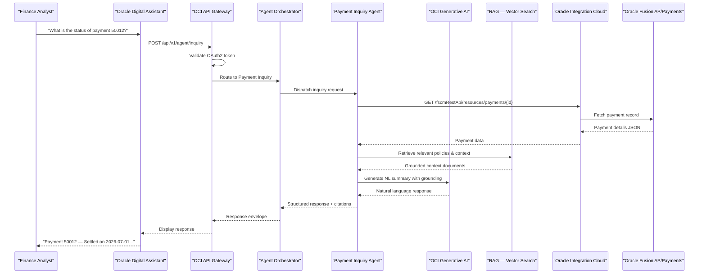

---

## 3. Payment Exception Handling Flow

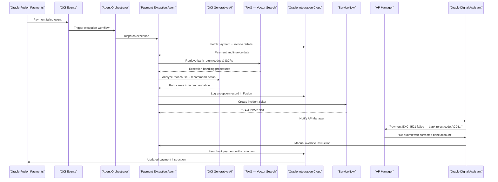

---

## 4. Payment Approval Flow

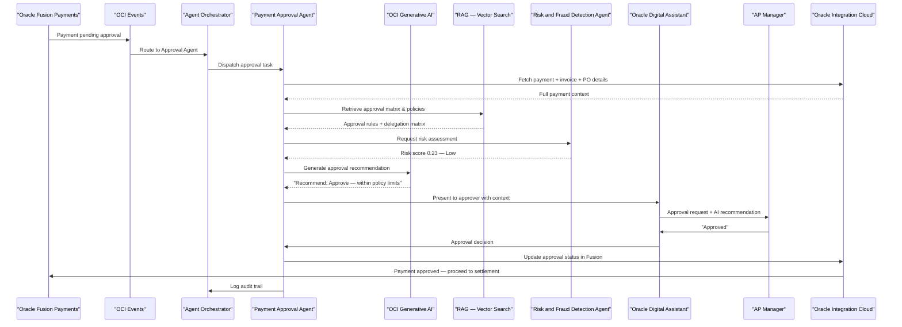

---

## 5. Duplicate Payment Detection Flow

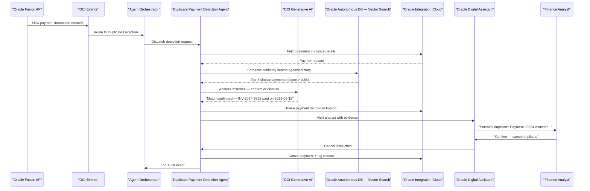

---

## 6. Payment Reconciliation Flow

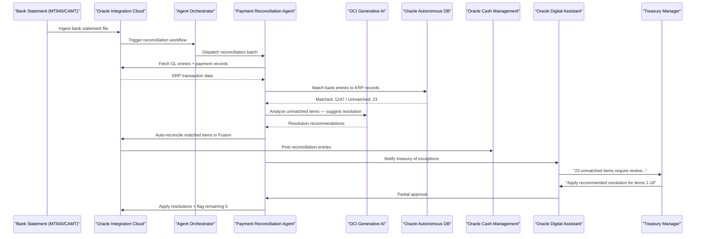

---

## 7. Human-in-the-Loop Workflow

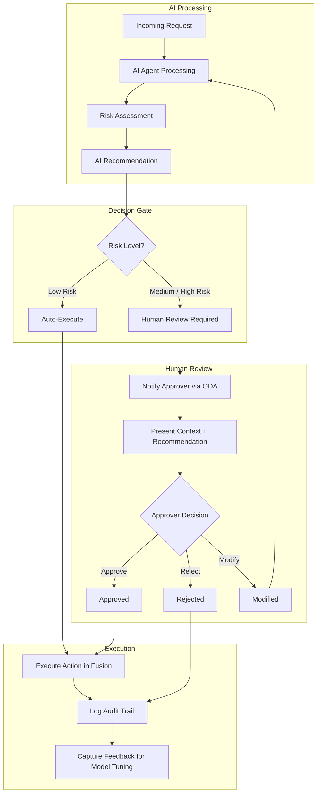

---

## 8. RAG Architecture

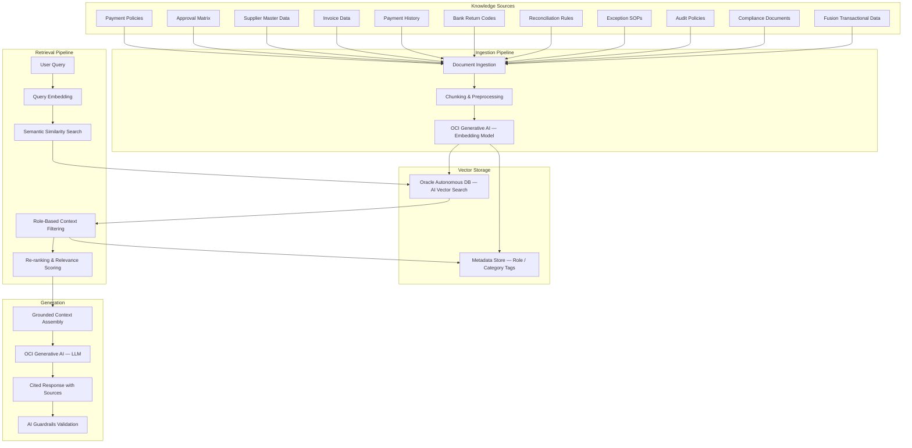

---

## 9. Multi-Agent Orchestration

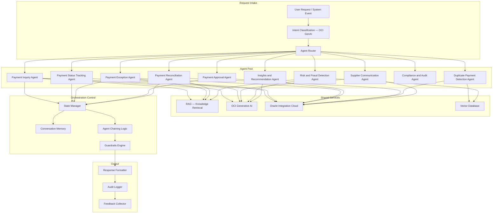

---

## 10. Security and Audit Flow

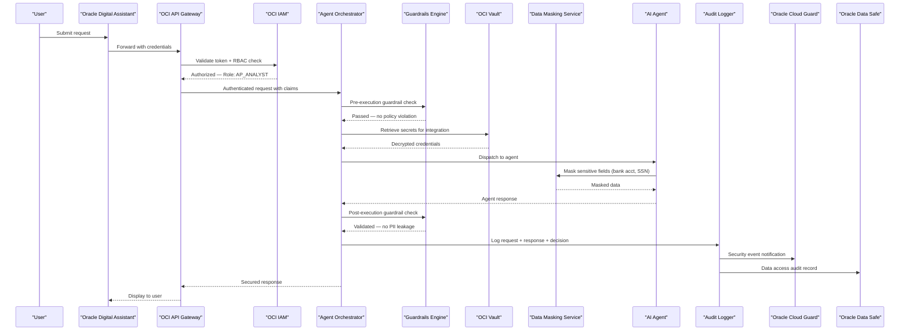

---

## 11. Deployment Architecture

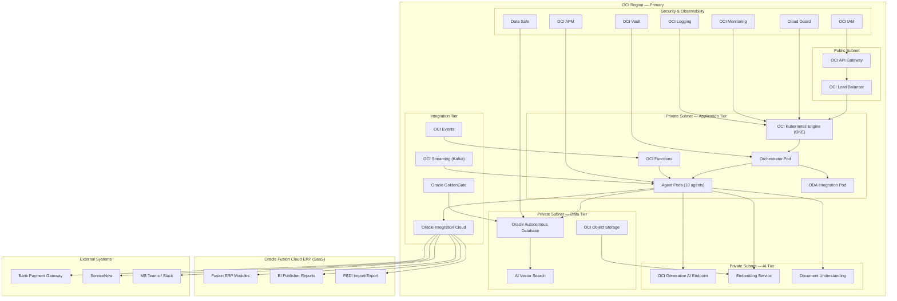

---

*All diagrams above are referenced from the HLD (`01-HLD.md`) and LLD (`02-LLD.md`) documents. Embed key diagrams inline in those documents using the same Mermaid source blocks.*
